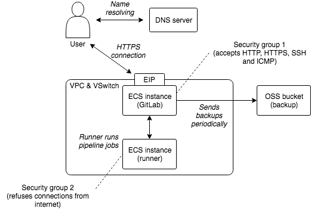
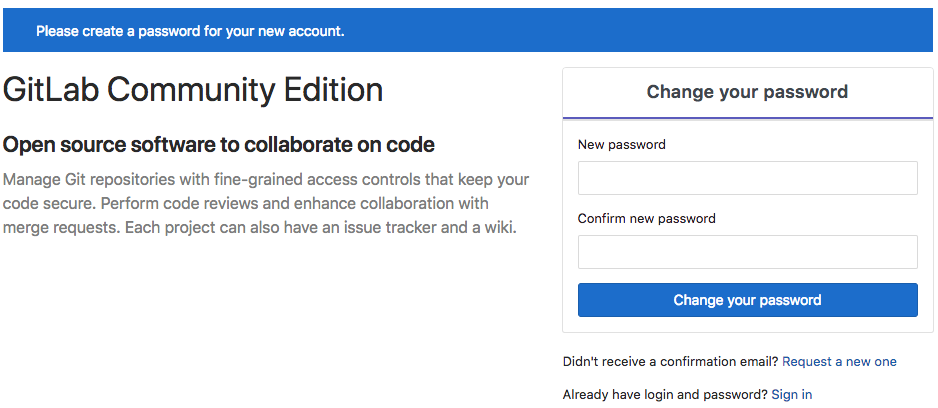
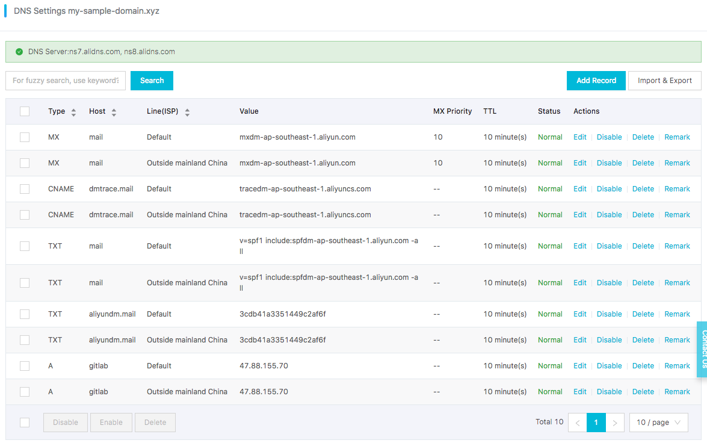
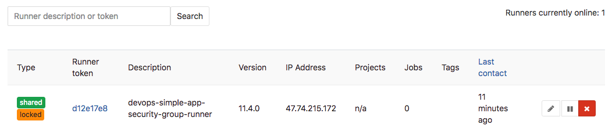
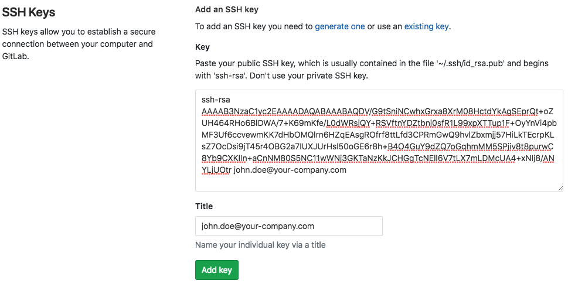
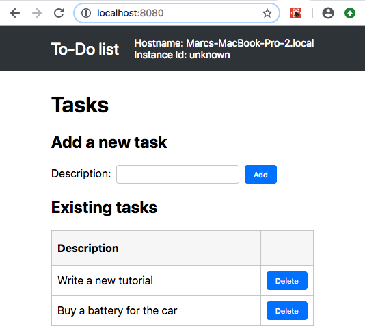
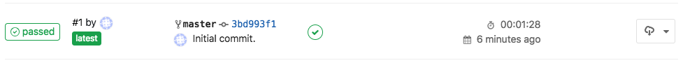

# DevOps for small-to-medium web applications

## Summary
0. [Introduction](#introduction)
1. [Prerequisite](#prerequisite)
2. [GitLab installation and configuration](#gitlab-installation-and-configuration)
   0. [Cloud resources creation](#cloud-resources-creation)
   1. [GitLab installation](#gitlab-installation)
   2. [HTTPS configuration](#https-configuration)
   3. [Mail server configuration](#mail-server-configuration)
   4. [GitLab runner installation and configuration](#gitlab-runner-installation-and-configuration)
   5. [User management](#user-management)
   6. [Maintenance](#maintenance)
   7. [Upgrade](#upgrade)
3. [Continuous Integration](#continuous-integration)
   0. [Simple application](#simple-application)
   1. [GitLab project creation](#gitlab-project-creation)
   2. [Run the application locally](#run-the-application-locally)
   3. [Commit and first CI pipeline](#commit-and-first-ci-pipeline)
4. [Code quality](#code-quality)
   0. [SonarQube installation and configuration](#sonarqube-installation-and-configuration)
   1. New code analysis pipeline stage
5. Continuous Deployment
   0. High-availability infrastructure
   1. GitLab flow
   2. Improved pipeline
6. Maintenance
   0. Logs centralization
   1. Monitoring and alarms
   2. Database schema upgrade
7. Evolution

## Introduction
The intended audience of this document are small independent developer teams that need to develop an maintain
a small-to-medium web application on Alibaba Cloud. The goal is to keep things simple so that only the necessary
technologies and good practices are introduced. For example
[infrastructure as code tools](https://en.wikipedia.org/wiki/Infrastructure_as_Code) are just mentioned since manual
configuration of few cloud resources is not particularly time consuming.

The sample web application that comes with this tutorial is composed of two parts:
* A backend written in Java with [Spring Boot](https://spring.io/projects/spring-boot).
* A frontend written in Javascript with [React](https://reactjs.org/).

This document addresses the following points:
* How to automate compilation, testing, code analysis and packaging with a
  [CI pipeline](https://en.wikipedia.org/wiki/Continuous_integration).
* How to extend this pipeline in order to
  [deploy the application automatically](https://en.wikipedia.org/wiki/Continuous_delivery).
* How to setup a highly-available architecture on Alibaba Cloud.
* How to backup periodically (and restore!) the database and
  the [version control system](https://en.wikipedia.org/wiki/Version_control).
* How to upgrade the application and the database.
* How to centralize logs and monitor your cluster.

## Prerequisite
In order to follow this tutorial, please familiarize yourself with [Git](https://git-scm.com/) and install it on your
computer.

In addition, this tutorial uses the [GitLab Flow](https://about.gitlab.com/2014/09/29/gitlab-flow/) workflow: the idea
is to have a `master` branch that must always compile and be ready for production; new features or bug fixes are
developed in `feature` branches created from the `master` and then merged into it when ready. When the code in `master`
is stable, it is then merged into a `production` branch that must always be in sync with the production environment.

Finally, make sure you [have an Alibaba Cloud account](https://www.alibabacloud.com/help/doc-detail/50482.htm).

Important: please download the 
[related resources](https://github.com/aliyun/devops-tutorials/tree/master/tutorials/devops_for_small_to_medium_web_applications)
before moving to the next section.

## GitLab installation and configuration
[GitLab CE edition](https://about.gitlab.com/) is a free open-source tool that will help us to host Git repositories
and run our CI/CD pipeline.

In order to keep it simple, we will install GitLab on an [ECS instance](https://www.alibabacloud.com/product/ecs) with
a direct access to internet. Although the servers will be protected via
[encryption](https://en.wikipedia.org/wiki/Transport_Layer_Security) and
restrictive [security group rules](https://www.alibabacloud.com/help/doc-detail/25471.htm), you might also want to
isolate your virtual machines from internet by using a
[VPN Gateway](https://www.alibabacloud.com/product/vpn-gateway).

The following diagram illustrates the architecture we will put in place for GitLab:


### Cloud resources creation
The first step is to buy a domain name. This is necessary if you want to enable security your servers:
* Sign in and open the [Alibaba Cloud console](https://home-intl.console.aliyun.com);
* Go to the [Domain console](https://dc.console.aliyun.com/);
* Click on the "Purchase" button;
* Choose a domain, such as "my-sample-domain.xyz" and follow the instructions to buy it;
* Return to the [Domain console](https://dc.console.aliyun.com/) and refresh the page in order to see your new domain;

The second step is to create ECS instances and related resources:
* Go to the [VPC console](https://vpc.console.aliyun.com/) (
  [please click here for more information about VPCs](https://www.alibabacloud.com/product/vpc));
* Select the [region](https://www.alibabacloud.com/help/doc-detail/40654.htm) where you want to create the VPC on top
  of the page (for example "Singapore");
* Click on "Create VPC";
* Fill the new form with the following information:
  * VPC name = devops-simple-app-vpc
  * VPC destination CIDR Block = "192.168.0.0/16"
  * VSwitch name = devops-simple-app-vswitch
  * VSwitch zone = first zone of the list
  * VSwitch destination CIDR Block = "192.168.0.0/24"
* Click on "OK" the create the VPC and the VSwitch;
* On the VPC list, click on the VPC you just have created;
* Scroll down and click on "0" at the right of "Security Group";
* In the new page, click on "Create Security Group";
* Fill the new form with the following information:
  * Template = Web Server Linux
  * Security Group Name = devops-simple-app-security-group
  * Network Type = VPC
  * VPC = select the VPC you just created (with the name devops-simple-app-vpc)
* Click on "OK" to create the security group and the rules from the template; note that the rules open the ports
  for [SSH](https://en.wikipedia.org/wiki/Secure_Shell), [HTTP](https://en.wikipedia.org/wiki/Hypertext_Transfer_Protocol),
  [HTTPS](https://en.wikipedia.org/wiki/HTTPS) and [ICMP](https://en.wikipedia.org/wiki/Internet_Control_Message_Protocol)
  to any computer on internet;
* Go to the [ECS console](https://ecs.console.aliyun.com/);
* Click on the "Create Instance" button;
* If needed, elect "Advanced Purchase" (also named "Custom");
* Fill the wizard with the following information:
  * Billing Method = Pay-As-You-Go
  * Region = the same as your VPC and the same availability zone as the VSwitch
  * Instance Type = filter by vCPU = 2, Memory = 4 GiB, Current Generation tab, and select a remaining type
    such as "ecs.n4.large"
  * Image = Ubuntu 16.04 64bit
  * System Disk = Ultra Disk 40 GiB
  * Network = VPC, select the VPC and VSwitch you have just created
  * Do NOT assign a public IP (we will create an EIP instead, which is more flexible)
  * Security Group = select the group you have just created
  * Log on Credentials = select "Password" and choose one
  * Instance Name = devops-simple-app-gitlab
  * Host = devops-simple-app-gitlab
  * Read and accept the terms of service
* Finish the instance creation by clicking on the "Create Instance" button;
* Go back to the [ECS console](https://ecs.console.aliyun.com/), select the "Instances" item on the left menu and
  choose your region on top the screen; you should be able to see your new instance;
* Click on the ["EIP" item](https://vpcnext.console.aliyun.com/eip) on the left menu;
* On the new page, click on "Create EIP";
* Fill the wizard with the following information:
  * Region = the region where you have created you ECS
  * Max Bandwidth = 1 Mbps
  * Quantity = 1
* Click on "Buy Now", select the agreement of service and click on "Activate";
* Go back to the [EIP console](https://vpcnext.console.aliyun.com/eip) and check your new EIP;
* Next to you new EIP, click on "Bind";
* In the new form, select:
  * Instance Type = ECS Instance
  * ECS Instance = devops-simple-app-gitlab/i-generatedstring
* Click on "OK" to bind the EIP to you ECS instance;
* Copy the IP Address of your EIP (it should be something like 47.88.155.70).

The ECS instance is ready for GitLab, but before let's register a sub-domain for this machine:
* Go to the [Domain console](https://dc.console.aliyun.com/);
* On the row corresponding to your domain (for example "my-sample-domain.xyz"), click on "Resolve";
* Click on "Add Record";
* Fill the new form with the following information:
  * Type = A- IPV4 address
  * Host = gitlab
  * ISP Line = Outside mainland China
  * Value = The EIP IP Address (for example 47.88.155.70)
  * TTL = 10 minute(s)
* Click on "OK" to add the record.

### GitLab installation
We can now finally install GitLab! Open a terminal on your computer and type (note: if you use MAC OSX, you first
need to disable the setting "Set locale environment variables on startup" in "Preferences > Profiles > Advanced"):
```bash
# Connect to the ECS instance
ssh root@gitlab.my-sample-domain.xyz # Use the password you set when you have created the ECS instance

# Update the machine
apt-get update

# Add the GitLab repository for apt-get
cd /tmp
curl -LO https://packages.gitlab.com/install/repositories/gitlab/gitlab-ce/script.deb.sh
bash /tmp/script.deb.sh

# Install GitLab
apt-get -y install gitlab-ce

# Open GitLab configuration
nano /etc/gitlab/gitlab.rb
```
In the GitLab configuration file, replace the value of `external_url` by "http://gitlab.my-sample-domain.xyz" (the
domain you have just purchased and configured), then save and quit by pressing CTRL+X.

Now let's start GitLab and try it! In your terminal, run the following command:
```bash
gitlab-ctl reconfigure
```
Open your web browser on "http://gitlab.my-sample-domain.xyz". You should have a screen like this:


Congratulation if you get a similar screen! In case it doesn't work, please first make sure you didn't miss a step,
then raise an issue if the problem persists.

Do not enter your new password yet because you are using an unencrypted connection! That what we are going to
configure now.

### HTTPS configuration
Open your terminal and enter the following commands:
```bash
# Connect to the ECS instance
ssh root@gitlab.my-sample-domain.xyz # Use the password you set when you have created the ECS instance

# Install dependencies
apt-get install ca-certificates openssh-server
apt-get postfix # During the installation, select "Internet Site" and set your domain (e.g. gitlab.my-sample-domain.xyz)

# Open GitLab configuration
nano /etc/gitlab/gitlab.rb
```
The last command allow you to edit GitLab configuration:
* Modify the value of `external_url` by adding a 's' to "http://" into "https://" (e.g.
  "https://gitlab.my-sample-domain.xyz");
* Scroll to "Let's Encrypt integration" and insert the following lines:
```ruby
letsencrypt['enable'] = true
letsencrypt['contact_emails'] = ["john.doe@your-company.com"] # Your email address
letsencrypt['auto_renew'] = true
letsencrypt['auto_renew_hour'] = 11
letsencrypt['auto_renew_minute'] = 42
letsencrypt['auto_renew_day_of_month'] = "*/14"
```
Quit and save the file by pressing CTRL+X, then apply the configuration change and restart GitLab with:
```bash
gitlab-ctl reconfigure
```
Check it worked by opening your web browser to https://gitlab.my-sample-domain.xyz (with the 's' in https).

You can now enter your new password and sign in with the username "root" and your new password. You should be able to access
to the GitLab homepage.

Before going further we still need to configure two things:
* An email server so that GitLab can send emails.
* Automatic backup in order to avoid loosing data.

### Mail server configuration
Let's start with the email server. Go back to the Alibaba Cloud web console and execute the following instructions:
* Go to the [Direct Mail console](https://dm.console.aliyun.com/);
* Select the same region as your ECS on top of the page;
* Click on the "Email Domains" item on the left menu;
* Click on the "New Domain" button;
* In the new form, set the domain as "mail.my-sample-domain.xyz" (the domain you chose earlier with the prefix "mail.");
* The page must be refreshed with your new email domain; click on the "Configure" link on its right side;
* The new page explains you how to configure your domain. Keep this web browser tab opened, open a new one and
  go to the [Domain console](https://dc.console.aliyun.com/);
* Click on the "Resolve" link next to your domain;
* Click on the "Add Record" button;
* Fill the new form with the following information:
  * Type = TXT- Text
  * Host = the "Host record" column under "1,Ownership verification" in the Direct Mail tab (e.g. aliyundm.mail)
  * ISP Line = Outside mainland China
  * Value = the "Record value" column under "1,Ownership verification" in the Direct Mail tab (e.g. 3cdb41a3351449c2af6f)
  * TTL = 10 minute(s)
* Click "OK" and click again on the "Add Record" button;
* Fill the new form with the following information:
  * Type = TXT- Text
  * Host = the "Host record" column under "2,SPF verification" in the Direct Mail tab (e.g. mail)
  * ISP Line = Outside mainland China
  * Value = the "Record value" column under "2,SPF verification" in the Direct Mail tab
    (e.g. v=spf1 include:spfdm-ap-southeast-1.aliyun.com -all)
  * TTL = 10 minute(s)
* Click "OK" and click again on the "Add Record" button;
* Fill the new form with the following information:
  * Type = MX- Mail exchange
  * Host = the "Host record" column under "3,MX Record Verification" in the Direct Mail tab (e.g. mail)
  * ISP Line = Outside mainland China
  * Value = the "Record value" column under "3,MX Record Verification" in the Direct Mail tab
    (e.g. mxdm-ap-southeast-1.aliyun.com)
  * MX Priority = 10
  * TTL = 10 minute(s)
  * Synchronize the Default Line = checked
* Click "OK" and click again on the "Add Record" button;
* Fill the new form with the following information:
  * Type = CNAME- Canonical name
  * Host = the "Host record" column under "4,CNAME Record Verification" in the Direct Mail tab (e.g. dmtrace.mail)
  * ISP Line = Outside mainland China
  * Value = the "Record value" column under "4,CNAME Record Verification" in the Direct Mail tab
    (e.g. tracedm-ap-southeast-1.aliyuncs.com)
  * TTL = 10 minute(s)
* Click "OK";

You should probably have a domain configuration that looks like that:


Continue the email server configuration:
* Go back to the [Direct Mail console](https://dm.console.aliyun.com/) (the web browser tab you kept opened);
* Click on the "Cancel" button to go back to the email domain list;
* Click on the "Verify" link next to your new domain, and confirm when the prompt appears;
* Refresh the page after 20 sec. If the status of your domain is still "To Be Verified", click on the "Configure" link
  and check with step is still in the "To Be Verified" status, fix your domain configuration and re-do the previous
  step ("Verify" link). Sometime the verification step is a bit slow and you need to retry several times.
  When the email domain status is "Verification successful", you can continue to the next step;
* Click on the "Sender Addresses" item on the left menu;
* Click on the "Create Sender Address" button;
* Fill the new form with the following information:
  * Email Domains = mail.my-sample-domain.xyz (the email domain you just configured)
  * Account = gitlab
  * Reply-To Address = your email address (e.g. john.doe@your-company.com)
  * Mail Type = Triggered Emails
* Click on "OK" to close the form;
* Your new sender address should be added to the list; click on the "Set SMTP password" link next to it;
* Set the SMTP password and click on "OK";
* Click on the "Verify the reply-to address" link next to your new sender address, and confirm when the prompt appears;
* Check your mailbox corresponding to the address you set in the "Reply-To Address" field, you should have received
  an email from "directmail";
* Click on the link in this email in order to see a confirmation message;
* Go back on the sender addresses page and note the SMTP address and port at the end of the description, it should be
  something like "SMTP service address: smtpdm-ap-southeast-1.aliyun.com . SMTP service ports: 25, 80 or
  465(SSL encryption)."

Now that the email server is ready, let's configure GitLab to use it! Open a terminal on your computer and enter
the following commands:
```bash
# Connect to the ECS instance
ssh root@gitlab.my-sample-domain.xyz # Use the password you set when you have created the ECS instance

# Open GitLab configuration
nano /etc/gitlab/gitlab.rb
```
Scroll down to "### Email Settings" and insert the following lines:
```ruby
gitlab_rails['gitlab_email_enabled'] = true
gitlab_rails['gitlab_email_from'] = 'gitlab@mail.my-sample-domain.xyz' # The sender address you just have created
gitlab_rails['gitlab_email_display_name'] = 'GitLab'
gitlab_rails['gitlab_email_reply_to'] = 'gitlab@mail.my-sample-domain.xyz'
```
Scroll down to "### GitLab email server settings" and insert the following lines:
```ruby
gitlab_rails['smtp_enable'] = true
gitlab_rails['smtp_address'] = "smtpdm-ap-southeast-1.aliyun.com"   # SMTP address written in the Direct Mail console
gitlab_rails['smtp_port'] = 465                                     # SMTP port written in the Direct Mail console
gitlab_rails['smtp_user_name'] = "gitlab@mail.my-sample-domain.xyz" # Sender address
gitlab_rails['smtp_password'] = "HangzhouMail2018"                  # SMTP password for the sender address
gitlab_rails['smtp_domain'] = "mail.my-sample-domain.xyz"           # Your email domain
gitlab_rails['smtp_authentication'] = "login"
gitlab_rails['smtp_enable_starttls_auto'] = false
gitlab_rails['smtp_tls'] = true
```
Apply the configuration change and restart GitLab:
```bash
gitlab-ctl reconfigure
```
You can test the configuration like this:
* Go to GitLab and sign in as root: https://gitlab.my-sample-domain.xyz/
* Click on the "Admin area" button in the top menu (the wrench icon);
* Click on the "Users" item in the left menu;
* Click on the "Administrator" user;
* Click on the "Edit" button;
* Change the "Email" field to your personal email address;
* Click on "Save changes";
* Sign out by first clicking on your profile picture on the top-right of the page;
* Click on the "Forgot your password?" link;
* Set your personal email address and click on "Reset password";
* Check in your personal mailbox and check you have received an email (it may be in the spam folder).

### Automatic backup configuration
Backups are important because they prevent data loss in case of accident and allow you to migrate to another
ECS instance if you need.

In order to run backups automatically, please open a terminal and run the following commands:
```bash
# Make sure rsync is installed
apt-get install rsync

# Install the latest version of tar
cd /tmp
wget http://ftp.gnu.org/gnu/tar/tar-latest.tar.gz
tar -xvzf tar-latest.tar.gz
cd tar-*/
FORCE_UNSAFE_CONFIGURE=1 ./configure
make
make install

# Restart the machine to make sure all users use the same version of tar
reboot

# Re-connect after few seconds to the ECS instance
ssh root@gitlab.my-sample-domain.xyz # Use the password you set when you have created the ECS instance

# Check the tar version is >= 1.30
tar --version

# Install OSSFS, a tool that allow us to mount an OSS bucket as a local folder: https://github.com/aliyun/ossfs
apt-get install gdebi-core
cd /tmp
wget https://github.com/aliyun/ossfs/releases/download/v1.80.5/ossfs_1.80.5_ubuntu16.04_amd64.deb
gdebi ossfs_1.80.5_ubuntu16.04_amd64.deb
```

Let's now create an [OSS bucket](https://www.alibabacloud.com/product/oss) where we will store our backups:
* Go to the [OSS console](https://oss.console.aliyun.com/);
* Click on the "Create Bucket" button;
* Fill the new form with the following information:
  * Bucket Name = gitlab-my-sample-domain-xyz (you can set the name you want, but it must be unique)
  * Region = the same as your ECS instance (e.g. Asia Pacific SE 1 (Singapore))
  * Storage Class = Standard
  * Access Control List (ACL) = Private
* Click on the "OK" button;
* The page must show the bucket you have just created. Please note the last "Endpoint" for VPC Network Access
  (something like "oss-ap-southeast-1-internal.aliyuncs.com"), it contains your bucket name and the region
  id (e.g. ap-southeast-1).

You will also need an access key id and secret:
* Go to the [User console](https://usercenter.console.aliyun.com/) by clicking on your user on the top-right of the page
  and by selecting AccessKey;
* Click on the "Create Access Key" button;
* Note the AccessKeyID and the AccessKeySecret and click on "Save AccessKey Information".

In your terminal, mount your OSS bucket as a folder:
```bash
# Save your bucket name, access key id and access key secret in the file /etc/passwd-ossfs
# The format is my-bucket:my-access-key-id:my-access-key-secret
echo gitlab-my-sample-domain-xyz:LTAIsP66uJ8zujwZ:rc15yggaCX08AiYKe2BGnX49wNUGpk > /etc/passwd-ossfs
chmod 640 /etc/passwd-ossfs

# Create a folder where we will mount the OSS bucket
mkdir /mnt/gitlab-bucket

# Mount the OSS bucket
# The -ourl come from the last "Endpoint" for VPC Network Access
ossfs gitlab-my-sample-domain-xyz /mnt/gitlab-bucket -ourl=http://oss-ap-southeast-1-internal.aliyuncs.com

# Check it works
echo "It works!" > /mnt/gitlab-bucket/test.txt

# Unmount the OSS bucket
umount /mnt/gitlab-bucket
```
Check that the test file is present in your bucket:
* Go to the [OSS console](https://oss.console.aliyun.com/);
* Click on your bucket name on the left menu;
* Click on "Files" on the top menu;
* The file "test.txt" should be present and should contain "It works!";
* Delete this file.

Configure the OSS bucket so that it is automatically mounted when the ECS machine starts. Create the following file:
```bash
nano /etc/systemd/user/ossfs.service
```
Adapt and copy the following content:
```
[Unit]
Description=OSSFS mounts
Wants=network-online.target
After=network-online.target

[Service]
Type=oneshot
RemainAfterExit=yes
ExecStart=/usr/local/bin/ossfs gitlab-my-sample-domain-xyz /mnt/gitlab-bucket -o allow_other -ourl=http://oss-ap-southeast-1-internal.aliyuncs.com
ExecStop=/bin/umount /mnt/gitlab-bucket

[Install]
WantedBy=default.target
```
Make sure you set the right bucket name and endpoint. Quit and save by pressing CTRL+X. Configure Systemd to run this
script at startup:
```bash
systemctl --user enable ossfs.service

# Restart the machine to test
reboot

# Re-connect after few seconds to the ECS instance
ssh root@gitlab.my-sample-domain.xyz # Use the password you set when you have created the ECS instance

# Create a sample file
echo "Second test" > /mnt/gitlab-bucket/test2.txt
```
Go to the [OSS console](https://oss.console.aliyun.com/), check that the test2.txt file is present in your bucket
and delete it.

Let's now configure GitLab to put its backup files in the mounted folder. Open the terminal and run:
```bash
# Open GitLab configuration
nano /etc/gitlab/gitlab.rb
```
Scroll to "### Backup Settings" and insert the following line:
```ruby
gitlab_rails['backup_path'] = "/mnt/gitlab-bucket/backup/"
```
Quit and save by pressing CTRL+X, then check if it works:
```bash
# Apply GitLab configuration
gitlab-ctl reconfigure

# Manually launch a first backup
gitlab-rake gitlab:backup:create
```
The last command should have created a backup. Go to the [OSS console](https://oss.console.aliyun.com/) and check you
have a file with a path like "backup/1540288854_2018_10_23_11.3.6_gitlab_backup.tar".

Let's now configure automatic backup to be run automatically every night. For that we will create two types of
[cron jobs](https://en.wikipedia.org/wiki/Cron): one to execute the backup command above, one to save the GitLab
configuration files.

Open your terminal and execute:
```bash
# Edit the CRON configuration file. Select nano as the editor.
crontab -e
```
Enter the following lines into this file:
```
0 2 * * * /opt/gitlab/bin/gitlab-rake gitlab:backup:create CRON=1
0 2 * * * /bin/cp /etc/gitlab/gitlab.rb "/mnt/gitlab-bucket/backup/$(/bin/date '+\%s_\%Y_\%m_\%d')_gitlab.rb"
0 2 * * * /bin/cp /etc/gitlab/gitlab-secrets.json "/mnt/gitlab-bucket/backup/$(/bin/date '+\%s_\%Y_\%m_\%d')_gitlab-secrets.json"
```
Save and quit by pressing CTRL+X.

You now have configured automatic backup every night at 2AM! If you want to test this configuration you can replace
"0 2 * * *" by the current time + 2 min; for example if the current time is 14:24, then set "26 14 * * *"; you then
just need to wait about 2 min and after check whether new files have been created in your OSS bucket.

The restoration process is well described in the
[official documentation](https://docs.gitlab.com/ee/raketasks/backup_restore.html#restore-for-omnibus-installations)
(section "Restore for Omnibus installations"). Note that it is considered as a
[good practice](https://www.theregister.co.uk/2017/02/01/gitlab_data_loss/) to test your backups from time to time.

### GitLab runner installation and configuration
It is [a good practice](https://docs.gitlab.com/ce/install/requirements.html#gitlab-runner) to run CI/CD jobs
(code compilation, unit tests execution, application packing, ...) on a different machine from the one that run GitLab.

Thus, we need to setup one [runner](https://docs.gitlab.com/ce/ci/runners/) on a new ECS instance. Please execute the
following instructions:
* Go to the [VPC console](https://vpc.console.aliyun.com/);
* Select the region of the GitLab ECS instance (on top of the screen);
* Click on the VPC "devops-simple-app-vpc";
* Click on "1" next to "Security Group";
* Click on "Create Security Group";
* Fill the new form with the following information:
  * Template = Customize
  * Security Group Name = devops-simple-app-security-group-runner
  * Network Type = VPC
  * VPC = select the VPC "devops-simple-app-vpc"
* Click on "OK" to create the group; We will not add any rule in order to be as restrictive as possible (to improve
  security);
* Go to the [ECS console](https://ecs.console.aliyun.com/);
* Click on the "Create Instance" button;
* If needed, select "Advanced Purchase" (also named "Custom");
* Fill the wizard with the following information:
  * Billing Method = Pay-As-You-Go
  * Region = the same as the ECS instance where you have installed GitLab
  * Instance Type = filter by vCPU = 2, Memory = 4 GiB, Current Generation tab, and select a remaining type
    such as "ecs.n4.large"
  * Image = Ubuntu 16.04 64bit
  * System Disk = Ultra Disk 40 GiB
  * Network = VPC, select the VPC and VSwitch of the GitLab ECS instance
  * Assign a public IP (no need of an EIP this time)
  * Security Group = select "devops-simple-app-security-group-runner"
  * Log on Credentials = select "Password" and choose one
  * Instance Name = devops-simple-app-gitlab-runner
  * Host = devops-simple-app-gitlab-runner
  * Read and accept the terms of service
* Finish the instance creation by clicking on the "Create Instance" button;
* Go back to the [ECS console](https://ecs.console.aliyun.com/), select the "Instances" item on the left menu and
  choose your region on top the screen; you should be able to see your new
  instance "devops-simple-app-security-group-runner";
* Click on the "Connect" link on the right of your ECS instance, copy the VNC Password (something like "667078") and
  enter it immediately after;
* You should see a terminal in your web browser inviting you to login; Authenticate as root with the password you have
  just created;

Execute the following commands in this "web-terminal":
```bash
# Add a new repository for apt-get for GitLab Runner
curl -L https://packages.gitlab.com/install/repositories/runner/gitlab-runner/script.deb.sh | sudo bash

# Add a new repository for apt-get for Docker
apt-get install software-properties-common
curl -fsSL https://download.docker.com/linux/ubuntu/gpg | sudo apt-key add -
add-apt-repository \
   "deb [arch=amd64] https://download.docker.com/linux/ubuntu \
   $(lsb_release -cs) \
   stable"

# Update the machine
apt-get update

# Install GitLab runner
apt-get install gitlab-runner

# Install dependencies for Docker
apt-get install apt-transport-https ca-certificates curl software-properties-common

# Install Docker
apt-get install docker-ce
```
As you can see we setup two applications: [GitLab Runner](https://docs.gitlab.com/ce/ci/runners/) and
[Docker](https://www.docker.com/). We will keep things very simple with Docker: it is
a [very](https://docs.docker.com/engine/swarm/key-concepts/) [powerful](https://kubernetes.io/) tool, but in this
tutorial we will just use it as a "super installer", for example we will not setup any tool, compiler or SDK on this
runner, instead we will be lazy and let Docker to download the right [images](https://docs.docker.com/get-started/)
for us. Things will become more clear later in this tutorial when we will configure our CI/CD pipeline.

Now we need to connect the runner with GitLab:
* Open GitLab in another web browser tab (the URL must be like https://gitlab.my-sample-domain.xyz/);
* Sign in if necessary;
* Click on the "Admin area" button in the top menu (the wrench icon);
* Click on the "Runners" item in the left menu;

The bottom of the page contains an URL and a token:


Go back to the "web-terminal" connected to the runner machine, and type:
```bash
gitlab-runner register
```
This tool needs several information in order to register the runner. Enter the following responses:
* Please enter the gitlab-ci coordinator URL (e.g. https://gitlab.com):
  copy the URL from the GitLab page above (e.g. https://gitlab.my-sample-domain.xyz/)
* Please enter the gitlab-ci token for this runner:
  copy the token from the GitLab page above (e.g. gXppo8ZyDgqdFb1vPG-w)
* Please enter the gitlab-ci description for this runner:
  devops-simple-app-security-group-runner
* Please enter the gitlab-ci tags for this runner (comma separated):
  keep it empty
* Please enter the executor:
  docker
* Please enter the default Docker image (e.g. ruby:2.1):
  alpine:latest

After the tool gives you back the hand, you should be able to see this runner in the GitLab web browser tab. Refresh the
page and check at the bottom, you should see something like this:


Our GitLab is now ready to be used! But there are few more points to read before creating our first project:

### User management
As administrator, there are few steps you need to follow in order to improve your GitLab account:
* Open GitLab in another web browser tab (the URL must be like https://gitlab.my-sample-domain.xyz/);
* Click on your avatar on the top-right of the page and select "Settings";
* Correctly set the "Full name" and "Email" fields and click on the "Edit profile settings" button;
* Click on the "Account" item on the left menu;
* Change your username and click on the "Update username" button, then confirm it again when the prompt appears (this
  step improves security as attackers would have to guess your username in addition to your password).

You may also want to control who can register on your GitLab server (the default configuration allows anyone on
internet to register):
* Click on the "Admin area" button in the top menu (the wrench icon);
* Click on the "Settings" item in the left menu;
* Expand the "Sign-up restrictions" section;
* Uncheck the "Sign-up enabled" field;
* Click on the "Save changes" button.

Now only administrators can create new users. This can be done by navigating to the "Overview > Users" menu in
the "Admin area".

### Maintenance
Linux servers need to be upgraded from time to time: security patches must be installed as soon as possible and 
applications should be updated to their latest versions.

On Ubuntu instances, the following command allows you to safely update your server:
```bash
apt-get upgrade
```
Other commands such as `apt-get dist-upgrade` or `do-release-upgrade` are less safe, especially
the last one since it can update Ubuntu to a newer LTS version that is not yet supported by Alibaba Cloud.

For more complex upgrade it may be more practical to replace the ECS instance:
* Create a [backup](#automatic-backup-configuration) of the existing GitLab data;
* Create a new ECS instance and install GitLab (note: the GitLab version on the new ECS instance must be the same as
  the old one, if not the backup-restore process will fail);
* Restore the backups into the new machine;
* Check the new instance works;
* Unbind the EIP from the old ECS instance and bind it to the new one;
* Release the old ECS instance.

Security updates can be automatically installed thanks to `unattended-upgrades`. For each ECS instance (GitLab and
its runner), open a terminal (via SSH or via the web-terminal console) and enter the following commands:
```bash
# Install unattended-upgrades
apt-get install unattended-upgrades

# Check the default configuration is fine for you. Press CTRL+X to quit.
nano /etc/apt/apt.conf.d/50unattended-upgrades

# Enable automatic upgrades
dpkg-reconfigure --priority=low unattended-upgrades

# Edit the related configuration
nano /etc/apt/apt.conf.d/20auto-upgrades
```
The last configuration file can be modified in order to look like this:
```
APT::Periodic::Update-Package-Lists "1";
APT::Periodic::Unattended-Upgrade "1";
APT::Periodic::Download-Upgradeable-Packages "1";
APT::Periodic::AutocleanInterval "7";
```
Save and quit by pressing CTRL+X. You can launch `unattended-upgrades` manually for testing:
```bash
unattended-upgrade -d
```
The logs of `unattended-upgrades` are printed in `/var/log/unattended-upgrades`.

More information about automatic update [can be found here](https://help.ubuntu.com/16.04/serverguide/automatic-updates.html.en).

### Upgrade
The described architecture for GitLab is fine as long as the number of users is not too large. However there are
several solutions when things start to get slow:
* When pipeline jobs take too much time to run, maybe adding more runners or using ECS instances with higher specs
  can help;
* When GitLab itself become slow, the simplest solution is to migrate it to a stronger ECS instance type.

When a single GitLab instance become unacceptable, maybe because of performance issues or
because [high-availability](https://en.wikipedia.org/wiki/High_availability) is required, the architecture can
evolve into a distributed system involving the following cloud resources:
* Additional ECS instances;
* A [server load balancer](https://www.alibabacloud.com/product/server-load-balancer) to distribute the load across
  ECS instances;
* A [NAS](https://www.alibabacloud.com/product/nas) to let multiple ECS instances to share a common file storage system;
* An external [database](https://www.alibabacloud.com/product/apsaradb-for-rds-postgresql).

As you can see the complexity can quickly increase. Tools such as [Packer](https://www.packer.io/) (machine image
builder), [Terraform](https://www.terraform.io/) (infrastructure as code software) or [Chef](https://www.chef.io/) /
[Puppet](https://puppet.com/) / [Ansible](https://www.ansible.com/) / [SaltStack](https://www.saltstack.com/)
(configuration management) can greatly help managing it: they require an initial investment but allow organizations
to better manage their systems.

Another solution is to let other companies to manage this complexity for you. There are
many [SaaS](https://en.wikipedia.org/wiki/Software_as_a_service) vendors such as
[GitLab.com](https://about.gitlab.com/pricing/#gitlab-com) or [GitHub](https://github.com/business). Alibaba Cloud
offers [Codepipeline](https://www.aliyun.com/product/codepipeline), but it is currently only available in Chinese.

## Continuous Integration
Now that GitLab is up and running, it is time to create a project and setup our first pipeline.

### Simple application
This tutorial is based on a simple web application written on top of
[Spring Boot](https://spring.io/projects/spring-boot) (for the backend) and [React](https://reactjs.org/) (for the
frontend).

The application consists in a todo list where a user can add or remove items. The goal is to have a simple
[3-tier architecture](https://en.wikipedia.org/wiki/Multitier_architecture#Three-tier_architecture) with enough
features that allow us to explore important concepts:
* The file organization shows a way to combine backend and frontend code into a single module (to keep it simple).
* The backend is [stateless](https://nordicapis.com/defining-stateful-vs-stateless-web-services/), which means that
  it doesn't store any data (e.g. no shared variable in the code); instead, the data is saved in a database. This
  architecture is particularly useful
  for [horizontal scaling](https://en.wikipedia.org/wiki/Scalability#Horizontal_and_vertical_scaling).
* Because a [relational database](https://en.wikipedia.org/wiki/Relational_database_management_system) is involved,
  this project demonstrate how to use [Flyway](https://flywaydb.org/) to help to upgrade the schema when the
  application evolve.
* The build process involves [Npm](https://www.npmjs.com/), [Babel](https://babeljs.io/),
  [Webpack](https://webpack.js.org/) and [Maven](https://maven.apache.org/) to compile and package the application for
  production.
* Code quality is achieved thanks to [SonarQube](https://www.sonarqube.org/), a tool that can detect bugs in the code
  and help us to maintain the project over time.

### GitLab project creation
Let's start by creating a project on GitLab:
* Open GitLab in your web browser (the URL must be like https://gitlab.my-sample-domain.xyz/);
* Click on the "New..." item in the top menu (with a '+' icon) and select "New project";
* Fill the new form with the following information:
  * Project name = todolist
  * Project slug = todolist
  * Visibility Level = Private
* Click on the "Create project" button.

We now have a project but we cannot download it on our computer yet; for that we need to generate and register a
SSH key:
* In your GitLab web browser tab, click on your avatar (top-right of the page) and select "Settings";
* Click on the "SSH Keys" item in the left menu;
* Open a terminal and type the following commands:
  ```bash
  # Generate a SSH certificate (set the email address you set in your GitLab profile)
  ssh-keygen -o -t rsa -C "john.doe@your-company.com" -b 4096

  # Display the public key
  cat ~/.ssh/id_rsa.pub
  ```
* Copy the result of the `cat` command and paste in the "Key" field (in the GitLab web browser tab);
* The "Title" field should be automatically filled with your email address; The page should look like this:
  
* Click on the "Add key" button in order to register your SSH key.

You can now configure git and [clone](https://git-scm.com/docs/git-clone) the project on your computer. Enter the
following commands in your terminal:
```bash
# Set your real name
git config --global user.name "John Doe"

# Set the same email address as the one you set in your GitLab profile
git config --global user.email "john.doe@your-company.com"

# Create a directory for your projects
mkdir ~/projects
cd ~/projects

# Clone the empty project on your computer (set your GitLab domain name and username)
git clone git@gitlab.my-sample-domain.xyz:johndoe/todolist.git

# Change directory and check the ".git" folder is present
cd todolist
ls -la
```

Copy all the files from the folder "sample-app/version1/*" of this tutorial into "~/projects/todolist". You should
have a directory with the following top files:
* .git              - Folder containing information for git.
* .gitignore        - List of files to ignore for Git.
* .gitlab-ci.yml    - GitLab CI pipeline configuration (more information about this file later).
* package.json      - [Npm](https://www.npmjs.com/) configuration for the frontend: it declares dependencies such as
  [React](https://reactjs.org/), [Babel](https://babeljs.io/) and [Webpack](https://webpack.js.org/).
* webpack.config.js - [Webpack](https://webpack.js.org/) configuration for the frontend: it contains information about
  how to [transpile](https://scotch.io/tutorials/javascript-transpilers-what-they-are-why-we-need-them) our
  [JSX](https://reactjs.org/docs/introducing-jsx.html) code into standard JavaScript supported by all modern
  web browsers. It also describes how to package the frontend code and place it into a folder where
  [Spring Boot](https://spring.io/projects/spring-boot) can pick it and serve it via HTTP.
* pom.xml           - [Maven](https://maven.apache.org/) configuration for the backend: it declares dependencies,
  how to compile the code, how to run the tests, and how to package the complete application.
* src               - Source code of the application.

The "src" folder is organized like this:
* src/main/java - Backend code in Java. The entry-point is "com/alibaba/intl/todolist/Application.java".
* src/main/js - Frontend code. The entry-point is "app.js".
* src/main/resources/application.properties - Backend configuration (e.g. database url).
* src/main/resources/static - Frontend code (HTML, CSS and JavaScript). The "built" folder is generated by Webpack.
* src/main/resources/db/migration - Database scripts for [Flyway](https://flywaydb.org/) (more on this later).
* src/test/java - Backend tests.
* src/test/resources - Backend tests configuration.

### Run the application locally
Install the [JDK 8](https://www.oracle.com/technetwork/java/javase/downloads/jdk8-downloads-2133151.html) and
[Maven](https://maven.apache.org/) on your computer, and build your application with the following command:
```bash
mvn clean package
```
This command should end with a "BUILD SUCCESS" message: it compile, run the tests and package the application.

Notes:
* The application source code organization is based on
  [this tutorial](https://spring.io/guides/tutorials/react-and-spring-data-rest/). You can read this document if you
  are interested in [HATEOAS](https://en.wikipedia.org/wiki/HATEOAS),
  [WebSockets](https://en.wikipedia.org/wiki/WebSocket) and
  [Spring Security](https://spring.io/projects/spring-security).
* Although the application needs a database, the tests pass because they use [H2](http://www.h2database.com/), an
  in-memory database.

The next step is to setup a database locally:
* Download and install [MySQL Community Server v5.7](https://dev.mysql.com/downloads/mysql/5.7.html#downloads);
  note that it will normally give you a temporary root password.
* MySQL should have installed the [MySQL Command-Line Tool](https://dev.mysql.com/doc/refman/8.0/en/mysql.html). You
  may need to configure your PATH environment variable if the `mysql` command is not available on your terminal. On
  Mac OSX you can do the following:
  ```bash
  # Add the MySQL tools into the PATH variable
  echo 'export PATH=/usr/local/mysql/bin:$PATH' >> ~/.bash_profile

  # Reload .bash_profile
  . ~/.bash_profile
  ```
* Launch MySQL on your computer and connect to it with your terminal:
  ```bash
  # Connect to the database (use the password you received during the installation)
  mysql -u root -p
  ```
* The command above should display a prompt. You can now configure your database:
  ```mysql
  -- Change the root password if you never did that before on this database
  ALTER USER 'root'@'localhost' IDENTIFIED BY 'YouNewRootPassword';

  -- Create a database for our project
  CREATE DATABASE todolist;

  -- Create a user for our project and grant him the rights
  CREATE USER 'todolist'@'localhost' IDENTIFIED BY 'P@ssw0rd';
  GRANT ALL PRIVILEGES ON todolist.* TO 'todolist'@'localhost';

  -- Exit
  QUIT;
  ```

Now that we have a database up and running, we need to create a [schema](https://en.wikipedia.org/wiki/Database_schema):
Enter the following commands in your terminal:
```bash
# Go to the project folder
cd ~/projects/todolist

# Use Flyway to run the DB scripts
mvn flyway:migrate -Ddatabase.url=jdbc:mysql://localhost:3306/todolist -Ddatabase.user=todolist -Ddatabase.password=P@ssw0rd
```
Note: [Flyway](https://flywaydb.org/) creates a table "flyway_schema_history" that contains the scripts from
"src/main/resources/db/migration" that have been executed successfully. During development when you upgrade your
application schema, you cannot modify existing SQL scripts from this folder, instead you need to create a new script
with a higher prefix number. Like this, next time you run `mvn flyway:migrate`, Flyway will be clever enough to only
run the new scripts.

Have a look at the backend configuration file "src/main/resources/application.properties" and check that the DB
configuration corresponds to your installation:
```properties
spring.datasource.url=jdbc:mysql://localhost:3306/todolist
spring.datasource.username=todolist
spring.datasource.password=P@ssw0rd
```
If you modified this file you need to re-run `mvn clean package`.

You can now launch the application locally with the following command:
```bash
mvn spring-boot:run -Ddatabase.url=jdbc:mysql://localhost:3306/todolist -Ddatabase.user=todolist -Ddatabase.password=P@ssw0rd
```
If everything went well, the application should print several lines of logs in the console. Look at the two last lines:
```
2018-11-02 13:56:18.139  INFO 87329 --- [main] o.s.b.w.embedded.tomcat.TomcatWebServer  : Tomcat started on port(s): 8080 (http) with context path ''
2018-11-02 13:56:18.145  INFO 87329 --- [main] com.alibaba.intl.todolist.Application    : Started Application in 5.305 seconds (JVM running for 17.412)
```

Open a new tab in your web browser and open the url "http://localhost:8080". You should normally get something like this:



Note: you can add new tasks by filling a description and clicking on the "Add" button.

Congratulation if you managed to get the application up and running! The source code has been written with the
[IntelliJ IDEA](https://www.jetbrains.com/idea/) [IDE](https://en.wikipedia.org/wiki/Integrated_development_environment),
(the ultimate edition is mandatory for frontend development, you can evaluate it for free for 30 days).

### Commit and first CI pipeline
It is now time to save the project in the git repository. Please enter the following command in your terminal:
```bash
# Go to the project folder
cd ~/projects/todolist

# Check files to commit
git status
```
The last command should print something like this:
```
On branch master

No commits yet

Untracked files:
  (use "git add <file>..." to include in what will be committed)

	.gitignore
	.gitlab-ci.yml
	package.json
	pom.xml
	src/
	webpack.config.js
```
Add all these files and commit them:
```bash
# Add the files
git add .gitignore .gitlab-ci.yml package.json pom.xml src/ webpack.config.js

# Commit the files and sent a comment
git commit -m "Initial commit."

# Push the commit to the GitLab server
git push origin master
```

Pushing your code to GitLab triggered something interesting:
* Open GitLab in your web browser (the URL must be like https://gitlab.my-sample-domain.xyz/);
* Click on the "Projects" item in the top menu and select the "Your projects";
* Click on the "todolist" project; You should be able to see your files;
* Click in the "CI / CD" item in the left menu and select "Pipelines";

You should see something like this:



Clicking on the "Artifacts" button on the left allows you to download the generated ".war" file containing your
ready-for-production application.

Clicking on the icon in the "Stages" column and then selecting "build" allows you to see the commands and logs used
to compile and package the application.

This pipeline is triggered when somebody pushes code to the server. It is configured by the ".gitlab-ci.yml" file:
```yaml
image: maven:3.5.4-jdk-8

variables:
  MAVEN_OPTS: "-Dmaven.repo.local=./.m2/repository"

cache:
  paths:
    - ./.m2/repository

stages:
  - build

build:
  stage: build
  script: "mvn package"
  artifacts:
    paths:
      - target/*.war
```
The first line "image: maven:3.5.4-jdk-8" defines the Docker image used to execute the build command (as you can see,
using Docker relieves us to setup the JDK 8 and Maven on the GitLab runner manually).

The "MAVEN_OPTS" variable and the "cache" block are an optimization: because Maven takes a lot of time to download
dependencies, these definitions allow us to re-use these dependencies among pipelines.

The "stages" block defines only one stage "build", we will add new ones later in this tutorial.

The "build" block is the most important one: it instructs the GitLab runner to execute "mvn package" in order to
compile, run the tests and package the application. The "artifacts" block instructs GitLab to save the generated
".war" file.

Note: even if this pipeline is simple, it is already quite useful for a team since it can immediately inform the team
that somebody committed something bad (for example he missed a file, or some test fail unexpectedly). GitLab
automatically sends an email to the person who made the mistake: this rapid feedback can save us a lot of time
because the error cause has a great chance to be located in the code that we just modified.

## Code quality
Before we continue on the way to production, it is important to add a stage in our pipeline to improve the
code quality of our application. In this tutorial we are introducing [SonarQube](https://www.sonarqube.org/),
a tool that can help us to find bugs before they arrive in production, and help us to manage
the [technical debt](https://en.wikipedia.org/wiki/Technical_debt).

### SonarQube installation and configuration
