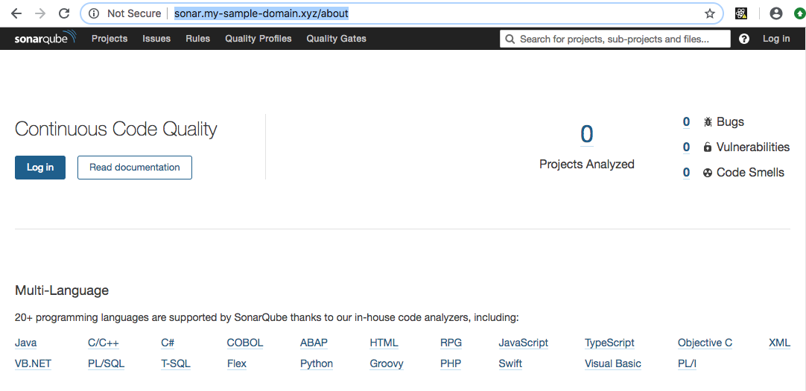
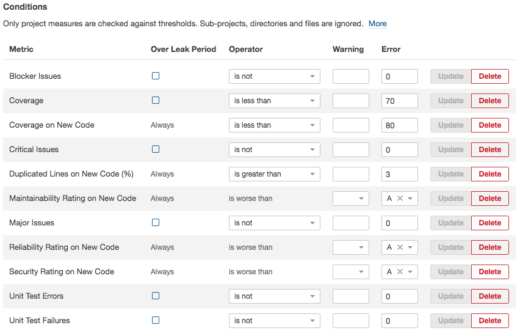
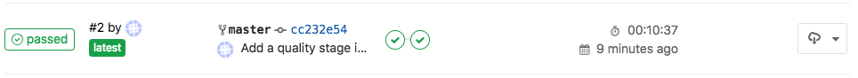
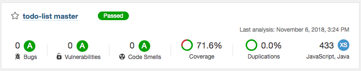
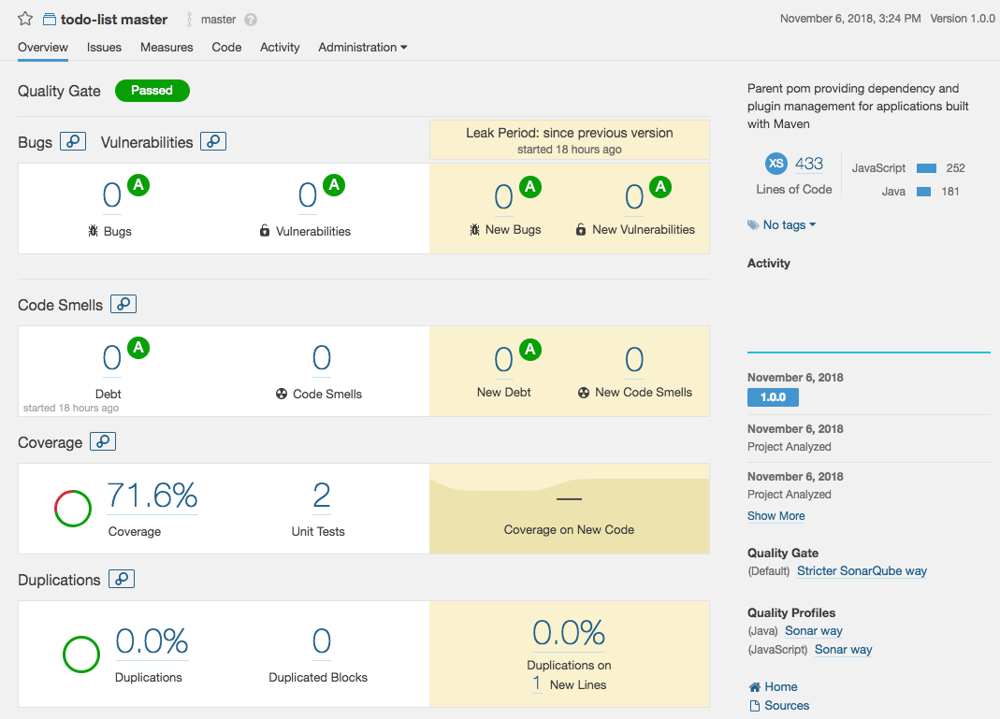
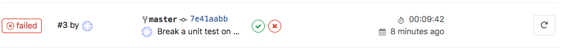
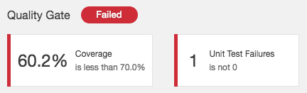
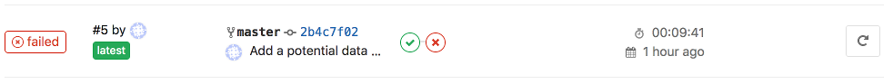
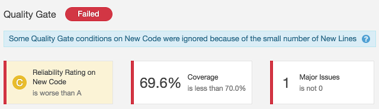
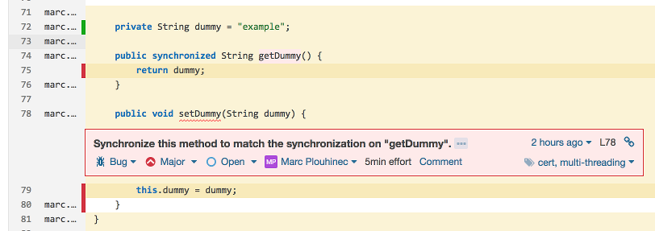


# DevOps for small / medium web apps - Part 3 - Code quality

## Summary
0. [Introduction](#introduction)
1. [SonarQube infrastructure](#sonarqube-infrastructure)
2. [SonarQube installation](#sonarqube-installation)
3. [SonarQube configuration](#sonarqube-configuration)
4. [Code analysis pipeline stage](#code-analysis-pipeline-stage)
5. [CI pipeline testing](#ci-pipeline-testing)

## Introduction
Before we continue on the way to deployment, it is important to add a stage in our pipeline to improve the
code quality of our application. In this tutorial we are introducing [SonarQube](https://www.sonarqube.org/),
a tool that can help us to find bugs before they arrive in production, and help us to manage
the [technical debt](https://en.wikipedia.org/wiki/Technical_debt).

## SonarQube infrastructure
Let's create an ECS instance with [SonarQube](https://www.sonarqube.org/):
* Go to the [ECS console](https://ecs.console.aliyun.com/);
* Click on the "Create Instance" button;
* If needed, select "Advanced Purchase" (also named "Custom");
* Fill the wizard with the following information:
  * Billing Method = Pay-As-You-Go
  * Region = the same region and availability zone as your GitLab server
  * Instance Type = filter by vCPU = 2, Memory = 4 GiB, Current Generation tab, and select a remaining type
    such as "ecs.n4.large"
  * Image = Ubuntu 18.04 64bit
  * System Disk = Ultra Disk 40 GiB
  * Network = VPC, select the same VPC and VSwitch as the GitLab server
  * Do NOT assign a public IP (we will create an EIP instead, which is more flexible)
  * Security Group = select the group "devops-simple-app-security-group"
  * Log on Credentials = select "Password" and choose one
  * Instance Name = devops-simple-app-sonar
  * Host = devops-simple-app-sonar
  * Read and accept the terms of service
* Finish the instance creation by clicking on the "Create Instance" button;
* Go back to the [ECS console](https://ecs.console.aliyun.com/), select the "Instances" item on the left menu and
  choose your region on top the screen; you should be able to see your new instance;
* Click on the ["EIP" item](https://vpcnext.console.aliyun.com/eip) on the left menu;
* On the new page, click on "Create EIP";
* Fill the wizard with the following information:
  * Region = the region where you have created you ECS
  * Max Bandwidth = 1 Mbps
  * Quantity = 1
* Click on "Buy Now", select the agreement of service and click on "Activate";
* Go back to the [EIP console](https://vpcnext.console.aliyun.com/eip) and check your new EIP;
* Next to you new EIP, click on "Bind";
* In the new form, select:
  * Instance Type = ECS Instance
  * ECS Instance = devops-simple-app-sonar/i-generatedstring
* Click on "OK" to bind the EIP to you ECS instance;
* Copy the IP Address of your EIP (it should be something like 47.74.253.23).

The ECS instance is ready, let's register a sub-domain for this machine:
* Go to the [Domain console](https://dc.console.aliyun.com/);
* On the row corresponding to your domain (for example "my-sample-domain.xyz"), click on "Resolve";
* Click on "Add Record";
* Fill the new form with the following information:
  * Type = A- IPV4 address
  * Host = sonar
  * ISP Line = Outside mainland China
  * Value = The EIP IP Address (for example 47.74.253.23)
  * TTL = 10 minute(s)
* Click on "OK" to add the record.

SonarQube requires a database, let's create a
[PostgreSQL RDS instance](https://www.alibabacloud.com/product/apsaradb-for-rds-postgresql):
* Go to the [ApsaraDB for RDS console](https://rdsnext.console.aliyun.com);
* Click on the "Create Instance" button;
* Fill the form with the following information:
  * Select "Pay-As-You-Go"
  * Region = the same as your ECS instance
  * DB Engine = PostgreSQL
  * Version = 9.4
  * Edition = High-availability
  * Zone = the same as your ECS instance
  * Network type = VPC, select the same VPC and availability zone as your ECS instance
  * Type = 2 cores, 4 GB (type rds.pg.s2.large)
  * Capacity = 20GB
  * Quantity = 1
* Click on the "Buy Now" button, accept the Product Terms of Service, Service Level Notice and Terms of Use,
  and click on "Pay Now";
* Go back to the [ApsaraDB for RDS console](https://rdsnext.console.aliyun.com) and wait for the RDS instance to start
  (it can take few minutes);
* Set a name for your RDS instance by moving your mouse cursor over it and by clicking on the "pen" icon; set the
  name "devops-simple-app-sonar-rds" and confirm;
* Click on the instance id;
* Click on the "Set Whitelist" link in the "Basic Information > Intranet Address" section;
* Click on the "Add a Whitelist Group" button;
* Click on the "Upload ECS Intranet IP Address" link;
* In the "Whitelist:" field, move your mouse cursor on top of the first IP address;
* A bubble should appear; Move your mouse cursor on top of the "Instance Name" bubble field;
* If the instance name is "devops-simple-app-sonar", select this IP address; if not, repeat on the next IP address;
* After you have selected exactly one IP address, set the group name "devops_simple_app_sonar_wlg";
* Click on "OK" to close the popup;

Note: the whitelist is a security feature: only the ECS instances in this list can access the database.

Let's now create a database account and collect connection information:
* Click on the "Accounts" item in the left menu;
* Click on the "Create Initial Account" button;
* Fill the form with the following information:
  * Database Account = sonarqube
  * Password = YourS0narP@ssword
  * Re-enter Password = YourS0narP@ssword
* Click on "OK" to create the account;
* Click on the "Connection Options" item in the left menu, and save the "Intranet Address" in the
  "Connection Information" section (it should be something
  like "rm-gs5wm687b2e3uc770.pgsql.singapore.rds.aliyuncs.com");

## SonarQube installation
We can now install SonarQube. Open a terminal and enter the following commands:
```bash
# Connect to the ECS instance
ssh root@sonar.my-sample-domain.xyz # Use the password you set when you have created the ECS instance

# Update the machine
apt-get update
apt-get upgrade

# Install tools
apt-get install unzip default-jdk postgresql-client

# Connect to the database (use the "Intranet Address" you saved in the paragraph above)
psql postgresql://rm-gs5wm687b2e3uc770.pgsql.singapore.rds.aliyuncs.com:3433/postgres -U sonarqube
```
The new command line allows you to configure the PostgreSQL database:
```postgresql
-- Create a database
CREATE DATABASE sonarqube;

-- Quit
\q
```
Back to Bash, continue the installation:
```bash
# Create a Linux user for SonarQube
adduser --system --no-create-home --group --disabled-login sonarqube

# Create directories where we will put SonarQube files
mkdir /opt/sonarqube
mkdir -p /var/sonarqube/data
mkdir -p /var/sonarqube/temp

# Download and unzip SonarQube (LTS version)
cd /opt/sonarqube
wget https://binaries.sonarsource.com/Distribution/sonarqube/sonarqube-6.7.5.zip # URL from https://www.sonarqube.org/downloads/
unzip sonarqube-6.7.5.zip
rm sonarqube-6.7.5.zip

# Change the SonarQube file owner
chown -R sonarqube:sonarqube /opt/sonarqube
chown -R sonarqube:sonarqube /var/sonarqube

# Configure SonarQube
nano sonarqube-6.7.5/conf/sonar.properties
```
In the configuration file:
* Scroll to "# User credentials.", uncomment and set the properties:
  * sonar.jdbc.username=sonarqube
  * sonar.jdbc.password=YourS0narP@ssword
* Scroll to "#----- PostgreSQL 8.x or greater", uncomment and set the property:
  * sonar.jdbc.url=jdbc:postgresql://rm-gs5wm687b2e3uc770.pgsql.singapore.rds.aliyuncs.com:3433/sonarqube # Set the "Intranet Address"
* Scroll to "# WEB SERVER", uncomment and set the property:
  * sonar.web.javaAdditionalOpts=-server
* Scroll to "# OTHERS", uncomment and set the properties:
  * sonar.path.data=/var/sonarqube/data
  * sonar.path.temp=/var/sonarqube/temp
  
Save and quit by pressing CTRL+X, then continue the installation:
```bash
# Create a service file for Systemd
nano /etc/systemd/system/sonarqube.service
```
Copy the following content in this new file (set the right path in "ExecStart" and "ExecStop"):
```
[Unit]
Description=SonarQube service
After=syslog.target network.target

[Service]
Type=forking

ExecStart=/opt/sonarqube/sonarqube-6.7.5/bin/linux-x86-64/sonar.sh start
ExecStop=/opt/sonarqube/sonarqube-6.7.5/bin/linux-x86-64/sonar.sh stop

User=sonarqube
Group=sonarqube
Restart=always

[Install]
WantedBy=multi-user.target
```
Save and quit by pressing CTRL+X. Back to Bash, continue the installation:
```bash
# Start SonarQube
systemctl start sonarqube.service

# Wait few seconds and check it worked (the text must finish with "SonarQube is up")
cat sonarqube-6.7.5/logs/sonar.log

# You can also check that the following command returns some HTML
curl http://localhost:9000

# Configure SonarQube to automatically start when the machine reboot
systemctl enable sonarqube.service
```

Now that SonarQube is started, we need to configure a [reverse proxy](https://en.wikipedia.org/wiki/Reverse_proxy) in
order to let users to connect to SonarQube via HTTPS.
Enter the following commands in your terminal:
```bash
# Install Nginx and Let's Encrypt tooling
apt-get install software-properties-common
add-apt-repository ppa:certbot/certbot
apt-get update
apt-get install nginx python-certbot-nginx

# Configure Nginx to act as a reverse proxy for SonarQube
nano /etc/nginx/sites-available/sonarqube
```
Copy the following content in the new file (set the correct "server_name" according to your domain):
```
server {
    listen 80;
    server_name sonar.my-sample-domain.xyz;

    location / {
        proxy_pass http://127.0.0.1:9000;
    }
}
```
Back to Bash, continue the installation:
```bash
# Enable the new configuration file
ln -s /etc/nginx/sites-available/sonarqube /etc/nginx/sites-enabled/sonarqube

# Disable the default Nginx configuration
rm /etc/nginx/sites-enabled/default

# Check the configuration syntax
nginx -t

# Start Nginx
systemctl start nginx
```

In order to check if the installation is successful, open a new web browser tab to "http://sonar.my-sample-domain.xyz/"
(adapt the URL for your domain). If everything went well, you should see something like this:



We now need to configure HTTPS. Enter the following commands in your terminal:
```bash
# Install the Let's Encrypt certificate (adapt for your domain)
certbot --nginx -d sonar.my-sample-domain.xyz
# Note: set your email address and accept the HTTP-to-HTTPS redirection

# The certificate will be automatically renewed. If you want, you can check the Cron configuration:
nano /etc/cron.d/certbot

# Check the renewal process with the following command
certbot renew --dry-run
# The logs should contain "Congratulations, all renewals succeeded" with your domain name (e.g. sonar.my-sample-domain.xyz)

# Restart Nginx
systemctl restart nginx

# Configure Nginx to automatically start when the machine reboot
systemctl enable nginx
```
Refresh your web browser tab with SonarQube and check the URL: the protocol HTTPS must replace HTTP.

## SonarQube configuration
We now need to change the administrator password:
* Open your web browser tab with SonarQube (URL like https://sonar.my-sample-domain.xyz/);
* Click on the "Log in" link on the top-right of the page;
* Fill the new form like this:
  * Login = admin
  * Password = admin
* Click on the "Log in" button;
* Click on your avatar on the top-right of the page and select "My Account";
* Click on the "Security" menu item;
* Change the password with the following values:
  * Old Password = admin
  * New Password = YourS0narQubeP@ssword
  * Confirm Password = YourS0narQubeP@ssword
* Click on the "Change password" button; the message "The password has been changed!" should be displayed.

Let's create a normal user:
* Click on the "Administration" item on the top menu;
* Click on the "Security" item in the top-sub-menu and select "Users";
* Click on the "Create User" button;
* Fill the new form like this (adapt the values):
  * Login = johndoe
  * Name = John Doe
  * Email = john.doe@your-company.com
  * Password = JohnDoeP@ssw0rd
* Click on the "Create" button;

Let's now force users to log in in order to work on SonarQube:
* Click on the "Configuration" item in the top-sub-menu and select "General Settings";
* Click on the "Security" item in the left menu;
* Enable the switch in the "Force user authentication" property and confirm by clicking on the "Save" button;

Now that user configuration is done, let's create our quality gate (the set of conditions to meet in order to let
SonarQube to consider a code analysis as successful):
* Click on the "Quality Gates" item in the top menu;
* Click on "SonarQube way" on the left panel;
* Click on the "Copy" button on the top-right of the page;
* Set the name "Stricter SonarQube way" and click on the "Copy" button;
* Add the following conditions (by clicking on the "Add Condition" widget below the existing conditions):
  * Metric = Coverage, Operator = is less than, Error = 70
  * Metric = Unit Test Errors, Operator = is not, Error = 0
  * Metric = Unit Test Failures, Operator = is not, Error = 0
  * Metric = Blocker Issues, Operator = is not, Error = 0
  * Metric = Critical Issues, Operator = is not, Error = 0
  * Metric = Major Issues, Operator = is not, Error = 0
* Don't forget to click on the "Add" button next to the conditions you just added;
* Click on the "Set as Default" button on the top-right of the page;

The quality gate should look like this:



SonarQube is now ready! Let's integrate it with our CI pipeline.

## Code analysis pipeline stage
The first step is to obtain a token from SonarQube:
* Open your web browser tab with SonarQube (URL like https://sonar.my-sample-domain.xyz/);
* If you are still logged in as "admin", log out by clicking on your avatar on the top-right of the page and
  select "Log out".
* Login with your username and password (don't use the "admin" user);
* Click on your avatar on the top-right of the screen and select "My Account";
* Click on the "Security" item in the top-sub-menu;
* Next to "Generate New Token", set the name "todolist" and click on the "Generate" button;
* You should see a new token appearing (something like "cfe2e3d7d7a15df20e3ecb7de53b6a23b3757474").

Note: the following part of this section will modify two files:
[pom.xml](https://maven.apache.org/guides/introduction/introduction-to-the-pom.html) and
[.gitlab-ci.yml](https://docs.gitlab.com/ee/ci/yaml/). You can see the results by browsing in the
["sample-app/version2"](https://github.com/alibabacloud-howto/devops/tree/master/tutorials/devops_for_small_to_medium_web_applications/sample-app/version2)
folder of this tutorial.

The second step is to modify the [pom.xml](https://maven.apache.org/guides/introduction/introduction-to-the-pom.html)
file by adding two Maven plugins:
* [JaCoCo](https://www.eclemma.org/jacoco/), used to analyze the code coverage of our unit tests;
* [SonarQube](https://docs.sonarqube.org/display/SCAN/Analyzing+with+SonarQube+Scanner+for+Maven), used to communicate
  with our SonarQube server.

[JaCoCo](https://www.eclemma.org/jacoco/) is independent from SonarQube, it allows us to check which part of our code
is covered by our tests. The following code contains the additions to our pom.xml file:
```xml
<?xml version="1.0" encoding="UTF-8"?>
<project>
    <!-- ... -->
    <properties>
        <!-- ... -->
        <jacoco-maven-plugin.version>0.8.2</jacoco-maven-plugin.version>
        <!-- ... -->
    </properties>
    <!-- ... -->
    <build>
        <plugins>
            <!-- ... -->
            <plugin>
                <groupId>org.jacoco</groupId>
                <artifactId>jacoco-maven-plugin</artifactId>
                <version>${jacoco-maven-plugin.version}</version>
                <configuration>
                    <append>true</append>
                </configuration>
                <executions>
                    <execution>
                        <id>agent-for-ut</id>
                        <goals>
                            <goal>prepare-agent</goal>
                        </goals>
                    </execution>
                    <execution>
                        <id>jacoco-site</id>
                        <phase>verify</phase>
                        <goals>
                            <goal>report</goal>
                        </goals>
                    </execution>
                </executions>
            </plugin>
        </plugins>
    </build>
</project>
```
JaCoCo Maven plugin is executed during the "verify" phase, which happens between "package" and "install". After its
execution, this plugin generates several files:
* target/site/jacoco - A report containing coverage results in multiple formats (HTML, XML and CSV). You can check it
  by running `mvn clean install` from your project directory and by opening "target/site/jacoco/index.html" in your
  web browser.
* target/jacoco.exec - Data used to generate the HTML, XML and CSV reports.

The SonarQube Maven plugin reads the reports generated by JaCoCo and
[Surefire](https://maven.apache.org/surefire/maven-surefire-plugin/) (the Maven plugin that runs our
[JUnit](https://junit.org/) tests). The following code contains the addition into our pom.xml file for this plugin:
```xml
<?xml version="1.0" encoding="UTF-8"?>
<project>
    <!-- ... -->
    <properties>
        <!-- ... -->
        <sonar-maven-plugin.version>3.5.0.1254</sonar-maven-plugin.version>
        <sonar.sources>src/main/java,src/main/js,src/main/resources</sonar.sources>
        <sonar.exclusions>src/main/resources/static/built/*</sonar.exclusions>
        <sonar.coverage.exclusions>src/main/js/**/*</sonar.coverage.exclusions>
        <!-- ... -->
    </properties>
    <!-- ... -->
    <build>
        <plugins>
            <!-- ... -->
            <plugin>
                <groupId>org.sonarsource.scanner.maven</groupId>
                <artifactId>sonar-maven-plugin</artifactId>
                <version>${sonar-maven-plugin.version}</version>
            </plugin>
        </plugins>
    </build>
</project>
```
This plugin is not automatically executed when running `mvn clean install`. You can run it "manually" with
the following command:
```bash
mvn clean install sonar:sonar \
    -Dsonar.host.url=https://sonar.my-sample-domain.xyz \
    -Dsonar.login=cfe2e3d7d7a15df20e3ecb7de53b6a23b3757474 \
    -Dsonar.branch=master \
    -Dmaven.test.failure.ignore=true
```
As you can see, the plugin needs to be configured with the following properties:
* `sonar.host.url` must be set to your SonarQube server URL.
* `sonar.login` must contain the token that SonarQube generated for you.
* `sonar.branch` must contain the Git branch name. Please note that this feature is working but deprecated in
  SonarQube version 6.x (and removed in the version 7.x). It is now replaced by `sonar.branch.name` and
  `sonar.branch.target`; however this functionality is not free anymore. You can read
  [the official documentation](https://docs.sonarqube.org/latest/branches/overview/) if you are interested in purchasing
  [the Developer Edition](https://www.sonarsource.com/plans-and-pricing/developer/). A cheaper alternative for the
  versions 7.x is to set the `sonar.projectKey` property with a name that contains the branch name.
* `maven.test.failure.ignore` must be set to `true` in order to run the SonarQube analysis even when some tests fail.

The third step is to modify the [.gitlab-ci.yml](https://docs.gitlab.com/ee/ci/yaml/) file with the following changes:
```yaml
image: maven:3.6.0-jdk-8

variables:
  MAVEN_OPTS: "-Dmaven.repo.local=./.m2/repository"
  SONAR_URL: "https://your_sonarqube.url"
  SONAR_LOGIN: "token_generated_by_sonarqube"

cache:
  paths:
    - ./.m2/repository
    - ./.sonar/cache

stages:
  - build
  - quality

build:
  stage: build
  script: "mvn package -DskipTests=true"

quality:
  stage: quality
  script:
    - "mvn clean install sonar:sonar -Dsonar.host.url=$SONAR_URL -Dsonar.login=$SONAR_LOGIN -Dsonar.branch=$CI_COMMIT_REF_NAME -Dmaven.test.failure.ignore=true -Duser.home=."
    - "wget https://github.com/gabrie-allaigre/sonar-gate-breaker/releases/download/1.0.1/sonar-gate-breaker-all-1.0.1.jar"
    - "java -jar sonar-gate-breaker-all-1.0.1.jar -u $SONAR_LOGIN"
  artifacts:
    paths:
      - target/*.jar
```
This file contains the following modifications:
* A new stage "quality" has been added under the `stages` block;
* The `build` block has been simplified: the unit test execution has been disabled thanks to the `-DskipTests=true`
  parameter, and the `artifacts` block has been removed;
* The new `quality` block contains 3 commands: the first one runs the unit tests and launch the SonarQube analysis,
  and the second and third ones wait for the analysis to complete and break the pipeline if there is a problem (e.g. a
  unit test failed or the quality gate is not respected).
* Two `variables` have been added:
  * SONAR_URL will contain the URL to your SonarQube server;
  * SONAR_LOGIN will contain the generated SonarQube token;

Before committing these two files, we need to properly set the `SONAR_URL` and `SONAR_LOGIN` variables:
* Open GitLab (the URL must be like https://gitlab.my-sample-domain.xyz/);
* Sign in if necessary;
* Click on the "Projects" item in the top menu and select "Your projects";
* Click on the "todolist" project;
* In the left menu select "Settings > CI/CD";
* Expand the "Variables" panel, and create the following variables:
  * SONAR_URL = your SonarQube server URL (e.g. https://sonar.my-sample-domain.xyz)
  * SONAR_LOGIN = your SonarQube token (e.g. cfe2e3d7d7a15df20e3ecb7de53b6a23b3757474)
* Click on "Save variables";

You can now commit the two modified files and let GitLab to run your new pipeline! Please execute the following
commands in your terminal:
```bash
# Go to the project folder
cd ~/projects/todolist

# Check the files to commit
git status

# Add the files
git add .gitlab-ci.yml pom.xml

# Commit the files and write a comment
git commit -m "Add a quality stage in the pipeline."

# Push the commit to the GitLab server
git push origin master
```

Check your new GitLab pipeline: in your GitLab web browser tab, click on the "CI / CD" item in the left menu. You
should get something like this:



As you can see, there is now 2 stages in the pipeline. You can click on them to check detailed logs.

Have a look at your SonarQube server: open your web browser tab with SonarQube
(URL like https://sonar.my-sample-domain.xyz/). You should see your project:



Click on your project name. You should see something like this:



Explore this interface by yourself, for example click on the coverage percentage: you will get a list of Java files
with their coverage percentage. If you click on one of these files you can see which line is covered and which one is
not.

Note: Code coverage is a good indicator before you attempt to execute a major
[code refactoring](https://en.wikipedia.org/wiki/Code_refactoring): like a safety net, a good code coverage means that
you have a greater chance that your unit tests will catch bugs before they hit production. 

## CI pipeline testing
Let's break our pipeline!

Let's start with a unit test:
```bash
# Go to the project folder
cd ~/projects/todolist

# Open a test file
nano src/test/java/com/alibaba/intl/todolist/controllers/TaskControllerTest.java
```
At the line 87 of this file, change:
```java
assertEquals("Task 2", createdTask2.getDescription());
```
Into:
```java
assertEquals("Task 2222222222", createdTask2.getDescription());
```
Save by pressing CTRL+X, then commit the change:
```bash
# Check the files to commit
git status

# Add the file
git add src/test/java/com/alibaba/intl/todolist/controllers/TaskControllerTest.java

# Commit the file and write a comment
git commit -m "Break a unit test on purpose."

# Push the commit to the GitLab server
git push origin master
```

Have a look at your GitLab pipeline:



And your SonarQube project:



Let's now fix the test:
```bash
# Open the file to fix
nano src/test/java/com/alibaba/intl/todolist/controllers/TaskControllerTest.java
```
Restore the the line 87 (set "Task 2" instead of "Task 2222222222"), save with CTRL+X and commit:
```bash
# Check the files to commit
git status

# Add the file
git add src/test/java/com/alibaba/intl/todolist/controllers/TaskControllerTest.java

# Commit the file and write a comment
git commit -m "Fix the unit test."

# Push the commit to the GitLab server
git push origin master
```

Your GitLab pipeline and SonarQube project should be successful.

Now let's break something else:
```bash
# Open another file to break
nano src/main/java/com/alibaba/intl/todolist/controllers/MachineController.java
```
Insert the following lines at the end of the class (line 71, before the last brace '}'):
```java
    private String dummy = "example";

    public synchronized String getDummy() {
        return dummy;
    }

    public void setDummy(String dummy) {
        this.dummy = dummy;
    }
```
Save with CTRL+X and continue:
```bash
# Check the files to commit
git status

# Add the file
git add src/main/java/com/alibaba/intl/todolist/controllers/MachineController.java

# Commit the file and write a comment
git commit -m "Add a potential data race issue."

# Push the commit to the GitLab server
git push origin master
```

Have a look at your GitLab pipeline:



And your SonarQube project:





This time the problem comes from a bug inside the code. Note: thread-safety issues are usually quite hard to fix because
the bugs are not easy to reproduce. Let's fix the code:
```bash
# Open the file to fix
nano src/main/java/com/alibaba/intl/todolist/controllers/MachineController.java
```
Remove the added lines (starting from line 71), then save with CTRL+X and continue:
```bash
# Check the files to commit
git status

# Add the file
git add src/main/java/com/alibaba/intl/todolist/controllers/MachineController.java

# Commit the file and write a comment
git commit -m "Fix the potential data race issue."

# Push the commit to the GitLab server
git push origin master
```

The GitLab pipeline and SonarQube project should be green again.
