# DevOps for small / medium web apps - Part 4 - Continuous Delivery

## Summary
0. [Introduction](#introduction)
1. [Highly available architecture](#highly-available-architecture)
2. [GitLab flow](#gitlab-flow)
3. [Infrastructure-as-code with Terraform](#infrastructure-as-code-with-terraform)
4. [VM image generation with Packer](#vm-image-generation-with-packer)
5. [Health check web service](#health-check-web-service)
6. [Application infrastructure](#application-infrastructure)
7. [Terraform state files management](#terraform-state-files-management)
8. [Delivery pipeline stage](#delivery-pipeline-stage)
9. [Pre-production and production environments](#pre-production-and-production-environments)

## Introduction
In this part we will finally deploy our application in the cloud!

We will create 3 environments:
* dev.my-sample-domain.xyz - The "development" environment with the latest features.
* pre-prod.my-sample-domain.xyz - The "pre-production" environment for testing.
* www.my-sample-domain.xyz - The "production" environment for all users.

The two first sections are quite theoretical as they deal with cloud infrastructure design and development workflow.

The next two sections introduces [Terraform](https://www.terraform.io/) and [Packer](https://packer.io/): as you can
see in the previous parts of this tutorial, creating our environment for GitLab and SonarQube with
the [web console](https://home-intl.console.aliyun.com/) is quite slow. Since we will have to create 3 nearly
identical environments, we will use Terraform and Packer to speed-up the process.

In the five last sections we will use Terraform, Packer and GitLab to create an highly-available architecture
that will be automatically built and updated with a new pipeline stage.

## Highly available architecture
The goal is to be able to serve our web application to users even in case of hardware or network failure.

The following diagram shows a simplified view of our architecture:

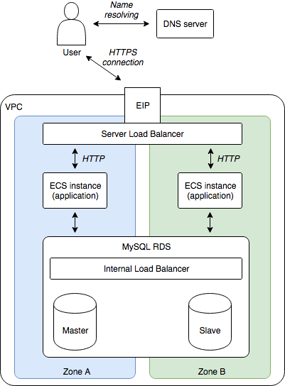

As you can see we are duplicating each cloud resource into two availability zones (zone A and zone B): since these zones
are independents, a problem in one zone (e.g. machine/network failure) can be compensated via the other one.

Our application will run on two ECS instances. The traffic from internet is redirected thanks to a
[server load balancer](https://en.wikipedia.org/wiki/Load_balancing_(computing)) installed in front of them.

For the data storage layer we use [ApsaraDB RDS for MySQL](https://www.alibabacloud.com/product/apsaradb-for-rds-mysql),
a managed database service that handles server installation, maintenance, automatic backup, ...etc.

Note: with this diagram you can understand why a stateless application is advantageous: the only place where data is
shared is the database, we don't need to establish a direct link between the application servers. Moreover, if two users
are modifying the same data (e.g. by deleting the same item), the database will handle transactions for us, keep
the data consistent and reject one user modification.

## GitLab flow
Until now our development workflow was simple: modify some source code, commit it into the master branch and push
it to GitLab. This is fine at the beginning (single developer, no deployment), but we need to enrich this process
in order to properly manage our releases. For that [GitLab Flow](https://docs.gitlab.com/ee/workflow/gitlab_flow.html)
is a good solution: simple but rich enough for our needs.

The following diagram illustrates how we will use GitLab Flow in this tutorial:

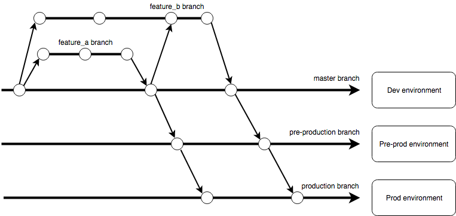

The long horizontal arrows corresponds to long-lived branches (master, pre-production and production), a circle
represents a commit, and the timeline goes from the left to the right (a commit on the left is older than a commit on
the right).

The two short horizontal branches on the top correspond to short-lived branches: they are used to implement new features
or bug fixes. In this example, two developers work on two features in parallel ("feature_a" and "feature_b"). When
the "feature_a" is finished, the developer emits
a [merge request](https://docs.gitlab.com/ee/user/project/merge_requests/) from his branch to the master. This is
usually a good time for [code review](https://en.wikipedia.org/wiki/Code_review): another developer can check the
modifications and accept / reject the request. If accepted, the feature branch is merged into the master and closed.
In this example, the developer on the "feature_b" merges the new commit from the master branch corresponding to the
"feature_a" to his own branch. He later can emit a merge request to merge his branch to the master.

On the right, the blocks correspond to environments (one environment contains an EIP, a server load balancer, two
ECS instances and a RDS instance). Everytime a commit is done in the master branch, the CI / CD pipeline compiles,
tests, analyzes the code, and build / update cloud resources with our application. The process is the
same with the pre-production and production branches: it allows us to manage releases by emitting a merge request
from the master branch to the pre-production one and from the pre-production one to the production one.

## Infrastructure-as-code with Terraform
The problem with creating cloud resources with the web console is that it is quite tedious and error prone, especially
when this process must be repeated for 3 environments. An elegant solution is to
use [Terraform](https://www.terraform.io/): we write a script that describes our architecture (in
the [HCL language](https://www.terraform.io/docs/configuration/syntax.html)) and we ask Terraform to create / update our
cloud environment accordingly.

Let's discover Terraform before using it for our project. Please
[install it](https://www.terraform.io/intro/getting-started/install.html) on your computer (download the binary package
and add it to your [PATH variable](https://en.wikipedia.org/wiki/PATH_(variable))), then open a terminal and run:
```bash
# Create a folder for our test
mkdir -p ~/projects/terraform-test

cd ~/projects/terraform-test

# Create a sample script
nano test.tf
```
Copy the following content into your script:
```hcl-terraform
// Use Alibaba Cloud provider (https://github.com/terraform-providers/terraform-provider-alicloud)
provider "alicloud" {}

// Sample VPC
resource "alicloud_vpc" "sample_vpc" {
  name = "sample-vpc"
  cidr_block = "192.168.0.0/16"
}
```
Save and quit with CTRL+X, and execute:
```bash
# Download the latest stable version of the Alibaba Cloud provider
terraform init

# Configure the Alibaba Cloud provider
export ALICLOUD_ACCESS_KEY="your-accesskey-id"
export ALICLOUD_SECRET_KEY="your-accesskey-secret"
export ALICLOUD_REGION="your-region-id"

# Create the resources in the cloud
terraform apply
```
Note: the values to set in `ALICLOUD_ACCESS_KEY` and `ALICLOUD_SECRET_KEY` are your access key ID and secret, you
have already used them when you configured automatic backup for GitLab in the
[part 1 of this tutorial](part_01_gitlab_installation_and_configuration.md)). For `ALICLOUD_REGION`, the available
values can be found [in this page](https://www.alibabacloud.com/help/doc-detail/40654.htm).

The last command should print something like this:
```
An execution plan has been generated and is shown below.
Resource actions are indicated with the following symbols:
  + create

Terraform will perform the following actions:

  + alicloud_vpc.sample_vpc
      id:              <computed>
      cidr_block:      "192.168.0.0/16"
      name:            "sample-vpc"
      route_table_id:  <computed>
      router_id:       <computed>
      router_table_id: <computed>


Plan: 1 to add, 0 to change, 0 to destroy.

Do you want to perform these actions?
  Terraform will perform the actions described above.
  Only 'yes' will be accepted to approve.

  Enter a value: 
```
Terraform displays its plan of its modifications. As you can see only one resource will be added (the VPC). Enter
the value `yes` and press ENTER. The result should be something like this:
```
alicloud_vpc.sample_vpc: Creating...
  cidr_block:      "" => "192.168.0.0/16"
  name:            "" => "sample-vpc"
  route_table_id:  "" => "<computed>"
  router_id:       "" => "<computed>"
  router_table_id: "" => "<computed>"
alicloud_vpc.sample_vpc: Creation complete after 7s (ID: vpc-t4nhi7y0wpzkfr2auxc0p)

Apply complete! Resources: 1 added, 0 changed, 0 destroyed.
```

Let's check the result:
* Go to the [VPC console](https://vpc.console.aliyun.com/);
* Select your region on top of the page;
* Check the VPC table, you should be able to see "sample-vpc":

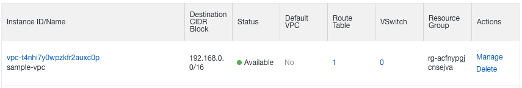

A very interesting feature of Terraform is its idempotence. We can check that with the following command:
```bash
# Run Terraform again
terraform apply
```
Terraform interacts with the [Alibaba Cloud APIs](https://api.aliyun.com/) to check what are the existing resources,
then compares them to our script and decides that no modification is needed. You can see it in the console logs:
```
alicloud_vpc.sample_vpc: Refreshing state... (ID: vpc-t4nhi7y0wpzkfr2auxc0p)

Apply complete! Resources: 0 added, 0 changed, 0 destroyed.
```

Behind the scene Terraform creates two files "terraform.tfstate" and "terraform.tfstate.backup". The first one contains
all the resources information that have been created. These files are important and should usually be shared among
the team (on an OSS bucket for example).

Another interesting feature is that Terraform is able to update an existing architecture. Let's check it by ourselves:
```bash
# Open our sample script
nano test.tf
```
Add the following "vswitch" block in order to obtain the following result:
```hcl-terraform
// Use Alibaba Cloud provider (https://github.com/terraform-providers/terraform-provider-alicloud)
provider "alicloud" {}

// Sample VPC
resource "alicloud_vpc" "sample_vpc" {
  name = "sample-vpc"
  cidr_block = "192.168.0.0/16"
}

// Query Alibaba Cloud about the availability zones in the current region
data "alicloud_zones" "az" {
  network_type = "Vpc"
}

// Sample VSwitch
resource "alicloud_vswitch" "sample_vswitch" {
  name = "sample-vswitch"
  availability_zone = "${data.alicloud_zones.az.zones.0.id}"
  cidr_block = "192.168.1.0/24"
  vpc_id = "${alicloud_vpc.sample_vpc.id}"
}
```
As you can see, we can use placeholders like `${a.variable}` to refer the resources with each others. We can also use
a [data source](https://www.terraform.io/docs/configuration/data-sources.html) to query some information from
Alibaba Cloud.

Save and quit with CTRL+X, and run the following command:
```bash
# Update our cloud resources
terraform apply
```
This time Terraform "understands" that it doesn't need to re-create the VPC, only the VSwitch:
```
alicloud_vpc.sample_vpc: Refreshing state... (ID: vpc-t4nhi7y0wpzkfr2auxc0p)
data.alicloud_zones.az: Refreshing state...

An execution plan has been generated and is shown below.
Resource actions are indicated with the following symbols:
  + create

Terraform will perform the following actions:

  + alicloud_vswitch.sample_vswitch
      id:                <computed>
      availability_zone: "ap-southeast-1a"
      cidr_block:        "192.168.1.0/24"
      name:              "sample-vswitch"
      vpc_id:            "vpc-t4nhi7y0wpzkfr2auxc0p"


Plan: 1 to add, 0 to change, 0 to destroy.

Do you want to perform these actions?
  Terraform will perform the actions described above.
  Only 'yes' will be accepted to approve.

  Enter a value: 
```
Enter `yes` and press ENTER. The VSwitch should be created in few seconds:
```
alicloud_vswitch.sample_vswitch: Creating...
  availability_zone: "" => "ap-southeast-1a"
  cidr_block:        "" => "192.168.1.0/24"
  name:              "" => "sample-vswitch"
  vpc_id:            "" => "vpc-t4nhi7y0wpzkfr2auxc0p"
alicloud_vswitch.sample_vswitch: Creation complete after 7s (ID: vsw-t4nvtqld0ktk4kddxq709)

Apply complete! Resources: 1 added, 0 changed, 0 destroyed.
```

Check it worked with the web console:
* Refresh your web browser tab with the [VPC console](https://vpc.console.aliyun.com/);
* If necessary, select your region on top of the page;
* Click on the ID of your VPC "sample-vpc";
* Scroll down and click on the '1' next to "VSwitch";

You should be able to see your sample VSwitch:

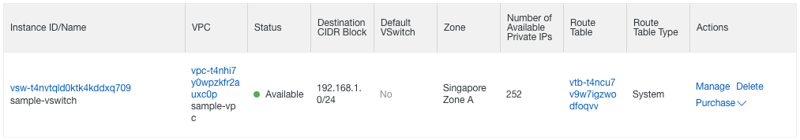

Congratulation if you managed to get this far! For more information about available resources and datasources, please
read the [Alicloud provider documentation](https://www.terraform.io/docs/providers/alicloud/index.html).

Let's release our cloud resources. With your terminal execute the following command:
```bash
# Release our cloud resources
terraform destroy
```
Terraform print its plan as usual:
```
alicloud_vpc.sample_vpc: Refreshing state... (ID: vpc-t4nhi7y0wpzkfr2auxc0p)
data.alicloud_zones.az: Refreshing state...
alicloud_vswitch.sample_vswitch: Refreshing state... (ID: vsw-t4nvtqld0ktk4kddxq709)

An execution plan has been generated and is shown below.
Resource actions are indicated with the following symbols:
  - destroy

Terraform will perform the following actions:

  - alicloud_vpc.sample_vpc

  - alicloud_vswitch.sample_vswitch


Plan: 0 to add, 0 to change, 2 to destroy.

Do you really want to destroy?
  Terraform will destroy all your managed infrastructure, as shown above.
  There is no undo. Only 'yes' will be accepted to confirm.

  Enter a value: 
```
Enter `yes` and press ENTER. The resources should be released in few seconds:
```
alicloud_vswitch.sample_vswitch: Destroying... (ID: vsw-t4nvtqld0ktk4kddxq709)
alicloud_vswitch.sample_vswitch: Destruction complete after 1s
alicloud_vpc.sample_vpc: Destroying... (ID: vpc-t4nhi7y0wpzkfr2auxc0p)
alicloud_vpc.sample_vpc: Destruction complete after 3s

Destroy complete! Resources: 2 destroyed.
```

As you can see, the fact that Terraform checks existing cloud resources and then compares them to our scripts allows us
to create a new pipeline stage to run "terraform apply": at the first execution cloud resources will be created, at the
next executions Terraform will update them if needed.

We will commit the Terraform scripts in the same repository as the application source code. Like this, modifications
in the application code will always be in sync with the infrastructure code.

However this approach has one drawback: like scripts that modifies database schemas, we need to make sure we don't
break things and stay [backward compatible](https://en.wikipedia.org/wiki/Backward_compatibility), in case we need to
rollback our application to an old version.

## VM image generation with Packer
[Packer](https://www.packer.io) is a tool made by the [same company](https://www.hashicorp.com/) as the one who
develops Terraform. It allows us to create [an image](https://www.alibabacloud.com/help/doc-detail/25460.htm)
containing our already-configured application. The goal is to be able to create an ECS instance with an image where
everything is already configured (no need to login to the machine via SSH and install or execute applications). This
solution is particularly handy for [auto scaling](https://www.alibabacloud.com/product/auto-scaling).

Let's discover Packer before using it for our project. Please
[install it](https://www.packer.io/intro/getting-started/install.html) on your computer (download the binary package
and add it to your [PATH variable](https://en.wikipedia.org/wiki/PATH_(variable))), then open a terminal and run:
```bash
# Create a folder for our test
mkdir -p ~/projects/packer-test

cd ~/projects/packer-test

# Create a sample configuration
nano test.json
```
Copy the following content into your script:
```json
{
  "variables": {
    "access_key": "{{env `ALICLOUD_ACCESS_KEY`}}",
    "secret_key": "{{env `ALICLOUD_SECRET_KEY`}}",
    "region_id": "{{env `ALICLOUD_REGION`}}",
    "source_image": "{{env `SOURCE_IMAGE`}}",
    "instance_type": "{{env `INSTANCE_TYPE`}}"
  },
  "builders": [
    {
      "type": "alicloud-ecs",
      "access_key": "{{user `access_key`}}",
      "secret_key": "{{user `secret_key`}}",
      "region": "{{user `region_id`}}",
      "image_name": "sample-image",
      "image_description": "Sample image for testing Packer.",
      "image_version": "1.0",
      "source_image": "{{user `source_image`}}",
      "ssh_username": "root",
      "instance_type": "{{user `instance_type`}}",
      "io_optimized": "true",
      "internet_charge_type": "PayByTraffic",
      "image_force_delete": "true"
    }
  ],
  "provisioners": [
    {
      "type": "shell",
      "inline": [
        "export DEBIAN_FRONTEND=noninteractive",
        "apt-get -y update",
        "apt-get -y upgrade",
        "apt-get -y install nginx",
        "systemctl start nginx",
        "systemctl enable nginx",
        "sleep 10",
        "curl http://localhost"
      ],
      "pause_before": "30s"
    }
  ]
}
```
Save and quit with CTRL+X.

Before we can run this script we need to know the exact source image and instance type available in your region. Open
a new web browser tab and follow these instructions:
* Go to [OpenAPI Explorer](https://api.aliyun.com/#product=Ecs&api=DescribeInstanceTypes);
* If it is not already the case, select the "ECS" product on the left menu, then the "DescribeInstanceTypes"
  service on the left sub-menu;
* Enter your [region ID](https://www.alibabacloud.com/help/doc-detail/40654.htm) in the "RegionId"
  field (e.g. ap-southeast-1);
* Click on the "Submit Request" button at the bottom;
* If needed, this website will ask you to login with your Alibaba Cloud account;
* The "Response Result" panel on the right should contain a tree of instance types; expand each instance type until you
  find one with "MemorySize" equals to 1 or more, then save the value of its "InstanceTypeId" (e.g. ecs.n1.small);
* Select the ["DescribeImages" service](https://api.aliyun.com/#product=Ecs&api=DescribeImages) on the left sub-menu;
* Enter your region ID in the "RegionId" field (e.g. ap-southeast-1);
* Enter "ubuntu\*64\*" in the "ImageName" field;
* Enter "system" in the "ImageOwnerAlias" field;
* Click on the "Submit Request" button at the bottom;
* The "Response Result" panel should contain a tree of available images; expand each image and save the value of the
  most recent "ImageId" (e.g. ubuntu_16_0402_64_20G_alibase_20180409.vhd);

Now that we have the "InstanceTypeId" and "ImageId", go back to your terminal and type:
```bash
# Configure the Alibaba Cloud provider
export ALICLOUD_ACCESS_KEY="your-accesskey-id"
export ALICLOUD_SECRET_KEY="your-accesskey-secret"
export ALICLOUD_REGION="your-region-id"
export SOURCE_IMAGE="your-ImageId"
export INSTANCE_TYPE="your-InstanceTypeId"

# Create the image in the cloud
packer build test.json
```
Packer should output something like this:
```
alicloud-ecs output will be in this color.

==> alicloud-ecs: Force delete flag found, skipping prevalidating image name.
    alicloud-ecs: Found image ID: ubuntu_16_0402_64_20G_alibase_20180409.vhd
==> alicloud-ecs: Creating temporary keypair: packer_5bea5aa2-e524-1af8-80d1-1db78347ed15
==> alicloud-ecs: Creating vpc
==> alicloud-ecs: Creating vswitch...
==> alicloud-ecs: Creating security groups...
==> alicloud-ecs: Creating instance.
==> alicloud-ecs: Allocating eip
==> alicloud-ecs: Allocated eip 47.74.178.35
    alicloud-ecs: Attach keypair packer_5bea5aa2-e524-1af8-80d1-1db78347ed15 to instance: i-t4nhcv8qx069trkfgye6
==> alicloud-ecs: Starting instance: i-t4nhcv8qx069trkfgye6
==> alicloud-ecs: Using ssh communicator to connect: 47.74.178.35
==> alicloud-ecs: Waiting for SSH to become available...
==> alicloud-ecs: Connected to SSH!
==> alicloud-ecs: Pausing 30s before the next provisioner...
==> alicloud-ecs: Provisioning with shell script: /var/folders/v1/jvjz3zmn64q0j34yc9m9n4w00000gn/T/packer-shell047404213
    alicloud-ecs: Get:1 http://mirrors.cloud.aliyuncs.com/ubuntu xenial InRelease [247 kB]
    alicloud-ecs: Get:2 http://mirrors.cloud.aliyuncs.com/ubuntu xenial-updates InRelease [109 kB]
[...]
    alicloud-ecs: 142 upgraded, 0 newly installed, 0 to remove and 4 not upgraded.
[...]
    alicloud-ecs: The following NEW packages will be installed:
    alicloud-ecs:   fontconfig-config fonts-dejavu-core libfontconfig1 libgd3 libvpx3 libxpm4
    alicloud-ecs:   libxslt1.1 nginx nginx-common nginx-core
    alicloud-ecs: 0 upgraded, 10 newly installed, 0 to remove and 4 not upgraded.
[...]
    alicloud-ecs: Executing /lib/systemd/systemd-sysv-install enable nginx
    alicloud-ecs:   % Total    % Received % Xferd  Average Speed   Time    Time     Time  Current
    alicloud-ecs:                                  Dload  Upload   Total   Spent    Left  Speed
    alicloud-ecs: 100   612  100   612    0     0  81415      0 --:--:-- --:--:-- --:--:-- 87428
    alicloud-ecs: <!DOCTYPE html>
    alicloud-ecs: <html>
    alicloud-ecs: <head>
    alicloud-ecs: <title>Welcome to nginx!</title>
    alicloud-ecs: <style>
    alicloud-ecs:     body {
    alicloud-ecs:         width: 35em;
    alicloud-ecs:         margin: 0 auto;
    alicloud-ecs:         font-family: Tahoma, Verdana, Arial, sans-serif;
    alicloud-ecs:     }
    alicloud-ecs: </style>
    alicloud-ecs: </head>
    alicloud-ecs: <body>
    alicloud-ecs: <h1>Welcome to nginx!</h1>
    alicloud-ecs: <p>If you see this page, the nginx web server is successfully installed and
    alicloud-ecs: working. Further configuration is required.</p>
    alicloud-ecs:
    alicloud-ecs: <p>For online documentation and support please refer to
    alicloud-ecs: <a href="http://nginx.org/">nginx.org</a>.<br/>
    alicloud-ecs: Commercial support is available at
    alicloud-ecs: <a href="http://nginx.com/">nginx.com</a>.</p>
    alicloud-ecs:
    alicloud-ecs: <p><em>Thank you for using nginx.</em></p>
    alicloud-ecs: </body>
    alicloud-ecs: </html>
==> alicloud-ecs: Stopping instance: i-t4nhcv8qx069trkfgye6
==> alicloud-ecs: Waiting instance stopped: i-t4nhcv8qx069trkfgye6
==> alicloud-ecs: Creating image: sample-image
    alicloud-ecs: Detach keypair packer_5bea5aa2-e524-1af8-80d1-1db78347ed15 from instance: i-t4nhcv8qx069trkfgye6
==> alicloud-ecs: Cleaning up 'EIP'
==> alicloud-ecs: Cleaning up 'instance'
==> alicloud-ecs: Cleaning up 'security group'
==> alicloud-ecs: Cleaning up 'vSwitch'
==> alicloud-ecs: Cleaning up 'VPC'
==> alicloud-ecs: Deleting temporary keypair...
Build 'alicloud-ecs' finished.

==> Builds finished. The artifacts of successful builds are:
--> alicloud-ecs: Alicloud images were created:

ap-southeast-1: m-t4n938t1plplyl7akeor
```
The last line contains the ID of the image we have just created (here "m-t4n938t1plplyl7akeor"). Before we go
further, let's study what Packer did with our script:

0. Create an ECS instance and necessary cloud resources (keypair, vpc, vswitch, security group, eip);
1. Connect to the ECS instance via SSH;
2. Wait for 30 seconds (to make sure the VM is completely started);
3. Update the machine (`apt-get -y update` and `apt-get -y upgrade`);
4. Install [Nginx](https://nginx.org/en/) (`apt-get -y install nginx`);
5. Start Nginx and configure
   [SystemD](https://www.freedesktop.org/software/systemd/man/systemctl.html#enable%20UNIT%E2%80%A6) to start it when
   the machine boots (`systemctl start nginx` and `systemctl enable nginx`);
6. Wait for 10 seconds (to make sure Nginx is started);
7. Test Nginx by sending a HTTP request to "http://localhost" (`curl http://localhost`);
8. Stop the ECS instance;
9. Create a [snapshot](https://www.alibabacloud.com/help/doc-detail/25455.htm) of the system disk and convert it to
   an image;
10. Release all cloud resources (eip, ecs, security group, vswitch, vpc, keypair).

You can check the newly created image via the web console:
* Open the [ECS console](https://ecs.console.aliyun.com/);
* Select "Images" in the left menu;
* If necessary, select your region on the top of the page;
* You should be able to see your new image:

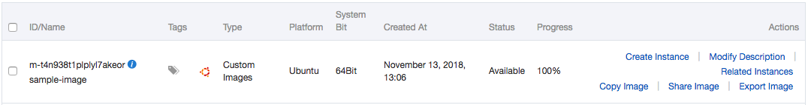

* If you want, you can test this image by clicking on the "Create Instance" link on the left;
* When you are done, you can delete this image by selecting its checkbox and by clicking on the "Delete" button at the
  bottom of the page;

## Health check web service
Before we start with infrastructure scripts, we first need to modify the application in order to add a
"/health" REST service that just responds "OK". It will be useful for the
[health check](https://www.alibabacloud.com/help/faq-detail/39455.htm) process performed by the
[server load balancer](https://www.alibabacloud.com/product/server-load-balancer).
Open a terminal and execute:
```bash
# Go to the project folder
cd ~/projects/todolist

# Create a REST controller
nano src/main/java/com/alibaba/intl/todolist/controllers/HealthController.java
```
Copy the following content into the new file:
```java
package com.alibaba.intl.todolist.controllers;

import org.springframework.web.bind.annotation.RequestMapping;
import org.springframework.web.bind.annotation.RestController;

/**
 * Inform other systems that the application is healthy.
 *
 * @author Alibaba Cloud
 */
@RestController
public class HealthController {

    @RequestMapping("/health")
    public String health() {
        return "OK";
    }
}
```
Save and quit by pressing CTRL+X, then create another file:
```bash
# Create the corresponding test
nano src/test/java/com/alibaba/intl/todolist/controllers/HealthControllerTest.java
```
Copy the following content into the new file:
```java
package com.alibaba.intl.todolist.controllers;

import com.alibaba.intl.todolist.AbstractTest;
import org.junit.Before;
import org.junit.Test;
import org.springframework.beans.factory.annotation.Autowired;
import org.springframework.test.web.servlet.MockMvc;
import org.springframework.test.web.servlet.setup.MockMvcBuilders;
import org.springframework.web.context.WebApplicationContext;

import static org.junit.Assert.assertEquals;
import static org.springframework.test.web.servlet.request.MockMvcRequestBuilders.get;
import static org.springframework.test.web.servlet.result.MockMvcResultMatchers.status;

/**
 * Test the REST API behind "/health".
 *
 * @author Alibaba Cloud
 */
public class HealthControllerTest extends AbstractTest {

    @Autowired
    private WebApplicationContext wac;

    private MockMvc mockMvc;

    @Before
    public void setup() {
        mockMvc = MockMvcBuilders.webAppContextSetup(wac).build();
    }

    @Test
    public void testHealth() throws Exception {
        String response = mockMvc.perform(get("/health"))
                .andExpect(status().isOk())
                .andReturn().getResponse().getContentAsString();
        assertEquals("OK", response);
    }
}
```
Save and quit by pressing CTRL+X, then continue:
```bash
# Compile and run the tests
mvn clean package
# Note: the resulting logs should contain "BUILD SUCCESS".

# Check the files to commit
git status

# Add the files
git add src/main/java/com/alibaba/intl/todolist/controllers/HealthController.java
git add src/test/java/com/alibaba/intl/todolist/controllers/HealthControllerTest.java

# Commit the files and write a comment
git commit -m "Add a /health REST controller."

# Push the commit to the GitLab server
git push origin master
```
Check that everything worked in your GitLab pipeline (the URL should be something like
https://gitlab.my-sample-domain.xyz/marcplouhinec/todolist/pipelines) and in your SonarQube dashboard (the URL should
be something like https://sonar.my-sample-domain.xyz/dashboard?id=com.alibaba.intl%3Atodo-list%3Amaster).

Note: the code modifications above are included in the "sample-app/version3" folder.

## Application infrastructure
In this section we will create Packer and Terraform scripts that will create the following cloud resources for
one environment:
* 1 [VPC](https://www.alibabacloud.com/product/vpc)
* 2 [VSwitches](https://www.alibabacloud.com/help/doc-detail/65387.htm) (one per availability zone)
* 1 [Security group](https://www.alibabacloud.com/help/doc-detail/25387.htm)
* 2 [ECS instances](https://www.alibabacloud.com/product/ecs) (one per availability zone)
* 1 [Multi-zone MySQL RDS](https://www.alibabacloud.com/product/apsaradb-for-rds-mysql)
* 1 [SLB instance](https://www.alibabacloud.com/product/server-load-balancer)
* 1 [EIP](https://www.alibabacloud.com/product/eip)

We will organize the scripts in 3 main groups:
* The basis group that setups VPC, VSwitches, Security group, EIP, SLB instance and domain records.
* The application group that setups RDS, VM image and ECS instances.
* The [Let's Encrypt](https://letsencrypt.org/) group responsible for obtaining and updating our
  [SSL certificate](https://www.verisign.com/en_US/website-presence/website-optimization/ssl-certificates/index.xhtml).

Note: we will deal with the third group in the next part of this tutorial.
 
In addition, we will commit our infrastructure scripts alongside the application source code. The logic behind this
design choice is to make sure both code bases are synchronized.

Because the scripts are quite large, we will copy them from the "sample-app/version3" folder of this tutorial. Open a
terminal and execute the following commands:
```bash
# Go to the project folder
cd ~/projects/todolist

# Copy the scripts from this tutorials (adapt the path to where you copied this tutorial)
cp -R path/to/sample-app/version3/infrastructure .

# Check the content of this folder
ls -l infrastructure
ls -l infrastructure/10_webapp
```

As you can see the scripts are organized like this:
* 05_vpc_slb_eip_domain - "basis group" (setup VPC, VSwitches, ...)
* 06_domain_step_2 - workaround for a bug in the `alicloud_dns_record` Terraform resource; it also
  belongs to the "basis group"
* 10_webapp - folder that contains the "application group"
  * 05_rds - setup the MySQL database
  * 10_image - build the VM image configured to connect to the MySQL database
  * 15_ecs - setup the ECS instances with the VM image

Note: the prefix "xx_" in the folder names is just a way to have them sorted when displayed with the `ls` command.

Let's have a look at the files in the "05_vpc_slb_eip_domain" folder. The "variables.tf" file contains 3 entries:
```hcl-terraform
variable "env" {
  description = "Environment (dev, pre-prod, prod)"
  default = "dev"
}

variable "domain_name" {
  description = "Domain name of the project."
  default = "my-sample-domain.xyz"
}

variable "sub_domain_name" {
  description = "Sub-domain name corresponding to the environment (dev, pre-prod, www)."
  default = "dev"
}
```
The description of each variable should be self-explanatory. We will pass the variable values when invoking
the `terraform apply` command.

Let's check the "main.tf" file. The first part declares a VPC, one VSwitch per availability zone, and a security
group that accepts incoming traffic from the port 8080 (the default port of our application):
```hcl-terraform
// ...
resource "alicloud_vpc" "app_vpc" { /* ... */ }

// One VSwitch per availability zone
resource "alicloud_vswitch" "app_vswitch_zone_0" {
  availability_zone = "... Zone A ..."
  vpc_id = "${alicloud_vpc.app_vpc.id}"
  // ...
}
resource "alicloud_vswitch" "app_vswitch_zone_1" {
  availability_zone = "... Zone B ..."
  vpc_id = "${alicloud_vpc.app_vpc.id}"
  // ...
}

// Security group and rule
resource "alicloud_security_group" "app_security_group" {
  vpc_id = "${alicloud_vpc.app_vpc.id}"
  // ...
}
resource "alicloud_security_group_rule" "accept_8080_rule" {
  type = "ingress"
  ip_protocol = "tcp"
  nic_type = "intranet"
  policy = "accept"
  port_range = "8080/8080"
  priority = 1
  security_group_id = "${alicloud_security_group.app_security_group.id}"
  cidr_ip = "0.0.0.0/0"
}
```
The next part declares the server load balancer:
```hcl-terraform
resource "alicloud_slb" "app_slb" {
  // ...
  vswitch_id = "${alicloud_vswitch.app_vswitch_zone_0.id}"
}

resource "alicloud_slb_listener" "app_slb_listener_http" {
  load_balancer_id = "${alicloud_slb.app_slb.id}"

  backend_port = 8080
  frontend_port = 80
  bandwidth = -1
  protocol = "http"

  health_check = "on"
  health_check_type = "http"
  health_check_connect_port = 8080
  health_check_uri = "/health"
  health_check_http_code = "http_2xx"
}
```
Note 0: the [SLB architecture](https://www.alibabacloud.com/help/doc-detail/27544.htm) is composed of a master and a
slave. The `vswitch_id` corresponds to the availability zone where the master is located, the slave is automatically
created in another zone. If the master fails, HTTP requests are transferred to the slave (within a delay of 30 sec).
For more information about failover scenarios, please read the
[official documentation](https://www.alibabacloud.com/help/doc-detail/27543.htm).

Note 1: as you can see the port redirection (80 to 8080) is defined in the SLB listener. You can also see how the SLB
uses our [Health check web service](#health-check-web-service) to determine whether a particular ECS instance is
behaving normally or not.

The last part of the "main.tf" file declares an EIP, attaches it to our SLB and registers a DNS entry:
```hcl-terraform
resource "alicloud_eip" "app_eip" { /* ... */ }

resource "alicloud_eip_association" "app_eip_association" {
  allocation_id = "${alicloud_eip.app_eip.id}"
  instance_id = "${alicloud_slb.app_slb.id}"
}

resource "alicloud_dns_record" "app_record_oversea" {
  name = "${var.domain_name}"
  type = "A"
  host_record = "${var.sub_domain_name}"
  routing = "oversea"
  value = "${alicloud_eip.app_eip.ip_address}"
  ttl = 600
}
```

There is currently a bug in the `alicloud_dns_record` resource. This is the reason why we will have to run the
`terraform apply` command twice in the folder "05_vpc_slb_eip_domain". This is also the reason why we had to create
"06_domain_step_2/main.tf":
```hcl-terraform
data "alicloud_dns_records" "app_record_overseas" {
  domain_name = "${var.domain_name}"
  type = "A"
  host_record_regex = "${var.sub_domain_name}"
  line = "oversea"
}

resource "alicloud_dns_record" "app_record_default" {
  name = "${var.domain_name}"
  type = "A"
  host_record = "${var.sub_domain_name}"
  routing = "default"
  value = "${data.alicloud_dns_records.app_record_overseas.records.0.value}"
  ttl = 600
}
```

Note: this workaround is useful if you want to make your web application available in Mainland China
(`routing = "default"`) and outside (`routing = "oversea"`).

Let's build the "basis group" of our infrastructure. Open your terminal and run:
```bash
# Go to the 05_vpc_slb_eip_domain folder
cd ~/projects/todolist/infrastructure/05_vpc_slb_eip_domain

# Configure Terraform
export ALICLOUD_ACCESS_KEY="your-accesskey-id"
export ALICLOUD_SECRET_KEY="your-accesskey-secret"
export ALICLOUD_REGION="your-region-id"

# Initialize Terraform (download the latest version of the alicloud provider)
terraform init

# Create our infrastructure (note: adapt the domain_name according to your setup)
terraform apply  \
    -var 'env=dev' \
    -var 'domain_name=my-sample-domain.xyz' \
    -var 'sub_domain_name=dev'

# Re-run the last command because of the bug in "alicloud_dns_record"
terraform apply  \
    -var 'env=dev' \
    -var 'domain_name=my-sample-domain.xyz' \
    -var 'sub_domain_name=dev'

# Go to the 06_domain_step_2 folder
cd ../06_domain_step_2

# Initialize Terraform
terraform init

# Finish the creation of the "basis group"
terraform apply  \
    -var 'env=dev' \
    -var 'domain_name=my-sample-domain.xyz' \
    -var 'sub_domain_name=dev'
```

You can check that your cloud resources have been successfully created by browsing the
[VPC console](https://vpc.console.aliyun.com/) and by following links to related resources.

You can also check your new domain:
```bash
# Note: use your top domain name
nslookup dev.my-sample-domain.xyz
```
It should output something like this:
```
Server:		30.14.129.245
Address:	30.14.129.245#53

Non-authoritative answer:
Name:	dev.my-sample-domain.xyz
Address: 161.117.2.245
```
The last IP address should be your EIP.

Let's study the "application group", open "10_webapp/05_rds/variables.tf":
```hcl-terraform
variable "env" {
  description = "Environment (dev, pre-prod, prod)"
  default = "dev"
}

variable "db_account_password" {
  description = "MySQL database user password."
  default = "P@ssw0rd"
}
```
Note: when creating the database, we set the database name to "todolist" and the user name to "todolist" as well.
We only let the user password to be configurable ("db_account_password" variable).

Open "10_webapp/05_rds/main.tf":
```hcl-terraform
// ...

resource "alicloud_db_instance" "app_rds" {
  // ...
  instance_type = "rds.mysql.t1.small"
  zone_id = "... Zone A + B ..."
  vswitch_id = "... ID of the VSwitch in zone A ..."
  security_ips = [
    "... VPC IP address range ..."
  ]
}

resource "alicloud_db_database" "app_rds_db" {
  instance_id = "${alicloud_db_instance.app_rds.id}"
  name = "todolist"
  character_set = "utf8"
}

resource "alicloud_db_account" "app_rds_db_account" {
  instance_id = "${alicloud_db_instance.app_rds.id}"
  name = "todolist"
  password = "${var.db_account_password}"
  type = "Normal"
}

resource "alicloud_db_account_privilege" "app_rds_db_account_privilege" {
  instance_id = "${alicloud_db_instance.app_rds.id}"
  account_name = "${alicloud_db_account.app_rds_db_account.name}"
  privilege = "ReadWrite"
  db_names = [
    "${alicloud_db_database.app_rds_db.name}"
  ]
}
```
Note: Like with the SLB, the RDS database uses a master / slave architecture. The `zone_id` is set via a datasource
(which provides a value like "ap-southeast-1MAZ1(a,b)"). The master is created in the availability zone of the 
given `vswitch_id`.

Let's create and configure the database. Execute the following instructions in your terminal:
```bash
# Go to the 10_webapp/05_rds folder
cd ../10_webapp/05_rds

# Initialize Terraform
terraform init

# Create the database
terraform apply  \
    -var 'env=dev' \
    -var 'db_account_password=YourD@tabasePassw0rd'

# Display the DB connection string
export RDS_CONNECTION_STRING=$(terraform output app_rds_connection_string)
echo $RDS_CONNECTION_STRING
```
The last command should print something like "rm-gs522kuv3u5m91256.mysql.singapore.rds.aliyuncs.com". This value comes
from the "output.tf" file:
```hcl-terraform
output "app_rds_connection_string" {
  value = "${alicloud_db_instance.app_rds.connection_string}"
}
```
This is the hostname we will use in our ECS instances to connect them to the database.

The next sub-group "10_webapp/10_image" is a bit different: the Terraform scripts are only used to obtain information
from Alibaba Cloud (the image ID of Ubuntu Linux and an ECS instance type). The "main.tf" file only contains
datasources:
```hcl-terraform
data "alicloud_images" "ubuntu_images" {
  owners = "system"
  name_regex = "ubuntu_16[a-zA-Z0-9_]+64"
  most_recent = true
}

data "alicloud_instance_types" "instance_types_zone_0" {
  cpu_core_count = 1
  memory_size = 2
  // ...
}
```
The "output.tf" file allows us to extract information from these datasources:
```hcl-terraform
output "image_id" {
  value = "${data.alicloud_images.ubuntu_images.images.0.id}"
}

output "instance_type" {
  value = "${data.alicloud_instance_types.instance_types_zone_0.instance_types.0.id}"
}
```

The "app_image.json" file is a Packer script:
```json
{
  "variables": {
    "access_key": "{{env `ALICLOUD_ACCESS_KEY`}}",
    "secret_key": "{{env `ALICLOUD_SECRET_KEY`}}",
    "region_id": "{{env `ALICLOUD_REGION`}}",
    "source_image": "{{env `SOURCE_IMAGE`}}",
    "image_version": "{{env `IMAGE_VERSION`}}",
    "instance_type": "{{env `INSTANCE_TYPE`}}",
    "application_path": "{{env `APPLICATION_PATH`}}",
    "properties_path": "{{env `PROPERTIES_PATH`}}",
    "environment": "{{env `ENVIRONMENT`}}",
    "rds_connection_string": "{{env `RDS_CONNECTION_STRING`}}",
    "rds_database": "{{env `RDS_DATABASE`}}",
    "rds_account": "{{env `RDS_ACCOUNT`}}",
    "rds_password": "{{env `RDS_PASSWORD`}}"
  },
  "builders": [
    {
      "type": "alicloud-ecs",
      "access_key": "{{user `access_key`}}",
      "secret_key": "{{user `secret_key`}}",
      "region": "{{user `region_id`}}",
      "image_name": "sample-app-image-{{user `environment`}}-{{user `image_version`}}",
      "image_description": "To-Do list web application ({{user `environment`}} environment).",
      "image_version": "{{user `image_version`}}",
      "source_image": "{{user `source_image`}}",
      "ssh_username": "root",
      "instance_type": "{{user `instance_type`}}",
      "io_optimized": "true",
      "internet_charge_type": "PayByTraffic",
      "image_force_delete": "true"
    }
  ],
  "provisioners": [
    {
      "type": "shell",
      "inline": [
        "export DEBIAN_FRONTEND=noninteractive",
        "apt-get -y update",
        "apt-get -y upgrade",
        "apt-get -y install default-jdk",
        "mkdir -p /opt/todo-list",
        "mkdir -p /etc/todo-list"
      ],
      "pause_before": "30s"
    },
    {
      "type": "file",
      "source": "{{user `application_path`}}",
      "destination": "/opt/todo-list/todo-list.jar"
    },
    {
      "type": "file",
      "source": "{{user `properties_path`}}",
      "destination": "/etc/todo-list/application.properties"
    },
    {
      "type": "file",
      "source": "resources/todo-list.service",
      "destination": "/etc/systemd/system/todo-list.service"
    },
    {
      "type": "shell",
      "inline": [
        "export RDS_CONNECTION_STRING=\"{{user `rds_connection_string`}}\"",
        "export RDS_DATABASE=\"{{user `rds_database`}}\"",
        "export RDS_ACCOUNT=\"{{user `rds_account`}}\"",
        "export RDS_PASSWORD=\"{{user `rds_password`}}\"",
        "export DATASOURCE_URL=\"jdbc:mysql://$RDS_CONNECTION_STRING:3306/$RDS_DATABASE?useSSL=false\"",
        "export ESCAPED_DATASOURCE_URL=$(echo $DATASOURCE_URL | sed -e 's/\\\\/\\\\\\\\/g; s/\\//\\\\\\//g; s/&/\\\\\\&/g')",
        "export ESCAPED_RDS_ACCOUNT=$(echo $RDS_ACCOUNT | sed -e 's/\\\\/\\\\\\\\/g; s/\\//\\\\\\//g; s/&/\\\\\\&/g')",
        "export ESCAPED_RDS_PASSWORD=$(echo $RDS_PASSWORD | sed -e 's/\\\\/\\\\\\\\/g; s/\\//\\\\\\//g; s/&/\\\\\\&/g')",
        "sed -i \"s/\\(spring\\.datasource\\.url=\\).*\\$/\\1${ESCAPED_DATASOURCE_URL}/\" /etc/todo-list/application.properties",
        "sed -i \"s/\\(spring\\.datasource\\.username=\\).*\\$/\\1${ESCAPED_RDS_ACCOUNT}/\" /etc/todo-list/application.properties",
        "sed -i \"s/\\(spring\\.datasource\\.password=\\).*\\$/\\1${ESCAPED_RDS_PASSWORD}/\" /etc/todo-list/application.properties",
        "systemctl enable todo-list.service"
      ]
    }
  ]
}
```
This script creates a VM image by executing the following steps:
* Create an ECS instance based on Ubuntu Linux;
* Upgrade the existing packages;
* Install Java JDK;
* Copy our packaged application;
* Copy our application configuration file (application.properties);
* Copy a [Systemd](https://www.freedesktop.org/wiki/Software/systemd/) script (see the next paragraph for more info);
* Set correct values in our application configuration file;
* Enable our Systemd script in order to run our application automatically when the ECS instance starts.

The systemd script is located in the "resources" folder:
```
[Unit]
Description=todo-list
After=syslog.target
After=network.target

[Service]
ExecStart=/usr/bin/java -Xmx1800m -jar /opt/todo-list/todo-list.jar --spring.config.location=file:/etc/todo-list/application.properties
SuccessExitStatus=143
TimeoutStopSec=10
Restart=on-failure
RestartSec=5
StandardOutput=syslog
StandardError=syslog
SyslogIdentifier=todo-list

[Install]
WantedBy=multi-user.target
```
This script instructs Systemd about how to start the application, how to restart it automatically if it crashes, and
where to print the logs (via [syslog](https://en.wikipedia.org/wiki/Syslog)).

Let's create our VM image; in your terminal run:
```bash
# Go to the 10_webapp/10_image folder
cd ../10_image

# Initialize Terraform
terraform init

# Request some information for the next step
terraform apply -var 'env=dev'
export SOURCE_IMAGE=$(terraform output image_id)
export INSTANCE_TYPE=$(terraform output instance_type)

# Go to the application root folder and package it
cd ~/projects/todolist
mvn clean package -DskipTests=true
export APPLICATION_PATH=$(pwd)/$(ls target/*.jar)
export PROPERTIES_PATH=$(pwd)/src/main/resources/application.properties

# Go back to the 10_webapp/10_image folder
cd infrastructure/10_webapp/10_image

# Create the VM image
export IMAGE_VERSION=1
export ENVIRONMENT=dev
export RDS_DATABASE=todolist
export RDS_ACCOUNT=todolist
export RDS_PASSWORD="YourD@tabasePassw0rd"
packer build app_image.json
```
You can check the newly created image via the web console:
* Open the [ECS console](https://ecs.console.aliyun.com/);
* Select "Images" in the left menu;
* If necessary, select your region on the top of the page;
* You should be able to see your new image named "sample-app-image-dev-1".

Now comes the final step: to create ECS instances with our image and attach them to the SLB.
Open the file "10_webapp/15_ecs/main.tf":
```hcl-terraform
// ...

// Our custom application image
data "alicloud_images" "app_images" {
  owners = "self"
  name_regex = "sample-app-image-${var.env}"
  most_recent = true
}

// ...

// One ECS instance per availability zone
resource "alicloud_instance" "app_ecs_zone_0" {
  // ...
  image_id = "${data.alicloud_images.app_images.images.0.id}"
  // ...
  vswitch_id = "... VSwitch in zone A ..."
  // ...
}
resource "alicloud_instance" "app_ecs_zone_1" {
  // ...
  image_id = "${data.alicloud_images.app_images.images.0.id}"
  // ...
  vswitch_id = "... VSwitch in zone B ..."
  // ...
}

// SLB attachments
resource "alicloud_slb_attachment" "app_slb_attachment" {
  load_balancer_id = "... SLB ID ..."
  instance_ids = [
    "${alicloud_instance.app_ecs_zone_0.id}",
    "${alicloud_instance.app_ecs_zone_1.id}"
  ]
}
```

Let's complete our infrastructure. Run the following instructions in your terminal:
```bash
# Go to the 10_webapp/15_ecs folder
cd ../15_ecs

# Initialize Terraform
terraform init

# Create the ECS instances and attach them to our SLB
terraform apply  \
    -var 'env=dev' \
    -var 'ecs_root_password=YourR00tP@ssword' \
    -parallelism=1
```
Note: as you can see, the last command set the
[parallelism](https://www.terraform.io/docs/commands/apply.html#parallelism-n) parameter to one. This is necessary
because we configured our application to update the database schema during its initialization (with
[Flyway](https://flywaydb.org/)). By creating one ECS instance at a time, we avoid potential data race issues (the
first instance updates the schema, then the next one simply checks that nothing needs to be done).

Let's check the deployment of our application:
* Open the [SLB console](https://slb.console.aliyun.com/);
* Select your region if necessary:

Your new SLB should look like this:

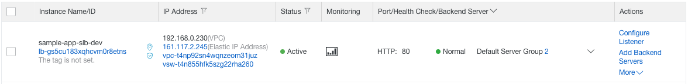

Click on the chevron icon next to "Default Server Group 2" and click on the first ECS instance. You should see some
information about this instance. The "Network (Internal)" graph is interesting:

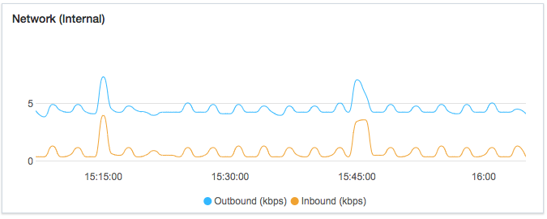

The small waves are the result of the SLB health check (HTTP requests to the "/health" endpoint).

Let's play with the application! Open a new web browser tab and navigate to your domain (like
http://dev.my-sample-domain.xyz/). You should obtain something like this:

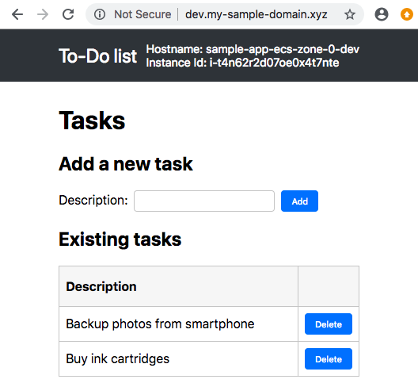

Look at the top-right of the page: the hostname and instance ID allow you to know which ECS instance responded to
your HTTP request. Refresh the page several times and look what happen:

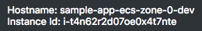

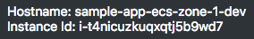

As you can see, your HTTP requests are distributed among your two ECS instances.

Note: if you wish, you can enable [session persistence](https://www.alibabacloud.com/help/doc-detail/85949.htm) when
configuring your SLB listener. That would allow each user to "stick" to the same ECS instance for all his HTTP requests,
which is nice if you want to better exploit a local cache on your application server. However the disadvantage of this
solution is that it might unbalance the load on your ECS instances. There are other solutions for caching, such as
[Memcached](https://memcached.org/) or [Redis](https://redis.io/).

After you have finished to study your environment, we need to delete it (it will be the responsibility of the CI/CD
pipeline to re-create and update it). Open a terminal and run:
```bash
# Go to the last sub-group folder
cd ~/projects/todolist/infrastructure/10_webapp/15_ecs/

# Configure Terraform
export ALICLOUD_ACCESS_KEY="your-accesskey-id"
export ALICLOUD_SECRET_KEY="your-accesskey-secret"
export ALICLOUD_REGION="your-region-id"

# Delete the ECS instances
terraform destroy

# Delete the database
cd ../05_rds/
terraform destroy

# Delete the domain record in Mainland China
cd ../../06_domain_step_2/
terraform destroy

# Delete the vpc and other basis group resources
cd ../05_vpc_slb_eip_domain
terraform destroy
```

## Terraform state files management
Terraform generates [tfstate files](https://www.terraform.io/docs/state/) when we run the `terraform apply` command;
they allow Terraform to keep track of existing cloud resources it has created during previous executions.

In the context of pipeline execution, it is crucial to store tfstate files into an external location, because local
files are deleted when a pipeline job terminates. As a solution we will use the OSS bucket we have already created
[to store our GitLab backups](part_01_gitlab_installation_and_configuration.md).

The tfstate files are managed by [Terraform backends](https://www.terraform.io/docs/backends/index.html). The default
one is the [local backend](https://www.terraform.io/docs/backends/types/local.html), its default configuration is to
store tfstate files alongside our scripts. There are other types of backends but unfortunately none of them is
directly compatible with OSS. One solution is to combine the local backend with
[OSSFS](https://github.com/aliyun/ossfs/): we mount our OSS bucket as a local folder and save the tfstate files inside.

In order to implement this solution, we need to give the permissions to our Docker containers (the ones that run our
pipeline jobs) to use [FUSE](https://en.wikipedia.org/wiki/Filesystem_in_Userspace), the underlying technology used
by OSSFS:
* Open the [ECS console](https://ecs.console.aliyun.com/);
* Click on the "Instance" item in the left menu;
* Select your region if necessary;
* Search for your instance named "devops-simple-app-gitlab-runner";
* Click on the "Connect" link on the left-side of your instance;
* The VNC console should appear: copy the VNC password displayed in the popup and paste it to the next one;
* Authenticate yourself with the "root" user and the password you set when you
  [configured GitLab](part_01_gitlab_installation_and_configuration.md#gitlab-runner-installation-and-configuration);
* Edit the GitLab Runner configuration file with this command:
  ```bash
  nano /etc/gitlab-runner/config.toml
  ```
* The configuration file should look like this:
  ```
  concurrent = 1
  check_interval = 0
  
  [[session_server]]
    session_timeout = 1800
  
  [[runners]]
    name = "devops-simple-app-gitlab-runner"
    url = "https://gitlab.my-sample-domain.xyz/"
    token = "8943412dd85a41002f9f803f21bdbf"
    executor = "docker"
    [runners.docker]
      tls_verify = false
      image = "alpine:latest"
      privileged = false
      disable_entrypoint_overwrite = false
      oom_kill_disable = false
      disable_cache = false
      volumes = ["/cache"]
      shm_size = 0
    [runners.cache]
      [runners.cache.s3]
      [runners.cache.gcs]
  ```
* Change "privileged = false" to "privileged = true". The file should now look like this:
  ```
    concurrent = 1
    check_interval = 0
    
    [[session_server]]
      session_timeout = 1800
    
    [[runners]]
      name = "devops-simple-app-gitlab-runner"
      url = "https://gitlab.my-sample-domain.xyz/"
      token = "8943412dd85a41002f9f803f21bdbf"
      executor = "docker"
      [runners.docker]
        tls_verify = false
        image = "alpine:latest"
        privileged = true
        disable_entrypoint_overwrite = false
        oom_kill_disable = false
        disable_cache = false
        volumes = ["/cache"]
        shm_size = 0
      [runners.cache]
        [runners.cache.s3]
        [runners.cache.gcs]
    ```
* Save and quit by pressing CTRL+X;
* Restart the GitLab Runner via the following command:
  ```bash
  gitlab-runner restart
  ```
* Quit the VNC session by entering the command `exit` and by closing the web browser tab.

## Delivery pipeline stage
We can now put everything together and integrate our infrastructure scripts into our CI/CD pipeline.

For that we need to open the ".gitlab-ci.yml" file and apply the following changes:
```yaml
# ...
variables:
  # ...
  ALICLOUD_ACCESS_KEY: "your-accesskey-id"
  ALICLOUD_SECRET_KEY: "your-accesskey-secret"
  ALICLOUD_REGION: "your-region-id"
  GITLAB_BUCKET_NAME: "gitlab-my-sample-domain-xyz"
  GITLAB_BUCKET_ENDPOINT: "http://oss-ap-southeast-1-internal.aliyuncs.com"
  DOMAIN_NAME: "my-sample-domain.xyz"
  DB_ACCOUNT_PASSWORD: "your-db-password"
  ECS_ROOT_PASSWORD: "your-ecs-root-password"
  OSSFS_VERSION: "1.80.5"
  TERRAFORM_VERSION: "0.11.10"
  PACKER_VERSION: "1.3.2"
# ...
stages:
  - build
  - quality
  - deploy
# ...
deploy:
  stage: deploy
  image: ubuntu:16.04
  script:
    - "export ENV_NAME=$(./gitlab-ci-scripts/deploy/get_env_name_by_branch_name.sh $CI_COMMIT_REF_NAME)"
    - "export SUB_DOMAIN_NAME=$(./gitlab-ci-scripts/deploy/get_sub_domain_name_by_branch_name.sh $CI_COMMIT_REF_NAME)"
    - "export BUCKET_LOCAL_PATH=/mnt/oss_bucket"
    - "./gitlab-ci-scripts/deploy/install_tools.sh"
    - "./gitlab-ci-scripts/deploy/mount_ossfs.sh"
    - "./gitlab-ci-scripts/deploy/build_basis_infra.sh"
    - "./gitlab-ci-scripts/deploy/build_webapp_infra.sh"
    - "umount $BUCKET_LOCAL_PATH"
    - "sleep 10"
  only:
    - master
    - pre-production
    - production
```
Note: the complete version of this file can be found in "sample-app/version3/.gitlab-ci.yml".

As you can see, we have added a third stage named "deploy" after "build" and "quality". The `only` property means that
this stage is only executed for the branches "master", "pre-production" and "production"; it means that a commit in a
feature branch only triggers the "build" and "quality" stages.

In addition, because this stage is quite large, it has been split into multiple Bash scripts located in the
folder "gitlab-ci-scripts/deploy":
* *get_env_name_by_branch_name.sh* is quite simple: it gives the environment name ("dev", "pre-prod" and "prod") for the
  current branch ("master", "pre-production" and "production"):
  ```bash
  #!/usr/bin/env bash
  #
  # Print the environment name according to the branch name.
  #
  # Parameters:
  #   - $1 = BRANCH_NAME
  #
  
  BRANCH_NAME=$1
  ENV_NAME_MASTER="dev"
  ENV_NAME_PRE_PRODUCTION="pre-prod"
  ENV_NAME_PRODUCTION="prod"
  
  if [[ ${BRANCH_NAME} == "production" ]]; then
      echo ${ENV_NAME_PRODUCTION};
  elif [[ ${BRANCH_NAME} == "pre-production" ]]; then
      echo ${ENV_NAME_PRE_PRODUCTION};
  else
      echo ${ENV_NAME_MASTER};
  fi
  ```
* *get_sub_domain_name_by_branch_name.sh* is similar to *get_env_name_by_branch_name.sh*, but it gives the sub-domain
  name instead ("dev", "pre-prod" and "www"):
  ```bash
  #!/usr/bin/env bash
  #
  # Print the sub-domain name according to the branch name.
  #
  # Parameters:
  #   - $1 = BRANCH_NAME
  #
  
  BRANCH_NAME=$1
  SUB_DOMAIN_NAME_MASTER="dev"
  SUB_DOMAIN_NAME_PRE_PRODUCTION="pre-prod"
  SUB_DOMAIN_NAME_PRODUCTION="www"
  
  if [[ ${BRANCH_NAME} == "production" ]]; then
      echo ${SUB_DOMAIN_NAME_PRODUCTION};
  elif [[ ${BRANCH_NAME} == "pre-production" ]]; then
      echo ${SUB_DOMAIN_NAME_PRE_PRODUCTION};
  else
      echo ${SUB_DOMAIN_NAME_MASTER};
  fi
  ```
* *install_tools.sh* installs [OSSFS](https://github.com/aliyun/ossfs), [Terraform](https://www.terraform.io/) and
  [Packer](https://www.packer.io/) on top of the [Ubuntu Docker image](https://hub.docker.com/_/ubuntu/):
  ```bash
  #!/usr/bin/env bash
  #
  # Install OSSFS, Terraform and Packer.
  #
  # Required global variables:
  #   - OSSFS_VERSION
  #   - TERRAFORM_VERSION
  #   - PACKER_VERSION
  #
  
  echo "Installing OSSFS version ${OSSFS_VERSION}, Terraform version ${TERRAFORM_VERSION} and Packer version ${PACKER_VERSION}..."
  
  # Create a temporary folder
  mkdir -p installation_tmp
  cd installation_tmp
  
  # Install OSSFS
  apt-get -y update
  apt-get -y install gdebi-core wget unzip
  wget "https://github.com/aliyun/ossfs/releases/download/v${OSSFS_VERSION}/ossfs_${OSSFS_VERSION}_ubuntu16.04_amd64.deb"
  gdebi -n "ossfs_${OSSFS_VERSION}_ubuntu16.04_amd64.deb"
  
  # Install Terraform
  wget "https://releases.hashicorp.com/terraform/${TERRAFORM_VERSION}/terraform_${TERRAFORM_VERSION}_linux_amd64.zip"
  unzip "terraform_${TERRAFORM_VERSION}_linux_amd64.zip" -d /usr/local/bin/
  
  # Install Packer
  wget "https://releases.hashicorp.com/packer/${PACKER_VERSION}/packer_${PACKER_VERSION}_linux_amd64.zip"
  unzip "packer_${PACKER_VERSION}_linux_amd64.zip" -d /usr/local/bin/
  
  # Display the version of installed tools
  echo "Installed OSSFS version:"
  ossfs --version
  echo "Installed Terraform version:"
  terraform version
  echo "Installed Packer version:"
  packer version
  
  # Delete the temporary folder
  cd ..
  rm -rf installation_tmp
  
  echo "Installation of OSSFS, Terraform and Packer completed."
  ```
* *mount_ossfs.sh* makes our OSS bucket accessible like a normal folder:
  ```bash
  #!/usr/bin/env bash
  #
  # Mount an OSS bucket with OSSFS.
  #
  # Required global variables:
  #   - ALICLOUD_ACCESS_KEY
  #   - ALICLOUD_SECRET_KEY
  #   - GITLAB_BUCKET_NAME
  #   - GITLAB_BUCKET_ENDPOINT
  #   - BUCKET_LOCAL_PATH
  #
  
  echo "Mounting the OSS bucket ${GITLAB_BUCKET_NAME} (endpoint ${GITLAB_BUCKET_ENDPOINT}) into ${BUCKET_LOCAL_PATH}..."
  
  # Configure OSSFS
  echo "$GITLAB_BUCKET_NAME:$ALICLOUD_ACCESS_KEY:$ALICLOUD_SECRET_KEY" > /etc/passwd-ossfs
  chmod 640 /etc/passwd-ossfs
  
  # Mount our bucket
  mkdir -p "$BUCKET_LOCAL_PATH"
  ossfs "$GITLAB_BUCKET_NAME" "$BUCKET_LOCAL_PATH" -ourl="$GITLAB_BUCKET_ENDPOINT"
  
  echo "OSS bucket ${GITLAB_BUCKET_NAME} mounted with success into ${BUCKET_LOCAL_PATH}."
  ```
* *build_basis_infra.sh* runs the Terraform scripts to build the basis infrastructure:
  ```bash
  #!/usr/bin/env bash
  #
  # Build the basis infrastructure (VPC, VSwitches, ...)
  #
  # Required global variables:
  #   - ALICLOUD_ACCESS_KEY
  #   - ALICLOUD_SECRET_KEY
  #   - ALICLOUD_REGION
  #   - ENV_NAME
  #   - DOMAIN_NAME
  #   - SUB_DOMAIN_NAME
  #   - BUCKET_LOCAL_PATH
  #
  
  echo "Building the basis infrastructure (environment: ${ENV_NAME},\
   region: ${ALICLOUD_REGION},\
   domain: ${DOMAIN_NAME},\
   sub-domain: ${SUB_DOMAIN_NAME})..."
  
  # Set values for Terraform variables
  export TF_VAR_env=${ENV_NAME}
  export TF_VAR_domain_name=${DOMAIN_NAME}
  export TF_VAR_sub_domain_name=${SUB_DOMAIN_NAME}
  
  # Run the Terraform scripts in 05_vpc_slb_eip_domain
  cd infrastructure/05_vpc_slb_eip_domain
  mkdir -p "$BUCKET_LOCAL_PATH/infrastructure/$ENV_NAME/05_vpc_slb_eip_domain"
  terraform init -input=false -backend-config="path=$BUCKET_LOCAL_PATH/infrastructure/$ENV_NAME/05_vpc_slb_eip_domain/terraform.tfstate"
  terraform apply -input=false -auto-approve
  terraform apply -input=false -auto-approve
  # Note: the last line has to be executed twice because of a bug in the alicloud_dns_record resource
  
  # Run the Terraform scripts in 06_domain_step_2
  cd ../06_domain_step_2
  mkdir -p "$BUCKET_LOCAL_PATH/infrastructure/$ENV_NAME/06_domain_step_2"
  terraform init -input=false -backend-config="path=$BUCKET_LOCAL_PATH/infrastructure/$ENV_NAME/06_domain_step_2/terraform.tfstate"
  terraform apply -input=false -auto-approve
  
  cd ../..
  
  echo "Basis infrastructure successfully built (environment: ${ENV_NAME}, region: ${ALICLOUD_REGION})."
  ```
  Note: you can see how we combine OSSFS with the
  [local backend](https://www.terraform.io/docs/backends/types/local.html) in order to save the tfstate files in our
  OSS bucket.
* *build_webapp_infra.sh* runs the Terraform scripts to build the application infrastructure:
  ```bash
  #!/usr/bin/env bash
  #
  # Build the web application infrastructure (RDS, VM image, ECS, ...)
  #
  # Required global variables:
  #   - ALICLOUD_ACCESS_KEY
  #   - ALICLOUD_SECRET_KEY
  #   - ALICLOUD_REGION
  #   - ENV_NAME
  #   - DB_ACCOUNT_PASSWORD
  #   - ECS_ROOT_PASSWORD
  #   - BUCKET_LOCAL_PATH
  #   - CI_PIPELINE_IID
  #
  
  echo "Building the application infrastructure (environment: ${ENV_NAME}, region: ${ALICLOUD_REGION})..."
  
  # Set values for Terraform and Packer variables
  export TF_VAR_env=${ENV_NAME}
  export TF_VAR_db_account_password=${DB_ACCOUNT_PASSWORD}
  export TF_VAR_ecs_root_password=${ECS_ROOT_PASSWORD}
  
  export APPLICATION_PATH=$(pwd)/$(ls target/*.jar)
  export PROPERTIES_PATH=$(pwd)/src/main/resources/application.properties
  export IMAGE_VERSION=${CI_PIPELINE_IID}
  export ENVIRONMENT=${ENV_NAME}
  export RDS_DATABASE=todolist
  export RDS_ACCOUNT=todolist
  export RDS_PASSWORD=${DB_ACCOUNT_PASSWORD}
  
  # Create/update the application database
  cd infrastructure/10_webapp/05_rds
  mkdir -p "$BUCKET_LOCAL_PATH/infrastructure/$ENV_NAME/10_webapp/05_rds"
  terraform init -input=false -backend-config="path=$BUCKET_LOCAL_PATH/infrastructure/$ENV_NAME/10_webapp/05_rds/terraform.tfstate"
  terraform apply -input=false -auto-approve
  export RDS_CONNECTION_STRING=$(terraform output app_rds_connection_string)
  
  # Extract Alibaba Cloud information for building the application image
  cd ../10_image
  mkdir -p "$BUCKET_LOCAL_PATH/infrastructure/$ENV_NAME/10_webapp/10_image"
  terraform init -input=false -backend-config="path=$BUCKET_LOCAL_PATH/infrastructure/$ENV_NAME/10_webapp/10_image/terraform.tfstate"
  terraform apply -input=false -auto-approve
  export SOURCE_IMAGE=$(terraform output image_id)
  export INSTANCE_TYPE=$(terraform output instance_type)
  
  # Build the application image
  packer build app_image.json
  
  # Create/update the ECS instances
  cd ../15_ecs
  mkdir -p "$BUCKET_LOCAL_PATH/infrastructure/$ENV_NAME/10_webapp/15_ecs"
  terraform init -input=false -backend-config="path=$BUCKET_LOCAL_PATH/infrastructure/$ENV_NAME/10_webapp/15_ecs/terraform.tfstate"
  terraform apply -input=false -auto-approve -parallelism=1
  
  cd ../../..
  
  echo "Application infrastructure successfully built (environment: ${ENV_NAME}, region: ${ALICLOUD_REGION})."
  ```
  Note: the `CI_PIPELINE_IID` variable [is set by GitLab](https://docs.gitlab.com/ee/ci/variables/), it contains the
  pipeline number. We use it to create unique VM image names.

Before we commit these scripts, we first need to add new variables in our GitLab project configuration:
* Open GitLab (the URL must be like https://gitlab.my-sample-domain.xyz/);
* Sign in if necessary;
* Click on the "Projects" item in the top menu and select the "Your projects";
* Click on the "todolist" project;
* In the left menu select "Settings > CI/CD";
* Expand the "Variables" panel, and create the following variables:
  * ALICLOUD_ACCESS_KEY = your Alibaba Cloud access key ID (e.g. LTBIgF7wiMozeRIa)
  * ALICLOUD_SECRET_KEY = your Alibaba Cloud access key secret (e.g. rdp59SYSKtNdDg3PYlTfjlrxu12fbp)
  * ALICLOUD_REGION = your Alibaba Cloud region (e.g. ap-southeast-1)
  * GITLAB_BUCKET_NAME = your OSS bucket name (e.g. gitlab-my-sample-domain-xyz)
  * GITLAB_BUCKET_ENDPOINT = the OSS bucket endpoint (e.g. http://oss-ap-southeast-1-internal.aliyuncs.com); you can
    get it from the [OSS console](https://oss.console.aliyun.com/), by selecting your bucket and by copying the
    endpoint next to "VPC Network Access from ECS (Internal Network)"
  * DOMAIN_NAME = your domain name (e.g. my-sample-domain.xyz)
  * DB_ACCOUNT_PASSWORD = the password of the "todolist" user in the MySQL database (e.g. YourSecretPassw0rdForRds)
  * ECS_ROOT_PASSWORD = the root password of your ECS instances (e.g. YourSecretPassw0rdForEcs)
  * OSSFS_VERSION = [latest OSSFS version](https://github.com/aliyun/ossfs/releases) (e.g. 1.80.5)
  * TERRAFORM_VERSION = [latest Terraform version](https://github.com/hashicorp/terraform/releases) (e.g. 0.11.10)
  * PACKER_VERSION = [latest Packer version](https://github.com/hashicorp/packer/releases) (e.g. 1.3.2)
* Click on "Save variables";

Let's commit and push our changes. Open your terminal and type:
```bash
# Go to the project folder
cd ~/projects/todolist

# Check files to commit
git status

# Add the modified and new files
git add .gitignore infrastructure/ gitlab-ci-scripts/

# Commit and push to GitLab
git commit -m "Add the deploy stage."
git push origin master
```

In your GitLab web browser tab, select "CI / CD > Pipelines" in the left menu. You should get something like this:

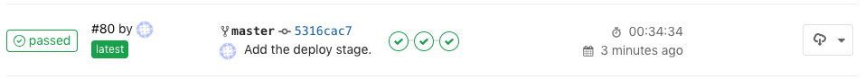

Check that your cloud resources have been successfully created by browsing to the
[VPC console](https://vpc.console.aliyun.com/) and by following links to related resources.

Check your application by opening a new web browser tab and by navigating to your domain (like
http://dev.my-sample-domain.xyz/).

Congratulation if you managed to deploy your application automatically! From now on, any commit on the master branch
automatically launches a pipeline that builds, tests, analyzes and deploys the change!

## Pre-production and production environments
As you can see in the scripts you have committed in the previous section, the two variables "ENV_NAME" and
"SUB_DOMAIN_NAME" are set to different values according to the current branch name. Let's create new branches for
the pre-production and production environments. Enter the following commands with your terminal:
```bash
# Go to the project folder
cd ~/projects/todolist

# Create a pre-production branch
git checkout -b pre-production
git push origin pre-production
```
Check your GitLab CI/CD pipeline ("CI / CD > Pipelines" left menu item): the process should work successfully.

Check your cloud resources by browsing the [VPC console](https://vpc.console.aliyun.com/): this time they should have
names containing "pre-prod" instead of "dev".

You can also check your web application with the "pre-prod" sub-domain (e.g. http://pre-prod.my-sample-domain.xyz/).
As you can see this new environment is completely isolated and independent from the development one.

Let's do the same with the production environment:
```bash
# Create a production branch
git checkout -b production
git push origin production
```
Check your GitLab CI/CD pipeline, then your [cloud resources](https://vpc.console.aliyun.com/) and finally your web
application with the "www" sub-domain: http://www.my-sample-domain.xyz/

Congratulation: you have 3 environments! From now on, the process to follow in order to deploy an new version of
your application is the following:
* Regularly commit improvements and new features into the master branch (via feature branches);
* When the master branch is stable enough for a release, create a
  [merge request](https://docs.gitlab.com/ee/gitlab-basics/add-merge-request.html) from the master branch into the
  pre-production one:
  
  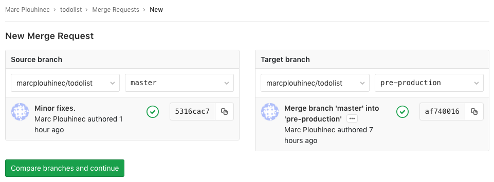
* Let another person to check and accept the merge request in order to start the deployment into pre-production.
* Test the pre-production version, fix bugs and re-test. Note that it may be necessary to merge the master into
  the pre-production branch several times until the bugs are fixed.
* When the pre-production branch is ready, create a
  [merge request](https://docs.gitlab.com/ee/gitlab-basics/add-merge-request.html) from the pre-production branch into
  the production one:
  
  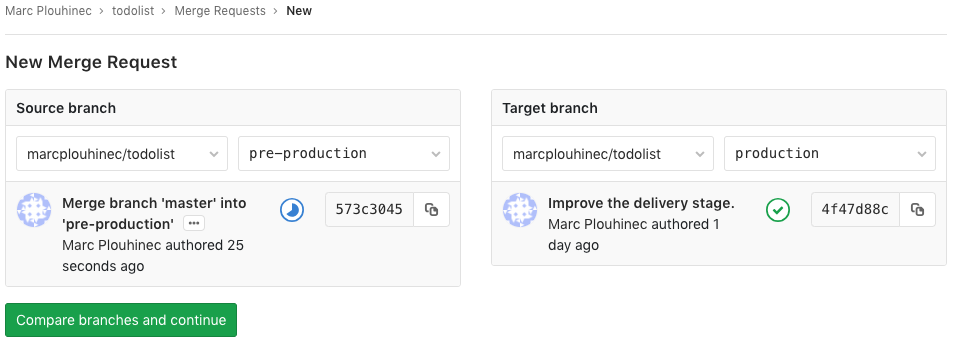
* Let another person to check and accept the merge request in order to start the deployment into production.
