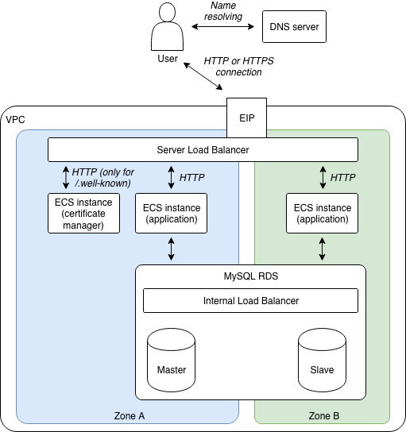

# DevOps for small / medium web apps - Part 5 - HTTPS configuration

## Summary
0. [Introduction](#introduction)
1. [Architecture](#architecture)
2. Certification server
3. SLB configuration
4. Pipeline improvement

## Introduction
[HTTPS](https://en.wikipedia.org/wiki/HTTPS) is now a requirement for any professional
website that needs to receive input from users, as it prevents
[man-in-the-middle](https://en.wikipedia.org/wiki/Man-in-the-middle_attack) and
[eavesdropping](https://en.wikipedia.org/wiki/Eavesdropping) attacks.

There are several ways to configure HTTPS for our sample application, the easiest one is to
[buy a SSL/TLS certificate](https://www.alibabacloud.com/product/certificates) and
[upload it on our SLB](https://www.alibabacloud.com/help/doc-detail/32336.htm). However we will choose a
more complex approach by using SSL/TLS certificates from [Let’s Encrypt](https://letsencrypt.org/).

"Let’s Encrypt" is a certificate authority founded by organizations such as the
[Electronic Frontier Foundation](https://www.eff.org/), the
[Mozilla Foundation](https://en.wikipedia.org/wiki/Mozilla_Foundation) and [Cisco Systems](https://www.cisco.com/).
The advantages is that it's free and 100% automated, the main disadvantage is that it only provides
[Domain-Validated certificates](https://en.wikipedia.org/wiki/Domain-validated_certificate) (no
[Organization Validation](https://en.wikipedia.org/wiki/Public_key_certificate#Organization_validation) nor
[Extended Validation](https://en.wikipedia.org/wiki/Extended_Validation_Certificate)), which is enough for
many use cases.

## Architecture
HTTPS works by encrypting HTTP traffic via the [TLS protocol](https://en.wikipedia.org/wiki/Transport_Layer_Security).
In order to configure HTTPS, we first need to obtain a
[SSL/TLS certificate](https://en.wikipedia.org/wiki/Transport_Layer_Security#Digital_certificates) and configure it
on our SLB (by adding a [HTTPS listener](https://www.alibabacloud.com/help/doc-detail/86438.htm)).

Once configured, the SLB handles the HTTPS "complexities" and continue to communicate with backend servers via
unencrypted HTTP. A typical HTTPS request works like this:
* A user opens a HTTPS connection with our web application;
* The SLB uses its configured SSL/TLS certificate to establish a secured connection;
* The user sends a HTTPS request;
* The SLB converts the HTTPS request into a HTTP one (unencrypted) and sends it to one of the backend servers;
* The backend server receives the HTTP request (as usual) and sends back a HTTP response;
* The SLB converts the HTTP response into a HTTPS one (encrypted) and sends it to the user.

Configuring a HTTPS listener for our SLB is relatively easy (we will add a
[alicloud_slb_server_certificate](https://www.terraform.io/docs/providers/alicloud/r/slb_server_certificate.html) and a
new [alicloud_slb_listener](https://www.terraform.io/docs/providers/alicloud/r/slb_listener.html) in our Terraform
script). Unfortunately obtaining an SSL/TLS certificate from Let’s Encrypt requires us to modify our architecture:



Let's Encrypt needs a way to automatically check that our domain name belongs to us before providing us a certificate.
For that it uses the concept of a [challenge](https://certbot.eff.org/docs/challenges.html): first we need to setup a
program called [certbot](https://certbot.eff.org/) on our system, then execute this application so that it cans
communicate with Let's Encrypt servers, run a challenge and obtain the certificate. There are several types of
challenges, we will use the [HTTP-01 one](https://certbot.eff.org/docs/challenges.html#http-01-challenge) and include
it in the following process:
* Create a new ECS instance named "certificate manager" and configure the SLB via a
  [slb_rule](https://www.terraform.io/docs/providers/alicloud/r/slb_rule.html) so that every HTTP request with an URL
  that starts with "http://dev.my-sample-domain.xyz/.well-known/" is forwarded to this new ECS instance.
* On this new ECS instance, install certbot and [Nginx](https://www.nginx.com/), then configure the later to serve
  files from "/var/www/html/certman/.well-known/" via "http:/localhost:8080/.well-known/" (the SLB is already configured
  to accept HTTP requests from internet on the port 80 and to distribute them to backend servers on the port 8080).
* Execute Certbot like this:
  ```bash
  certbot certonly --webroot -w /var/www/html/certman/.well-known/ -d dev.my-sample-domain.xyz
  ```
  This command runs the "HTTP-01" challenge in the following way:
  * Certbot creates a file with a unique name in the folder "/var/www/html/certman/.well-known/acme-challenge/", so
    that Nginx cans serve this file with the URL path "/.well-known/acme-challenge/unique-name";
  * Certbot contacts the Let's Encrypt server and asks it the to make a HTTP request to this file with the URL 
    "http://dev.my-sample-domain.xyz/.well-known/acme-challenge/unique-name";
  * If the Let's Encrypt server succeed to download this file, it means that we own the domain name and passed
    the challenge.
    
  Once the challenge is passed, the Let's Encrypt server generates a SSL/TLS certificate and sends it to certbot. The
  later stores it in the [PEM format](https://en.wikipedia.org/wiki/Privacy-Enhanced_Mail) in the folder
  "/etc/letsencrypt/live/dev.my-sample-domain.xyz/".
  
  Note: beware that Let's Encrypt has [rate limits](https://letsencrypt.org/docs/rate-limits/), so we should take care
  to run certbot only when necessary.


TODO new variable 
  EMAIL_ADDRESS: "john.doe@example.org"