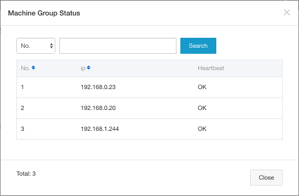
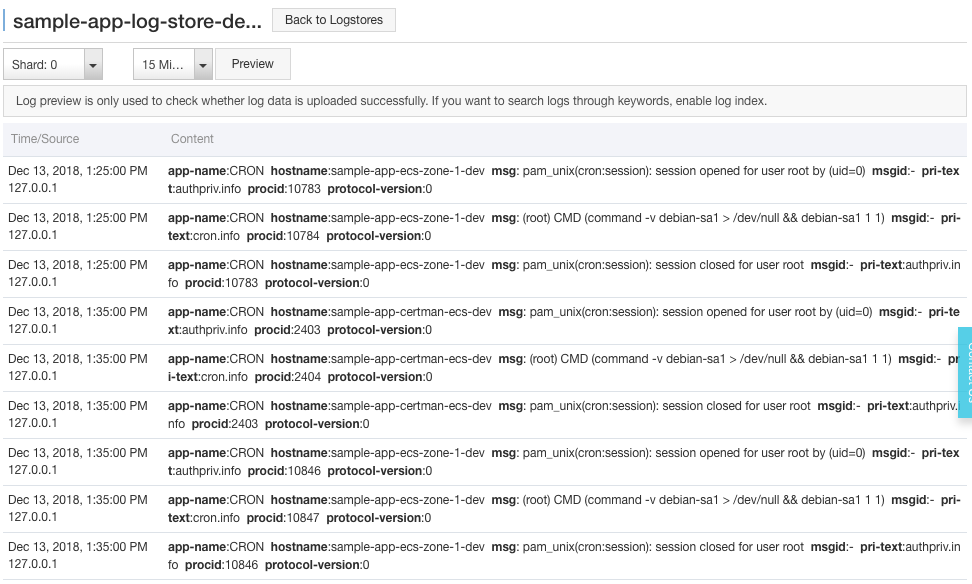
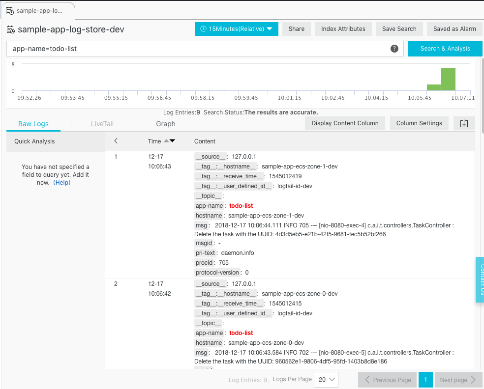

# DevOps for small / medium web apps - Part 6 - Log management

## Summary
0. [Introduction](#introduction)
1. [Architecture](#architecture)
2. [Infrastructure improvements](#infrastructure-improvements)
   1. [Cloud resources](#cloud-resources)
   2. [Logtail configuration on the log project](#logtail-configuration-on-the-log-project)
   3. [VM images](#vm-images)
   4. [CI/CD pipeline update](#ci/cd-pipeline-update)
3. [Log search](#log-search)
4. [Pre-production and production environments](#pre-production-and-production-environments)

## Introduction
Working with application logs become more complex when the number of servers increase: for example when there is only
one server, an administrator just needs to connect to this machine and reads the "/var/logs" folder and execute
commands such as `journalctl --unit=todo-list`. But when the number of servers increase, the same administrator
must connect to each machine in order to find the information he's looking for. This become even worse when auto-scaling
is enabled, because servers are automatically created and released.

A solution to this problem is to use the [Log Service](https://www.alibabacloud.com/product/log-service): its role
is to collect logs from servers and let administrators / developers to search in them.

Note: you can find the source code containing the modifications described in this part in the folder
"sample-app/version5".

## Architecture
Configuring Alibaba Cloud Log Service is a bit complex. The following diagram illustrates how it works:


In this diagram we can see that in each ECS instance, an application is generating logs and sending them to 
[Rsyslog](https://en.wikipedia.org/wiki/Rsyslog) (this is the case of our java application, thanks to the
SystemD configuration file that specifies `StandardOutput=syslog` and `StandardError=syslog`).

Rsyslog must then be configured to forward the logs to
[Logtail](https://www.alibabacloud.com/help/doc-detail/28979.htm), a log collection agent similar to
[LogStash](https://www.elastic.co/products/logstash), responsible for sending logs to the Log Service (note: you can
read [this document](https://www.alibabacloud.com/help/doc-detail/44259.htm) if you are interested in a comparison
between these tools).

The Log Service is organized in [log projects](https://www.alibabacloud.com/help/doc-detail/48873.htm) that contains
[log stores](https://www.alibabacloud.com/help/doc-detail/48874.htm). In our case we just need one log project and one
log store. The Log Service provides endpoints in each region for Logtail
(such as "http://logtail.ap-southeast-1-intranet.log.aliyuncs.com").

Both the log project and Logtail must be configured:
* Logtail needs a configuration to understand how to parse logs from Rsyslog (the fields / columns in each log line)
  and how to send them to the Log Service (the endpoint, buffer size, ...)
* The log project needs to be configured in order to know what are the logs that needs to be stored (e.g. from which
  data source). This configuration is related to the ECS instances via
  [machine groups](https://www.alibabacloud.com/help/doc-detail/28966.htm).

## Infrastructure improvements
### Cloud resources
The first step is to add a log project, a log store and a log machine in our basis infrastructure. Open a terminal on
your computer and type:
```bash
# Go to the project folder
cd ~/projects/todolist

# Edit the basis infrastructure definition
nano infrastructure/05_vpc_slb_eip_domain/main.tf
```
Add the following code at the end of the file:
```hcl-terraform
// Log project, store and machine group
resource "alicloud_log_project" "app_log_project" {
  name = "sample-app-log-project-${var.env}"
  description = "Sample web application log project (${var.env} environment)."
}
resource "alicloud_log_store" "app_log_store" {
  project = "${alicloud_log_project.app_log_project.name}"
  name = "sample-app-log-store-${var.env}"
}
resource "alicloud_log_machine_group" "app_log_machine_group" {
  project = "sample-app-log-project-${var.env}"
  name = "sample-app-log-machine-group-${var.env}"
  identify_type = "userdefined"
  identify_list = [
    "logtail-id-${var.env}"
  ]
}
```
We should also add an ingress security group rule in order to open the port 11111 (used by Logtail). Add the
following block under `accept_8080_rule`:
```hcl-terraform
resource "alicloud_security_group_rule" "accept_11111_rule" {
  type = "ingress"
  ip_protocol = "tcp"
  nic_type = "intranet"
  policy = "accept"
  port_range = "11111/11111"
  priority = 1
  security_group_id = "${alicloud_security_group.app_security_group.id}"
  cidr_ip = "0.0.0.0/0"
}
```
Save the changes by pressing CTRL+X.

Note: if you check the
[Terraform documentation](https://www.terraform.io/docs/providers/alicloud/r/log_machine_group.html) about
`alicloud_log_machine_group`, you can see that the `identify_type` can take 2 values: "ip" and "userdefined". The "ip"
one is less flexible and a bit problematic for our CI / CD pipeline, as it requires us to create the ECS
instances first (to get the private IP addresses), then to configure the log machine group and finally to complete the
Log Service configuration. This is problematic because the ECS instances would start without a complete
logging configuration (at that time the CI / CD pipeline is not finished yet and the Log Service is not ready),
so the logtail application running on the ECS instances will fail to initialize.

For more information about user-defined identity, please read
[this documentation](https://www.alibabacloud.com/help/doc-detail/28983.htm).

### Logtail configuration on the log project
There are two Logtail configurations: one on the ECS instance side, one on the log project side. This section deals
with the log project side.

Unfortunately the Terraform provider for Alibaba Cloud doesn't support Logtail configuration on the log project side,
so we will manage it automatically with the [OpenAPI services](https://www.alibabacloud.com/help/doc-detail/29042.htm).

There are several ways to call this API, one solution is to use the
[Python SDK](https://www.alibabacloud.com/help/doc-detail/29077.htm) to create a script that will be called by GitLab:
```bash
# Create the Python script that will update the Logtail configuration on the log project side
nano gitlab-ci-scripts/deploy/update_logtail_config.py
```
Copy the following content into this file:
```python
#!/usr/bin/python3

import sys
from aliyun.log.logclient import LogClient
from aliyun.log.logexception import LogException
from aliyun.log.logtail_config_detail import SyslogConfigDetail

# Read the arguments
accessKeyId = sys.argv[1]
accessKeySecret = sys.argv[2]
regionId = sys.argv[3]
environment = sys.argv[4]
print("Update the Logtail configuration on the log project (environment = " + environment +
      ", region = " + regionId + ")")

endpoint = regionId + ".log.aliyuncs.com"
logProjectName = "sample-app-log-project-" + environment
logStoreName = "sample-app-log-store-" + environment
logtailConfigName = "sample-app-logtail-config-" + environment
logMachineGroupName = "sample-app-log-machine-group-" + environment

# Load the existing Logtail configuration
print("Loading existing Logtail configuration (endpoint = " + endpoint +
      ", logProjectName = " + logProjectName + ", logtailConfigName = " + logtailConfigName + ")...")

client = LogClient(endpoint, accessKeyId, accessKeySecret)
existingConfig = None
try:
    response = client.get_logtail_config(logProjectName, logtailConfigName)
    existingConfig = response.logtail_config
    print("Existing logtail configuration found: ", existingConfig.to_json())
except LogException:
    print("No existing logtail configuration found.")

# Create or update the logtail configuration
configDetail = SyslogConfigDetail(logstoreName=logStoreName, configName=logtailConfigName, tag="sys_tag")
if existingConfig is None:
    print("Create the logtail configuration:", configDetail.to_json())
    client.create_logtail_config(logProjectName, configDetail)
else:
    print("Update the logtail configuration:", configDetail.to_json())
    client.update_logtail_config(logProjectName, configDetail)

# Apply the configuration to the machine group
print("Apply the logtail configuration to the machine group", logMachineGroupName)
client.apply_config_to_machine_group(logProjectName, logtailConfigName, logMachineGroupName)
```
Save and quit by pressing CTRL+X.

As you can see this script creates or updates the Logtail configuration and then links it to the machine group.

### VM images
The next step is to modify our Packer scripts in order to install Logtail and configure it:
```bash
# Edit the application image script
nano infrastructure/10_webapp/10_image/app_image.json
```
Add the following provisioner at the end of the `provisioners` array:
```json
{
  "type": "shell",
  "inline": [
    "export REGION=\"{{user `region_id`}}\"",
    "export ENVIRONMENT=\"{{user `environment`}}\"",
    "mkdir -p /etc/ilogtail",
    "echo \"logtail-id-${ENVIRONMENT}\" > /etc/ilogtail/user_defined_id",
    "wget \"http://logtail-release-${REGION}.oss-${REGION}.aliyuncs.com/linux64/logtail.sh\" -O logtail.sh",
    "chmod 755 logtail.sh",
    "./logtail.sh install auto",
    "export STREAMLOG_FORMATS='[{\"version\": \"0.1\", \"fields\": []}]'",
    "sed -i \"s/\\(\\\"streamlog_open\\\" : \\).*\\$/\\1true,/\" /usr/local/ilogtail/ilogtail_config.json",
    "sed -i \"s/\\(\\\"streamlog_formats\\\":\\).*\\$/\\1${STREAMLOG_FORMATS},/\" /usr/local/ilogtail/ilogtail_config.json",
    "/etc/init.d/ilogtaild stop",
    "rm /usr/local/ilogtail/app_info.json",
    "rm /etc/init.d/ilogtaild",
    "systemctl enable logtail"
  ]
}
```
Save and exit with CTRL+X. Then do the same with the certificate manager image:
```bash
# Edit the certificate manager image script
nano infrastructure/15_certman/05_image/certman_image.json
```
Add the same provisioner as above, then save and exit with CTRL+X.

As you can see, this provisioner executes the following actions:
* Create the file "/etc/ilogtail/user_defined_id" and put "logtail-id-${ENVIRONMENT}" inside. This is a necessary step
  in order to inform Logtail that it is running inside an ECS instance that belongs to the machine group
  "sample-app-log-machine-group-${var.env}" (created via Terraform).
* Download and install Logtail (also called ilogtail). Note that this installation script automatically starts
  Logtail on the machine.
* Modify the the properties `streamlog_open` and `streamlog_formats` in the Logtail configuration file
  "/usr/local/ilogtail/ilogtail_config.json". Note that Logtail has configuration files in two locations:
  "/etc/ilogtail/" and "/usr/local/ilogtail/".
* Stop Logtail and remove the configuration file "/usr/local/ilogtail/app_info.json", as it contains the hostname and
  private ip address of the ECS instance used by Packer to create the VM image. Logtail will automatically re-create
  this file when the VM image is used to start our "real" ECS instances.
* Remove the Logtail default startup script (/etc/init.d/ilogtaild) and replace it by our own (we will create it in
  a moment). We need to do that because we need to control the moment when Logtail starts: when our ECS instance starts
  for the first time, [cloud-init](https://www.alibabacloud.com/help/doc-detail/57803.htm) scripts reconfigure the
  system by setting attributes such as the hostname. We need to make sure that Logtail starts AFTER cloud-init,
  that's why we create our own [SystemD](https://www.freedesktop.org/wiki/Software/systemd/) script.

Let's create this SystemD script now:
```bash
# Create our own SystemD script for Logtail
nano infrastructure/10_webapp/10_image/resources/logtail.service
```
Copy the following content into this file:
```
[Unit]
Description=logtail
After=syslog.target
After=network.target
After=cloud-config.service
After=cloud-final.service
After=cloud-init-local.service
After=cloud-init.service
After=cloudmonitor.service
After=cloud-config.target

[Service]
Type=simple
RemainAfterExit=yes
ExecStartPre=/bin/sleep 5
ExecStart=/usr/local/ilogtail/ilogtail
StandardOutput=syslog
StandardError=syslog
SyslogIdentifier=logtail
WorkingDirectory=/usr/local/ilogtail

[Install]
WantedBy=multi-user.target
```
Save and quit by pressing CTRL+X.

As you can see at the beginning of this script, we start Logtail after the cloud-init scripts. We even wait 5 seconds
with `ExecStartPre=/bin/sleep 5` to make sure the cloud-init scripts have completed their tasks.

Copy this file for the certificate manager machine:
```bash
# Copy the Logtail startup script
cp infrastructure/10_webapp/10_image/resources/logtail.service infrastructure/15_certman/05_image/resources/
```

We also need to configure Rsyslog to forward logs to Logtail:
```bash
# Create the Rsyslog configuration script
nano infrastructure/10_webapp/10_image/resources/rsyslog-logtail.conf
```
Enter the following content into this file:
```
$ActionQueueFileName fwdRule1 # unique name prefix for spool files
$ActionQueueMaxDiskSpace 1g # 1gb space limit (use as much as possible)
$ActionQueueSaveOnShutdown on # save messages to disk on shutdown
$ActionQueueType LinkedList # run asynchronously
$ActionResumeRetryCount -1 # infinite retries if host is down

# Defines the fields of log data
$template ALI_LOG_FMT,"0.1 sys_tag %timegenerated:::date-unixtimestamp% %fromhost-ip% %hostname% %pri-text% %protocol-version% %app-name% %procid% %msgid% %msg:::drop-last-lf%\n"
*.* @@127.0.0.1:11111;ALI_LOG_FMT
```
Save and exit by pressing CTRL+X. Copy the same file for the certificate manager:
```bash
# Copy the Rsyslog configuration script
cp infrastructure/10_webapp/10_image/resources/rsyslog-logtail.conf infrastructure/15_certman/05_image/resources/
```
Add a provisioner into the application Packer script in order to upload this configuration file:
```bash
# Edit the application image script
nano infrastructure/10_webapp/10_image/app_image.json
```
Add the following provisioners BEFORE the shell one we have just created above:
```json
{
  "type": "file",
  "source": "resources/rsyslog-logtail.conf",
  "destination": "/etc/rsyslog.d/80-logtail.conf"
}
```
```json
{
  "type": "file",
  "source": "resources/logtail.service",
  "destination": "/etc/systemd/system/logtail.service"
}
```
Save and exit with CTRL+X. Edit in a similar way the certificate manager image script:
```bash
# Edit the certificate manager image script
nano infrastructure/15_certman/05_image/certman_image.json
```
Add the same provisioners as above then save and quit with CTRL+X.

The last step is to force our applications to start after Logtail is started, in order to make sure that their logs are
completely collected. Let's edit the SystemD scripts:
```bash
# Edit the SystemD script for our web application
nano infrastructure/10_webapp/10_image/resources/todo-list.service
```
Add the following content below `After=network.target`:
```
After=logtail.service
```
Save and quit by pressing CTRL+X. Let's edit the certificate updater as well:
```bash
# Edit the SystemD script for our certificate updater
nano infrastructure/15_certman/05_image/resources/certificate-updater.service
```
Add the following content below `After=ossfs.service`:
```
After=logtail.service
```
Save and quit by pressing CTRL+X.

### CI/CD pipeline update
We need to update our pipeline definition file (.gitlab-ci.yml) in order to run our Python script
"update_logtail_config.py". But before we need to create a script that installs its dependencies:
```bash
# Create a script that installs the dependencies for update_logtail_config.py
nano gitlab-ci-scripts/deploy/install_python_packages.sh
```
Copy the following script into the editor:
```bash
#!/usr/bin/env bash
#
# Install PIP and aliyun-log-python-sdk.
#

echo "Installing Python packages..."

export DEBIAN_FRONTEND=noninteractive
apt-get -y update
apt-get -y install python3-pip

pip3 install -U aliyun-log-python-sdk

echo "Python packages installed with success."
```
Save and quit by pressing CTRL+X; then modify the file ".gitlab-ci.yml":
```bash
# Edit the pipeline definition file
nano .gitlab-ci.yml
```
Modify the `deploy` block accordingly:
```yaml
deploy:
  # ...
  script:
    - "export ENV_NAME=$(./gitlab-ci-scripts/deploy/get_env_name_by_branch_name.sh $CI_COMMIT_REF_NAME)"
    - "export SUB_DOMAIN_NAME=$(./gitlab-ci-scripts/deploy/get_sub_domain_name_by_branch_name.sh $CI_COMMIT_REF_NAME)"
    - "export BUCKET_LOCAL_PATH=/mnt/oss_bucket"
    - "./gitlab-ci-scripts/deploy/install_tools.sh"
    - "./gitlab-ci-scripts/deploy/install_python_packages.sh"
    - "./gitlab-ci-scripts/deploy/mount_ossfs.sh"
    - "./gitlab-ci-scripts/deploy/build_basis_infra.sh"
    - "python3 ./gitlab-ci-scripts/deploy/update_logtail_config.py $ALICLOUD_ACCESS_KEY $ALICLOUD_SECRET_KEY $ALICLOUD_REGION $ENV_NAME"
    - "./gitlab-ci-scripts/deploy/build_webapp_infra.sh"
    - "./gitlab-ci-scripts/deploy/build_certman_infra.sh"
    - "umount $BUCKET_LOCAL_PATH"
    - "sleep 10"
  # ...
```
Save and exit with CTRL+X.

As you can see we have added two commands:
* ./gitlab-ci-scripts/deploy/install_python_packages.sh
* python3 ./gitlab-ci-scripts/deploy/update_logtail_config.py $ALICLOUD_ACCESS_KEY $ALICLOUD_SECRET_KEY $ALICLOUD_REGION $ENV_NAME

The final step is to commit and push the changes to GitLab:
```bash
# Check files to commit
git status

# Add the modified and new files
git add .gitlab-ci.yml
git add gitlab-ci-scripts/deploy/install_python_packages.sh
git add gitlab-ci-scripts/deploy/update_logtail_config.py
git add infrastructure/05_vpc_slb_eip_domain/main.tf
git add infrastructure/10_webapp/10_image/app_image.json
git add infrastructure/10_webapp/10_image/resources/logtail.service
git add infrastructure/10_webapp/10_image/resources/todo-list.service
git add infrastructure/10_webapp/10_image/resources/rsyslog-logtail.conf
git add infrastructure/15_certman/05_image/certman_image.json
git add infrastructure/15_certman/05_image/resources/certificate-updater.service
git add infrastructure/15_certman/05_image/resources/logtail.service
git add infrastructure/15_certman/05_image/resources/rsyslog-logtail.conf

# Commit and push to GitLab
git commit -m "Collect logs with the Log Service."
git push origin master
```

Check your CI / CD pipeline on GitLab, in particularly the logs of the "deploy" stage and make sure there is no error.

Check that the Log Service is correctly configured:
* Go the the [Log Service console](https://sls.console.aliyun.com/);
* You should see the log project "sample-app-log-project-dev", click on it;
* You should be able to see the log store "sample-app-log-store-dev";
* In the left menu, click on "Log Machine Group";
* You should see the group "sample-app-log-machine-group-dev"; click on the "Status" link on the right;
* A popup should open with three IP addresses: one like "192.168.0.x" and two like "192.168.1.x". The heartbeat column
  must contain "OK" (this value means that Logtail is running on the ECS instance):



* Close the popup and click on the "Logtail Config" left menu item; you should see one configuration
  "sample-app-logtail-config-dev" with "syslog" as data source. Click on this configuration;
* The new page should display a form with a field "Tag Settings" containing "sys_tag". This value must be exactly
  the same as the one in the Rsyslog configuration file. Click on the "next" button: the machines group
  "sample-app-log-machine-group-dev" must be displayed and checked;
  click on the "Cancel" button to close this wizard;
* Click on the "Logstores" item in the left menu.
* Click on the "Preview" link next to the "sample-app-log-store-dev" log store;
* A new web browser tab should open and show collected logs like this:



Note: if there is no log, try to switch to the "Shard: 1" and click on the "Preview" button. You can generate logs by
yourself by opening your web application (http://dev.my-sample-domain.xyz/) and by creating and deleting tasks. Sometime
it may be necessary to wait for few minutes for the logs to appear.

## Log search
Now that we collect logs, let's check how to search into them:
* Open your web application (http://dev.my-sample-domain.xyz/) and create 4 tasks (Task 1, Task 2, Task 3 and Task 4),
  then delete them one by one.
* Go the the [Log Service console](https://sls.console.aliyun.com/);
* Click on the log project "sample-app-log-project-dev";
* Click on "Search" next to the "sample-app-log-store-dev" log store;
* The new page should display logs with a search bar on top; enter `app-name=todo-list` in this bar and click on
  "Search & Analysis";
* The "Raw Logs" panel should now only contains the logs of our application:



We can see the following messages:
* Time: 12-17 10:06:43
  * hostname: sample-app-ecs-zone-1-dev
  * msg: 2018-12-17 10:06:44.111 INFO 705 --- \[nio-8080-exec-4] c.a.i.t.controllers.TaskController : Delete the
    task with the UUID: 4d3d5eb5-e21b-42f5-9681-fec5b52bf266
* Time: 12-17 10:06:42
  * hostname: sample-app-ecs-zone-0-dev
  * msg: 2018-12-17 10:06:43.584 INFO 702 --- \[nio-8080-exec-5] c.a.i.t.controllers.TaskController : Delete the
    task with the UUID: 960562e1-9806-4df5-95fd-1403b8d8e186
* Time: 12-17 10:06:41
  * hostname: sample-app-ecs-zone-1-dev
  * msg: 2018-12-17 10:06:42.966 INFO 705 --- \[nio-8080-exec-9] c.a.i.t.controllers.TaskController : Delete the
    task with the UUID: 8145a65b-c1d4-4a24-b1b9-2af3a53b324c
* Time: 12-17 10:06:41
  * hostname: sample-app-ecs-zone-0-dev
  * msg: 2018-12-17 10:06:42.464 INFO 702 --- \[nio-8080-exec-1] c.a.i.t.controllers.TaskController : Delete the
    task with the UUID: efa997bf-f101-429a-bc01-badd69241d5a
* Time: 12-17 10:06:39
  * hostname: sample-app-ecs-zone-1-dev
  * msg: 2018-12-17 10:06:40.802 INFO 705 --- \[nio-8080-exec-5] c.a.i.t.controllers.TaskController : Create a new
    task: Task{uuid='4d3d5eb5-e21b-42f5-9681-fec5b52bf266', description='Task 4'}
* Time: 12-17 10:06:35
  * hostname: sample-app-ecs-zone-0-dev
  * msg: 2018-12-17 10:06:36.970 INFO 702 --- \[nio-8080-exec-3] c.a.i.t.controllers.TaskController : Create a new
    task: Task{uuid='960562e1-9806-4df5-95fd-1403b8d8e186', description='Task 3'}
* Time: 12-17 10:06:32
  * hostname: sample-app-ecs-zone-1-dev
  * msg: 2018-12-17 10:06:33.274 INFO 705 --- \[nio-8080-exec-4] c.a.i.t.controllers.TaskController : Create a new
    task: Task{uuid='8145a65b-c1d4-4a24-b1b9-2af3a53b324c', description='Task 2'}
* Time: 12-17 10:06:25
  * hostname: sample-app-ecs-zone-0-dev
  * msg: 2018-12-17 10:06:26.112 INFO 702 --- \[nio-8080-exec-8] c.a.i.t.controllers.TaskController : Create a new
    task: Task{uuid='efa997bf-f101-429a-bc01-badd69241d5a', description='Task 1'}

It's interesting to see how the load balancer distributes HTTP requests to each ECS instance. This is
due to the fact that we configured its [scheduling algorithm](https://www.alibabacloud.com/help/doc-detail/55193.htm)
to [weighted round robin](https://en.wikipedia.org/wiki/Weighted_round_robin) and set the same weight for all ECS
instances.

We can also remark that each row is organized by fields (app-name, hostname, msg, ...). We can make
search easier and faster by adding our own fields (for example by splitting a message "2018-12-17 10:06:44.111 INFO
705 --- \[nio-8080-exec-4] c.a.i.t.controllers.TaskController : Delete the task with the UUID:
4d3d5eb5-e21b-42f5-9681-fec5b52bf266" into datetime, level, process-id, thread-name, logger-name and message). For that
we can modify Rsyslog and Logtail configurations (attribute `streamlog_formats` in
"/usr/local/ilogtail/ilogtail_config.json") or directly modify our Java application to use the
[aliyun-log-log4j-appender](https://github.com/aliyun/aliyun-log-log4j-appender).

Note: if you let your system running for one day, you can also check the logs of the certificate manager by searching
for the query `app-name=certificate-updater`.

## Pre-production and production environments
Now that the development environment is ready, let's apply the changes to the pre-production and production
environments as well.

Please follow the instructions described
[in the previous part](part_05_https_configuration.md#pre-production-and-production-environments) in order to
create merge requests between the master branch into the pre-production one, and then from the pre-production to
the production one.

You can check the configuration by browsing to the [Log Service console](https://sls.console.aliyun.com/) and
by exploring the log projects "sample-app-log-project-pre-prod" and "sample-app-log-project-prod".
