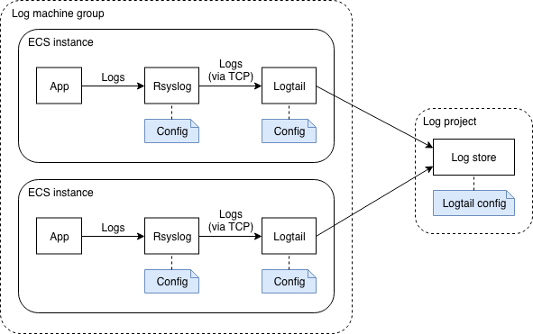

# DevOps for small / medium web apps - Part 6 - Maintenance and evolution

## Summary
0. [Introduction](#introduction)
1. [Logs management](#logs-management)
   1. [Log Service architecture](#log-service-configuration)
   2. [Log Service configuration](#log-service-configuration)
   3. [Log search](#log-search)
2. Monitoring and alarms
3. Database schema evolution
4. User management
5. Decommissioning

## Introduction
This document is the last "must-read" part of the tutorial in order to build a professional web application with
Alibaba Cloud (the next parts are more optional as they will mainly deal with improvements).

This part covers several important points:
* Log collection and search;
* System monitoring and alarms;
* Database schema evolution
* User management
* Decommissioning

Note: please find the source code containing the changes of this part in the "sample-app/version5" folder.

## Logs management
Working with application logs become more complex when the number of servers increase: for example when there is only
one server, an administrator just needs to connect to this machine and read the "/var/logs" folder and execute
commands such as `journalctl --unit=todo-list`. But when the number of servers increase, the same administrator
must connect to each machine in order to find the information he's looking for. This become even worse when auto-scaling
is enabled, because servers are automatically created and released.

A solution to this problem is to use the [Log Service](https://www.alibabacloud.com/product/log-service): its role
is to collect logs from servers and let administrators / developers to make search into them.

### Log Service architecture
Configuring Alibaba Cloud Log Service is a bit complex. The following diagram illustrates how it works:



In this diagram we can see that in each ECS instance, an application is generating logs and sending them to 
[Rsyslog](https://en.wikipedia.org/wiki/Rsyslog) (this is the case of our java application, thanks to the
SystemD configuration file that specifies `StandardOutput=syslog` and `StandardError=syslog`).

Rsyslog then must be configured to forward the logs to
[Logtail](https://www.alibabacloud.com/help/doc-detail/28979.htm), a log collection agent similar to
[LogStash](https://www.elastic.co/products/logstash), responsible for sending logs to the Log Service (note: you can
read [this document](https://www.alibabacloud.com/help/doc-detail/44259.htm) if you are interested in a comparison
between these tools).

The Log Service is organized in [log projects](https://www.alibabacloud.com/help/doc-detail/48873.htm) that contains
[log stores](https://www.alibabacloud.com/help/doc-detail/48874.htm). In our case we just need one log project and one
log store. The Log Service provides endpoints (such as "http://logtail.ap-southeast-1-intranet.log.aliyuncs.com") in
each region for Logtail, but both the log store and logtail must be configured:
* Logtail needs a configuration to understand how to parse logs from Rsyslog (the fields / columns in each log line)
  and how to send them to the Log Service (the endpoint, buffer size, ...)
* A log store needs to be configured in order to know what are the logs that needs to be stored (e.g. from which data
  source).

The log store configuration uses the concept of a
[machine group](https://www.alibabacloud.com/help/doc-detail/28966.htm) that refers to the ECS instances that
send their logs via Logtail.

### Log Service configuration
The first step is to add a log project and a log store in our basis infrastructure. Open a terminal on your
computer and type:
```bash
# Go to the project folder
cd ~/projects/todolist

# Edit the basis infrastructure definition
nano infrastructure/05_vpc_slb_eip_domain/main.tf
```
Add the following code at the end of the file:
```hcl-terraform
// Log project and store
resource "alicloud_log_project" "app_log_project" {
  name = "sample-app-log-project-${var.env}"
  description = "Sample web application log project (${var.env} environment)."
}
resource "alicloud_log_store" "app_log_store" {
  project = "${alicloud_log_project.app_log_project.name}"
  name = "sample-app-log-store-${var.env}"
}
```
Save the changes by pressing CTRL+X.

We then need to create two machine groups: one for our application, one for our certificate manager.
Enter the following commands in your terminal:
```bash
# Edit the application infrastructure definition
nano infrastructure/10_webapp/15_ecs/main.tf
```
Add the following code at the end of the file:
```hcl-terraform
// Log machine group
resource "alicloud_log_machine_group" "example" {
  project = "sample-app-log-project-${var.env}"
  name = "sample-app-log-machine-group-${var.env}"
  identify_list = [
    "${alicloud_instance.app_ecs_zone_0.private_ip}",
    "${alicloud_instance.app_ecs_zone_1.private_ip}"
  ]
}
```
Save the changes by pressing CTRL+X.

Note: as you can see, we use the private IP addresses to include ECS machines into the group.

Continue adding the machine group for the certificate manager:
```bash
# Edit the certificate manager infrastructure definition
nano infrastructure/15_certman/10_ecs_slb_rule/main.tf
```
Add the following code at the end of the file:
```hcl-terraform
// Log machine group
resource "alicloud_log_machine_group" "example" {
  project = "sample-app-log-project-${var.env}"
  name = "sample-app-certman-log-machine-group-${var.env}"
  identify_list = [
    "${alicloud_instance.certman_ecs.private_ip}"
  ]
}
```
Save the changes by pressing CTRL+X.

The next step is to modify our Packer scripts in order to install Logtail and configure it:
```bash
# Edit the application image script
nano infrastructure/10_webapp/10_image/app_image.json
```
Add the following provisioner at the end of the `provisioners` array:
```json
{
  "type": "shell",
  "inline": [
    "export REGION=\"{{user `region_id`}}\"",
    "wget \"http://logtail-release-${REGION}.oss-${REGION}.aliyuncs.com/linux64/logtail.sh\" -O logtail.sh",
    "chmod 755 logtail.sh",
    "./logtail.sh install auto",
    "export STREAMLOG_FORMATS=\"[{\\\"version\\\": \\\"0.1\\\", \\\"fields\\\": []}]\"",
    "export ESCAPED_STREAMLOG_FORMATS=$(echo $STREAMLOG_FORMATS | sed -e 's/\\\\/\\\\\\\\/g; s/\\//\\\\\\//g; s/&/\\\\\\&/g')",
    "sed -i \"s/\\(\\\"streamlog_open\\\" : \\).*\\$/\\1true,/\" /usr/local/ilogtail/ilogtail_config.json",
    "sed -i \"s/\\(\\\"streamlog_formats\\\":\\).*\\$/\\1${ESCAPED_STREAMLOG_FORMATS},/\" /usr/local/ilogtail/ilogtail_config.json"
  ]
}
```
Save and exit with CTRL+X. Then do the same with the certificate manager image:
```bash
# Edit the certificate manager image script
nano infrastructure/15_certman/05_image/certman_image.json
```
Add the same provisioner as above, then save and exit with CTRL+X.

We haven't finished with Packer scripts yet as we still need to configure Rsyslog to forward logs to Logtail.
```bash
# Create the Rsyslog configuration script
nano infrastructure/10_webapp/10_image/resources/rsyslog-logtail.conf
```
Enter the following content into this file:
```
$ActionQueueFileName fwdRule1 # unique name prefix for spool files
$ActionQueueMaxDiskSpace 1g # 1gb space limit (use as much as possible)
$ActionQueueSaveOnShutdown on # save messages to disk on shutdown
$ActionQueueType LinkedList # run asynchronously
$ActionResumeRetryCount -1 # infinite retries if host is down

# Defines the fields of log data
$template ALI_LOG_FMT,"0.1 sys_tag %timegenerated:::date-unixtimestamp% %fromhost-ip% %hostname% %pri-text% %protocol-version% %app-name% %procid% %msgid% %msg:::drop-last-lf%\n"
*.* @@127.0.0.1:11111;ALI_LOG_FMT
```
Save and exit by pressing CTRL+X. Copy the same file for the certificate manager:
```bash
# Copy the Rsyslog configuration script
cp infrastructure/10_webapp/10_image/resources/rsyslog-logtail.conf infrastructure/15_certman/05_image/resources/rsyslog-logtail.conf
```
Add a provisioner into the application Packer script in order to upload this configuration file:
```bash
# Edit the application image script
nano infrastructure/10_webapp/10_image/app_image.json
```
Add the following provisioner:
```json
{
  "type": "file",
  "source": "resources/rsyslog-logtail.conf",
  "destination": "/etc/rsyslog.d/80-logtail.conf"
}
```
Save and exit with CTRL+X. Edit in a similar way the certificate manager image script:
```bash
# Edit the certificate manager image script
nano infrastructure/15_certman/05_image/certman_image.json
```
Add the same provisioner as above then save and quit with CTRL+X.


--- TODO ---
TODO: modify the Packer scripts to setup logtail:
wget http://logtail-release-ap-southeast-1.oss-ap-southeast-1.aliyuncs.com/linux64/logtail.sh -O logtail.sh
chmod 755 logtail.sh
./logtail.sh install auto

Modify the configuration of logtail:
"streamlog_formats":[{"version": "0.1", "fields": []}]


Modify the conf /etc/rsyslog.conf (would be better in /etc/rsyslog.d/afile):
$WorkDirectory /var/spool/rsyslog # where to place spool files
$ActionQueueFileName fwdRule1 # unique name prefix for spool files
$ActionQueueMaxDiskSpace 1g # 1gb space limit (use as much as possible)
$ActionQueueSaveOnShutdown on # save messages to disk on shutdown
$ActionQueueType LinkedList # run asynchronously
$ActionResumeRetryCount -1 # infinite retries if host is down
# Defines the fields of log data
$template ALI_LOG_FMT,"0.1 sys_tag %timegenerated:::date-unixtimestamp% %fromhost-ip% %hostname% %pri-text% %protocol-version% %app-name% %procid% %msgid% %msg:::drop-last-lf%\n"
*.* @@127.0.0.1:11111;ALI_LOG_FMT


Check if some ports have to be opened (security group)


Check how to enable logtail with systemd:
sudo /etc/init.d/ilogtaild stop
sudo /etc/init.d/ilogtaild start

Check if it is possible to configure a "Logtail Config" with Terraform, or at least with a Python script
--- TODO ---

The final step is to commit and push your changes to GitLab:
```bash
# Check files to commit
git status

# Add the modified and new files
git add infrastructure/05_vpc_slb_eip_domain/main.tf
git add infrastructure/10_webapp/15_ecs/main.tf
git add infrastructure/15_certman/10_ecs_slb_rule/main.tf

# Commit and push to GitLab
git commit -m "Collect logs into a log project."
git push origin master
```

--- TODO ---
TODO: add the modified Packer scripts
--- TODO ---

Check your CI / CD pipeline on GitLab, in particularly the logs of the "deploy" stage and make sure there is no error.

### Log search
Let's check the logging configuration. First we need to generate logs with the application.
One way to do that is to connect to the application (http://dev.my-sample-domain.xyz/) and create / delete tasks.

