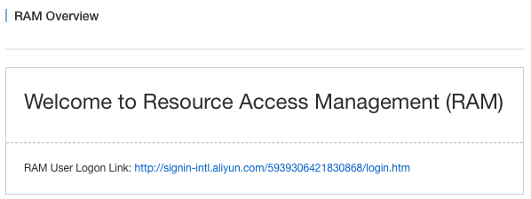
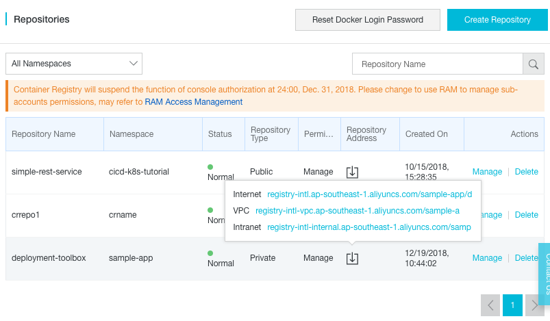


# DevOps for small / medium web apps - Part 7 - Speeding up CI / CD pipeline

## Summary
0. [Introduction](#introduction)
1. [Deployment Docker image](#deployment-docker-image)
   1. [Docker repository creation](#docker-repository-creation)
   2. [Docker image project](#docker-image-project)
   3. Pipeline update
2. VM image pre-building
3. Parallelization
2. Pre-production and production environments

## Introduction
Until now we have been focusing on adding new functionalities to our application
([HTTPS](part_05_https_configuration.md) and [centralized logs](part_06_log_management.md)). However, in doing so we
have slowed down substantially our CI / CD pipeline, as it now takes about one hour to complete the full process.

The goal of this tutorial part is to focus on this slow pipeline problem and to find ways to accelerate it.

## Deployment Docker image
The slowest stage of our pipeline is the one responsible for deployment, and its first task is always the same:
downloading and installing tools. It usually takes several minutes to complete and unnecessarily waste resources
such as network bandwidth or computational.

A way to speed up this first task is to create our own Docker image, and then use it in our pipeline.

### Docker repository creation
The first step is to create a [repository](https://www.alibabacloud.com/help/doc-detail/60763.htm) via
the [Container Registry Service](https://www.alibabacloud.com/help/doc-detail/60945.htm) in order to host our
own Docker images. Open a web browser tab and execute the following instructions:
* Go to the [Container Registry web console](https://cr.console.aliyun.com);
* If necessary, select your region on top of the page;
* Click on the "Namespace" left menu item;
* Click on the "Create Namespace" button;
* In the popup form, set a field value corresponding to your domain name such as "my-sample-domain-xyz" (replace
  dots '.' by dashes '-') and click on the "Confirm" button.
  Please note that we use the domain name because namespaces must be unique among all accounts in Alibaba Cloud.
* Click on the "Repositories" left menu item;
* Click on the "Create Repository" button;
* Fill the popup form with the following values:
  * Region = your region
  * Namespace = your namespace such as my-sample-domain-xyz
  * Repository Name = deployment-toolbox
  * Summary = Ubuntu with deployment tools (Terraform, Packer, ...)
  * Repository Type = Private
* Click on the "Next" button;
* Select the "Local Repository" tab and click on "Create Repository";

We then need to create a [RAM](https://www.alibabacloud.com/product/ram) user in order to let Docker to access to
our repository:
* Go to the [RAM web console](https://ram.console.aliyun.com);



* Copy the URL next to "RAM User Logon Link", we will need to use it later;
* Click on the "Users" left menu item;
* Click on the "Create User" button;
* In the popup form set "sample-app-gitlab" in the "User Name" field and click on "OK";
* The page should refresh itself and display our "sample-app-gitlab" user; click on his "Authorize" link on the right;
* In the new popup, select the policy name "AliyunContainerRegistryFullAccess" and click on the button with an arrow
  pointing to the right;
* Click on "OK" to close the popup;
* Click on the "Manage" link on the right of the user "sample-app-gitlab";
* Click on the "Enable Console Logon" button;
* In the popup form, enter twice the same password, uncheck the checkbox "On your next logon you must reset the
  password." and click on "OK";

We now need to set the Docker password for this RAM user:
* Open a [private web browser window](https://en.wikipedia.org/wiki/Private_browsing) and browse to the
  "RAM User Logon Link" URL you copied earlier (it should be something like
  "http://signin-intl.aliyun.com/5939306421830868/login.htm");
* Login with your ram username and password (the username should be something like
  "sample-app-gitlab@5939306421830868", the password is the one you set earlier);
* Go to the [Container Registry web console](https://cr.console.aliyun.com);
* Click on the button "Reset Docker Login Password";
* Set a new password and click on "OK";
* Close your private web browser window.

If you have [Docker](https://www.docker.com/get-started) installed on your computer, you can test your configuration
like this:
* Go to the [Container Registry web console](https://cr.console.aliyun.com) (with your normal account);
* If necessary, select your region on top of the page;
* The repository "deployment-toolbox" should be displayed; move your mouse cursor on top of the icon that looks like
  an arrow going into a box under the "Repository Address" column; a popup should open with multiple URLS:
  


* Click on the first address (next to "Internet") to copy it (it should be like
  registry-intl.ap-southeast-1.aliyuncs.com/my-sample-domain-xyz/deployment-toolbox);
* Open a terminal and type:
  ```bash
  # Test your repository configuration
  docker login --username=sample-app-gitlab@5939306421830868 registry-intl.ap-southeast-1.aliyuncs.com
  ```
  This command should prompt for the password you set earlier when you clicked on "Reset Docker Login Password". If
  the configuration is good, the command should print "Login Succeeded".
  
  Notes:
  * The `--username` argument should be `sample-app-gitlab@your-user-id-or-enterprise-alias`. You can find your
    user ID or enterprise alias inside the "RAM User Logon Link" you copied earlier (for example if the link is
    "http://signin-intl.aliyun.com/5939306421830868/login.htm", then the user ID is 5939306421830868).
  * The next argument is the domain name of your repository address (for example if the repository address is
    "registry-intl.ap-southeast-1.aliyuncs.com/my-sample-domain-xyz/deployment-toolbox", then the argument is
    "registry-intl.ap-southeast-1.aliyuncs.com").

### Docker image project
The next step is to create a new GitLab project where we will host the 

