
# Getting Started with Container Service (Swarm)

## Summary
0. [Introduction](#introduction)
1. [Prerequisite](#prerequisite)
2. [Step 1 - Spring Boot application](#step-1-spring-boot-application)
3. [Step 2 - Containerisation with Docker](#step-2-containerisation-with-docker)
4. [Step 3 - GitHub repository](#step-3-github-repository)
5. [Step 4 - Container Registry](#step-4-container-registry)
6. [Step 5 - Container Service Swarm](#step-5-container-service-swarm)
7. [Step 6 - Automatic build & deploy verification](#step-6-automatic-build-deploy-verification)
8. [References](#references)
9. [Support](#support)

## Introduction
The goal of this tutorial is to explain how to create a simple CI / CD pipeline in order to deploy an application
in Alibaba Cloud [Container Service (Swarm)](https://www.alibabacloud.com/help/doc-detail/63583.htm).

## Prerequisite
* Have an [Alibaba Cloud account](https://www.alibabacloud.com/help/doc-detail/50482.htm)
  and [obtain an access key id and secret](https://www.alibabacloud.com/help/faq-detail/63482.htm).
* Sign up on [GitHub](https://github.com/) and add your 
  [SSH key](https://help.github.com/articles/connecting-to-github-with-ssh/).
* Have the following tools and SDK installed on your computer:
  * [Java JDK 8+](https://adoptopenjdk.net/)
  * [Maven 3.2+](https://maven.apache.org/download.cgi)
  * [Docker](https://www.docker.com/)
  * [Git](https://git-scm.com/)

## Step 1 - Spring Boot application
Let's start with an example [Spring Boot](https://spring.io/projects/spring-boot) application. Please create a folder
for this project (e.g. `~/projects/container-service-sample`) with the following sub-directory structure:
```
├── src
│   └── main
│       └── java
│           └── com
│               └── alibabacloud
│                   └── howto
│                       └── ContainerServiceApplication.java
└── pom.xml
```

Create a [pom.xml](https://maven.apache.org/guides/introduction/introduction-to-the-pom.html) file with the
following content:
```xml
<?xml version="1.0" encoding="UTF-8"?>
<project xmlns="http://maven.apache.org/POM/4.0.0" xmlns:xsi="http://www.w3.org/2001/XMLSchema-instance"
         xsi:schemaLocation="http://maven.apache.org/POM/4.0.0 http://maven.apache.org/xsd/maven-4.0.0.xsd">
    <modelVersion>4.0.0</modelVersion>
    <groupId>com.alibabacloud.howto</groupId>
    <artifactId>container-service-sample</artifactId>
    <version>1.0.0</version>
    <packaging>jar</packaging>

    <name>${artifactId}</name>
    <description>Demo project for Spring Boot, Docker, and will be running on top of Alibaba Cloud.</description>

    <properties>
        <spring-boot.version>2.1.1.RELEASE</spring-boot.version>

        <java.version>1.8</java.version>
        <maven.compiler.source>1.8</maven.compiler.source>
        <maven.compiler.target>1.8</maven.compiler.target>
        <project.build.sourceEncoding>UTF-8</project.build.sourceEncoding>
        <project.reporting.outputEncoding>UTF-8</project.reporting.outputEncoding>
    </properties>

    <dependencyManagement>
        <dependencies>
            <dependency>
                <!-- Import dependency management from Spring Boot -->
                <groupId>org.springframework.boot</groupId>
                <artifactId>spring-boot-dependencies</artifactId>
                <version>${spring-boot.version}</version>
                <type>pom</type>
                <scope>import</scope>
            </dependency>
        </dependencies>
    </dependencyManagement>

    <dependencies>
        <dependency>
            <groupId>org.springframework.boot</groupId>
            <artifactId>spring-boot-starter-web</artifactId>
        </dependency>

        <dependency>
            <groupId>org.springframework.boot</groupId>
            <artifactId>spring-boot-devtools</artifactId>
        </dependency>
        <dependency>
            <groupId>org.springframework.boot</groupId>
            <artifactId>spring-boot-starter-test</artifactId>
            <scope>test</scope>
        </dependency>
    </dependencies>

    <build>
        <plugins>
            <plugin>
                <groupId>org.springframework.boot</groupId>
                <artifactId>spring-boot-maven-plugin</artifactId>
                <executions>
                    <execution>
                        <goals>
                            <goal>repackage</goal>
                        </goals>
                    </execution>
                </executions>
            </plugin>
        </plugins>
    </build>

</project>
```

Our application is made of a single Java class `ContainerServiceApplication`. Please create the file
`src/main/java/com/alibabacloud/howto/ContainerServiceApplication.java` with the following content:
```java
package com.alibabacloud.howto;

import org.springframework.boot.SpringApplication;
import org.springframework.boot.autoconfigure.SpringBootApplication;
import org.springframework.web.bind.annotation.GetMapping;
import org.springframework.web.bind.annotation.RestController;

@RestController
@SpringBootApplication
public class ContainerServiceApplication {

    @GetMapping("/")
    public String welcome() {
        return "Hello, Container Service!";
    }

    public static void main(String[] args) {
        SpringApplication.run(ContainerServiceApplication.class, args);
    }

}
```

Let's test the application. Open a terminal and execute the following commands:
```bash
# Navigate to the project directory
cd ~/projects/container-service-sample

# Build the application
mvn clean package

# Run it
mvn spring-boot:run
```
Then open a web browser and go to [localhost:8080](http://localhost:8080). If everything went well, you should see
the "Hello, Container Service!" message.

> Note: to stop the application, press CTRL+C.

## Step 2 - Containerisation with Docker
Let's create a Docker image of our application. Add the following `Dockerfile` to the root directory of our project
(e.g. `~/projects/container-service-sample/Dockerfile`):
```dockerfile
## Docker multi-stage build
## First stage: complete build environment
FROM maven:3.5.0-jdk-8-alpine AS builder
# Add source code and pom.xml
ADD ./src src/
ADD ./pom.xml pom.xml
# Package executable jar
RUN mvn clean package

## Second stage: minimal runtime environment
FROM openjdk:8-jdk-alpine
VOLUME /tmp
# Copy jar from the first stage
COPY --from=builder target/container-service-sample-1.0.0.jar app.jar
ENTRYPOINT ["java","-Djava.security.egd=file:/dev/./urandom","-jar","app.jar"]
```

We could directly use the [docker build command](https://docs.docker.com/engine/reference/commandline/build/) to build
our Docker image, however we will integrate this build step into our Maven configuration.

Open the `pom.xml` file with your favorite text editor, and apply the following changes:
```xml
<?xml version="1.0" encoding="UTF-8"?>
<project>
    ...

    <properties>
        ...
        <docker.image.prefix>alibabacloud-howto</docker.image.prefix>
        <dockerfile-maven-plugin.version>1.4.9</dockerfile-maven-plugin.version>
    </properties>

    ...

    <build>
        <plugins>
            ...
            <plugin>
                <groupId>com.spotify</groupId>
                <artifactId>dockerfile-maven-plugin</artifactId>
                <version>${dockerfile-maven-plugin.version}</version>
                <configuration>
                    <repository>${docker.image.prefix}/${project.artifactId}</repository>
                </configuration>
            </plugin>
        </plugins>
    </build>

</project>
```
> Note: the existing XML code has been replaced by `...` to improve readability.

Let's build our Docker image. Enter the following commands in your terminal:
```bash
# Build the Docker image
mvn clean dockerfile:build
```
> Note: before executing this command, make sure you have your [Docker daemon](https://docs.docker.com/config/daemon/)
> running.

The build step should take few minutes. Once this is finished, you can check if it worked with the following command:
```bash
# List all Docker images saved locally
docker images
```

You should be able to see the following Docker image:

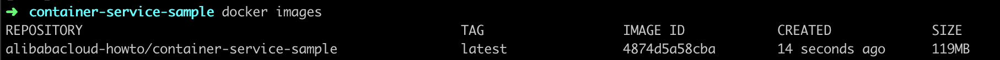

Let's create a container from our image. Run the following command in your terminal:
```bash
# Run the our application with Docker
$ docker run -p 8080:8080 -t alibabacloud-howto/container-service-sample
```

The outputs should look like this:

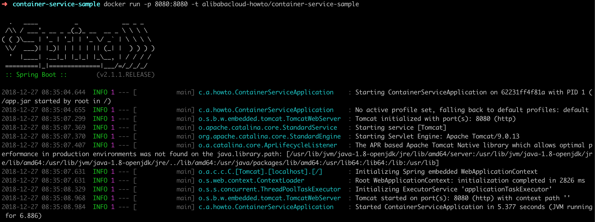

You can also use your web browser and navigate to [localhost:8080](http://localhost:8080). You should see
the "Hello, Container Service!" message.

In order to stop the Docker container, we need to run the following commands in a terminal:
```bash
# Get the container ID
docker container ls

# Stop the container
docker stop 54789f1c4b67 # Replace 54789f1c4b67 by your ID
```

## Step 3 - GitHub repository
Alibaba Cloud Container Service can simplify our life by automatically deploying our application.
In order to use this service, we first need to bind our Alibaba Cloud account with a source code hosting platform,
such as [GitHub](https://github.com/), [Bitbucket](https://bitbucket.org/) or [GitLab](https://about.gitlab.com/).

Let's host our project on GitHub:
* With a web browser go to [GitHub](https://github.com/) and sign in. 
* Create a new repository "container-service-sample" (can be private, but do not initialize it with a README,
  .gitignore or LICENSE).

On the top of the repository page, GitHub should display the repository address
(e.g. `git@github.com:username/container-service-sample.git`).

Let's push our code to Github. In our terminal we execute the following commands:
```bash
# Navigate to the project directory
cd ~/projects/container-service-sample

# Initialize the project as a git repository
git init

# Add and commit the files we want to push
git add Dockerfile pom.xml src
git commit -m "first commit"

# Add a remote origin
git remote add origin git@github.com:username/container-service-sample.git # Replace the username

# Push the commit to GitHub
git push -u origin master
```
We should now be able to see our files in GitHub after refreshing our page in the web browser.

## Step 4 - Container Registry
Let's bind our GitHub account with Alibaba Cloud Container Service:
* Go to the [Container Registry console](https://cr.console.aliyun.com/).
* Select your region on top of the page:

   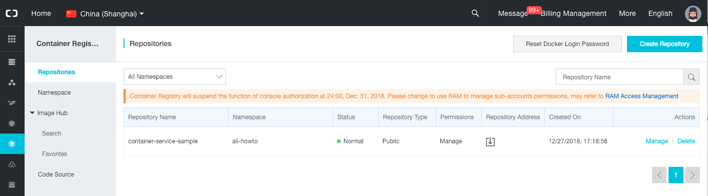

* On the left menu, select "Code Source".
* Click on the "Bind Account" button in the GitHub panel.

   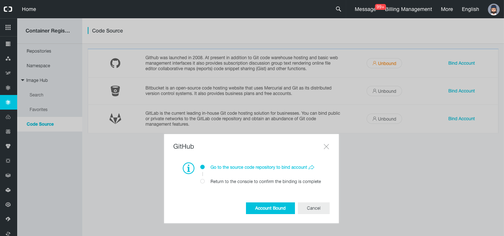

* Click on the "Go to the source code repository to bind account" link.

   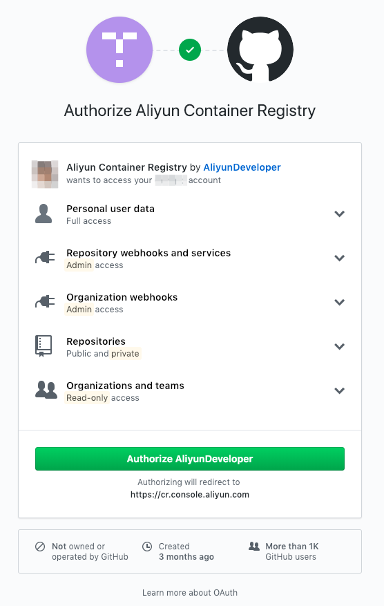

* Click on the "Authorize AliyunDeveloper" button.
* Re-enter your GitHub password if requested.

At the end of this process we are redirected back to the Container Registry console with a message:
"You have successfully bound the GitHub account."

Let's now create a namespace:
* On the left menu, select "Namespace".
* Click on the "Create Namespace" button.
* In the popup, choose a name such as "ali-howto" and click on "Confirm".

   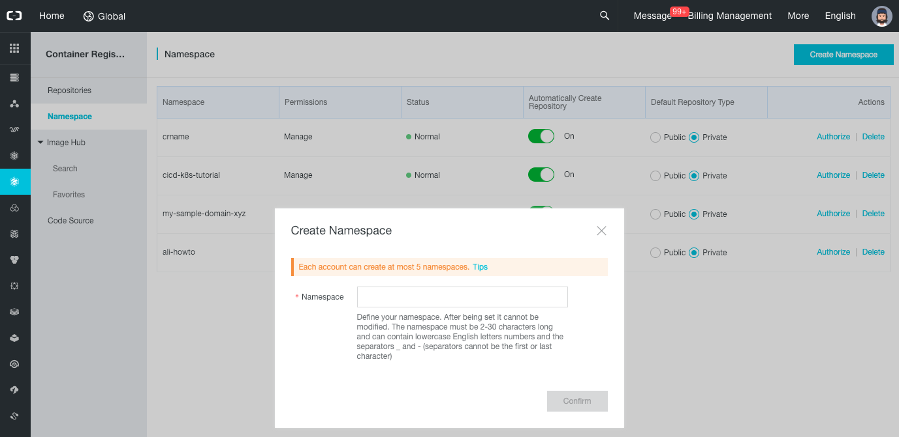


Let's create a Docker repository:
* Click on the "Repositories" item on the left menu.
* Click on the "Create Repository" button.
* In the new popup select your namespace, set the repository name to "container-service-sample", write a summary,
  set the type as "Public", and click on "Next".
  
   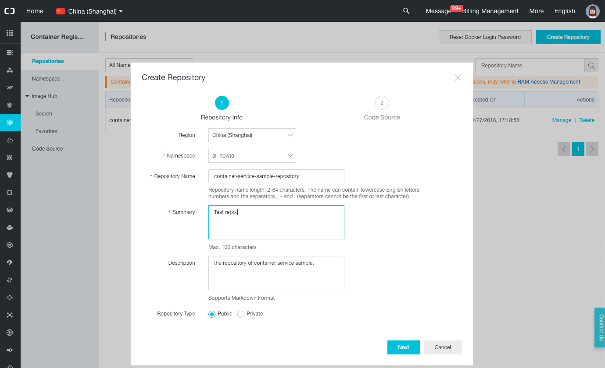

* Select the "GitHub" tab, select your code repository "container-service-sample",
  make sure "Automatically build image" is checked, and click on "Create Repository".

   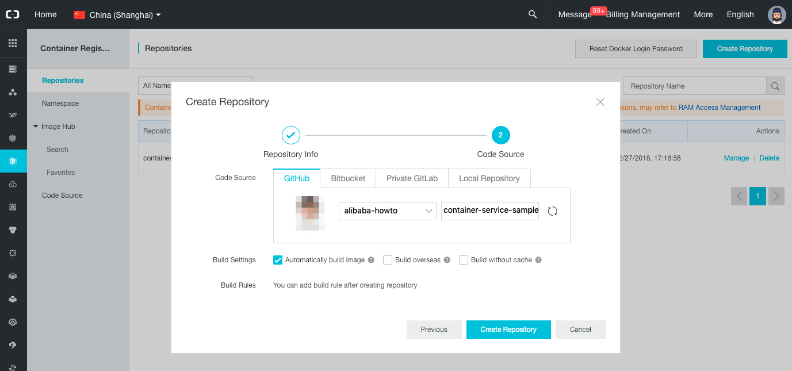

* You should now see a list of repositories, click on the "Manage" link on your new repository.

   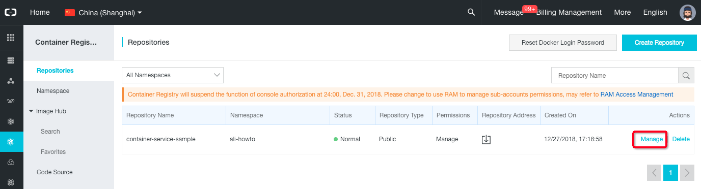

* On the new page, click on the "Build" left menu item.
* Click on "Add Build Rule", select the master branch, set the tag name to "latest", and click on "OK".

   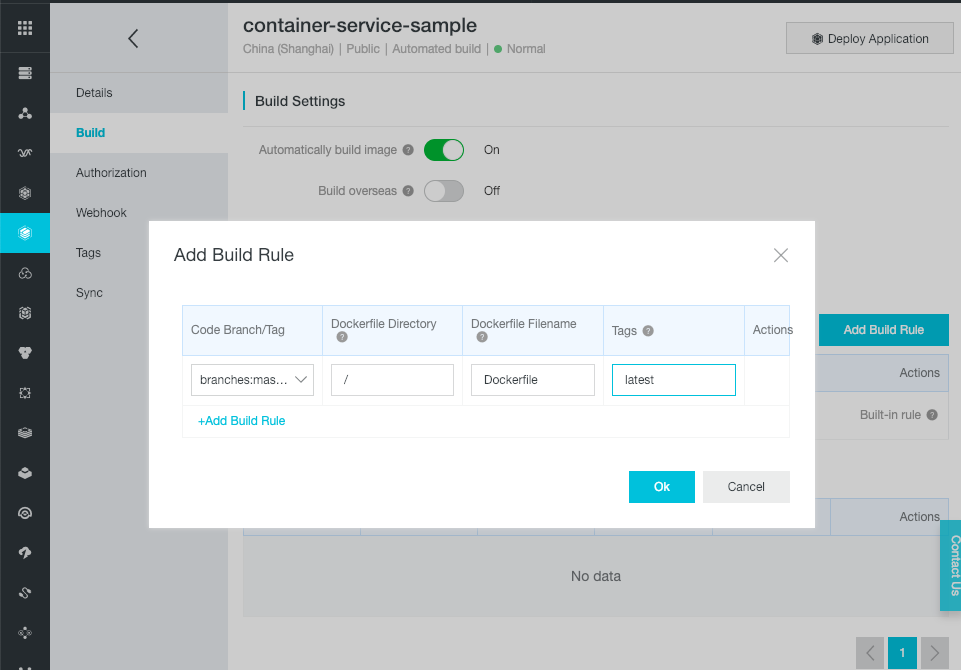

* After the popup closes itself, we can see new build rules. Click on the "Build" link on the "branches:master" row.
  This triggers the build of the "container-service-sample" docker image.

   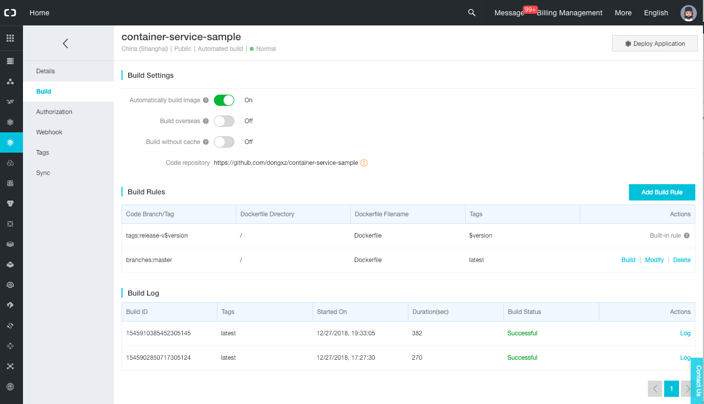

After few minutes the build should succeed with the "Successful" status.

Click on the "Tags" left menu item to see the Docker image that we have just built.

## Step 5 - Container Service Swarm
Let's deploy our application into a Docker Swarm cluster:
* Go to the [VPC console](https://vpc.console.aliyun.com/).
* Select the same region as the container repository.
* Click on the "Create VPC" button.
* In the new form, set the VPC name to "swarm-cluster-howto-vpc", the VSwitch name to "swarm-cluster-howto-vswitch",
  choose a zone, and click on the "OK" button.
* Close the form panel by clicking on the "Complete" button.

* Go to the [Container Service console](https://cs.console.aliyun.com/).
* On the top-left of the page, select "Container Service - Swarm".

   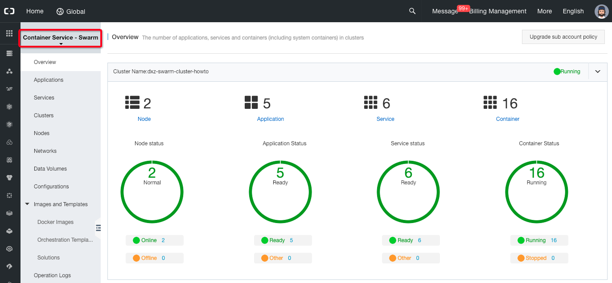

* If you are not already on this page, click on the "Clusters" left menu item.
* Click on the "Create Cluster" button.

   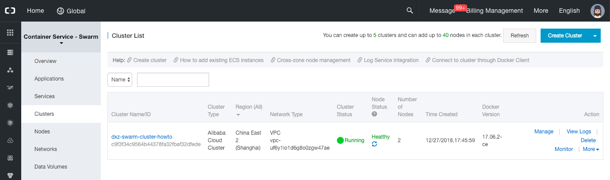

* In the new form, set the cluster name to "swarm-cluster-howto", set the same region and zone as your Vswitch,
  select the VPC and Vswitch, set the login to "Password" and set a logon password.
  Leave all the other parameters to their default values and click on the "Create" button on the top-right of the page.
  
  > Note: for more information about Swarm cluster creation, please read the 
  > [official user guide](https://www.alibabacloud.com/help/doc-detail/25995.htm).

   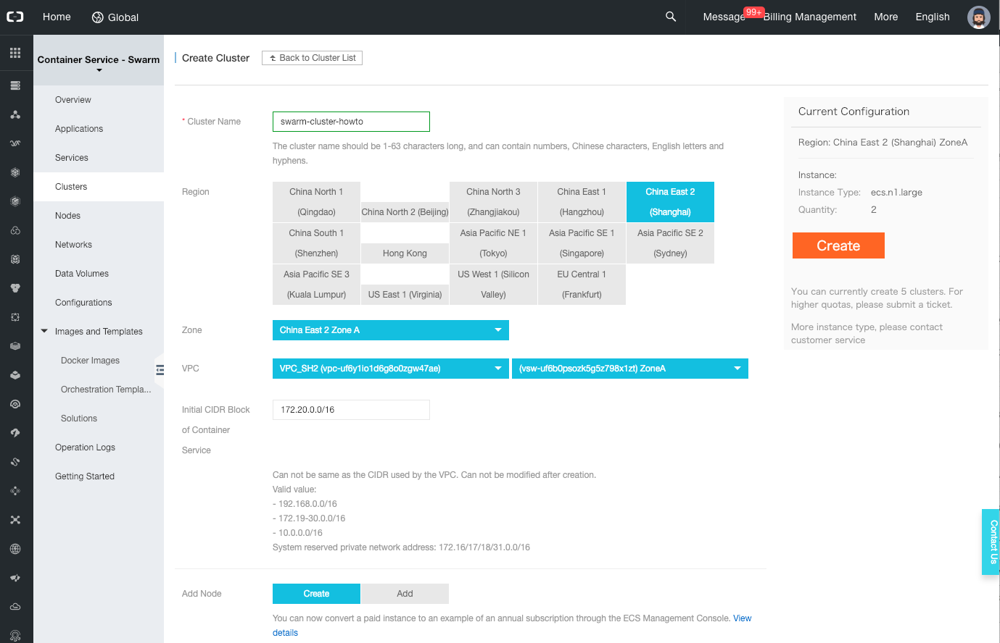

* A new popup "Confirm Cluster Configuration" should appear. Click on the "OK" button.

   
   
* The next page displays the logs during the creation of the cluster.

   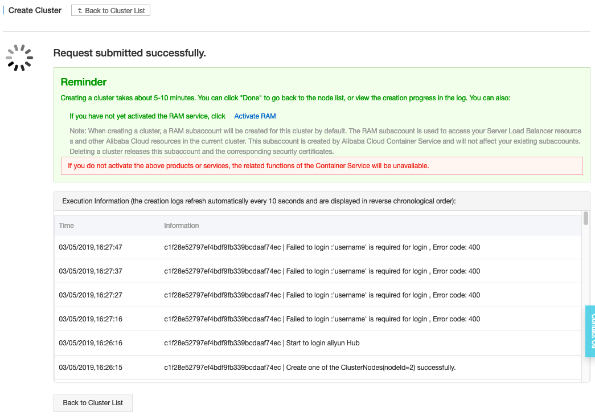

* Once finished, the message "Cluster created successfully." is displayed.

   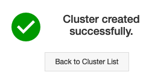


It's time to deploy our application into our new cluster:
* Click on the "Applications" left menu item.
* Select the cluster that we have created above and click on "Create Application".

   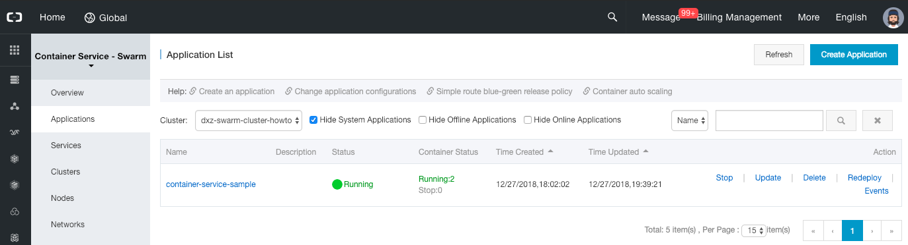

* Set the application name to "container-service-sample" and click on "Create with Image".

   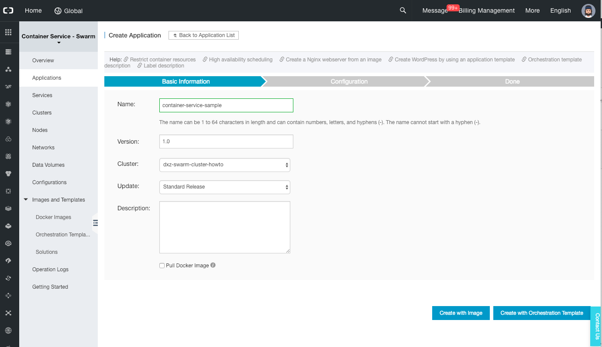

* On the next page, select the user image "ali-howto/container-service-sample" and set the scale to 2.

* Click on the (+) icon next to "Port Mapping" (do not click on the link, it will open a new tab to the official
  documentation). Leave the host port empty, but set the container port to 8080.

   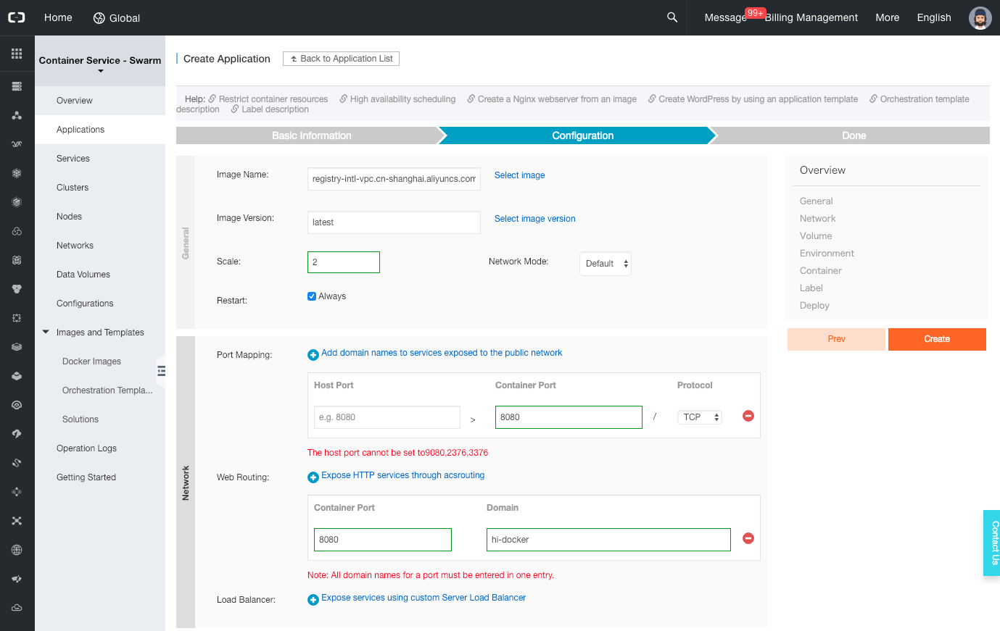

* Click on the (+) icon next to "Web Routing". Set the container port to 8080 and the domain to "hi-docker".

* Click on the "Create" button on the top-right of the page.

* Click on the "Services" left menu item, select the cluster and click the "container-service-sample" service name link.
 
   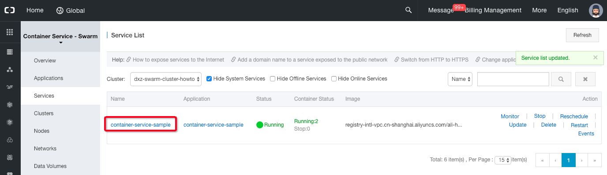

* The new page should display an access point such as "http://hi-docker.someid.ap-southeast-1.alicontainer.com", click
  on this link.

   

* If everything went well, the message "Hello, Container Service!" should be displayed.


## Step 6 - Automatic build & deploy verification
Let's configure the Container Service to automatically re-deploy our application when we push changes to GitHub. For
that we need to link our cluster with our container repository:
* Go to the [Container Service console](https://cs.console.aliyun.com/).
* Click on the "Applications" left menu item.
* Select the cluster, find the application "container-service-sample", and click on its name to open the details page.

   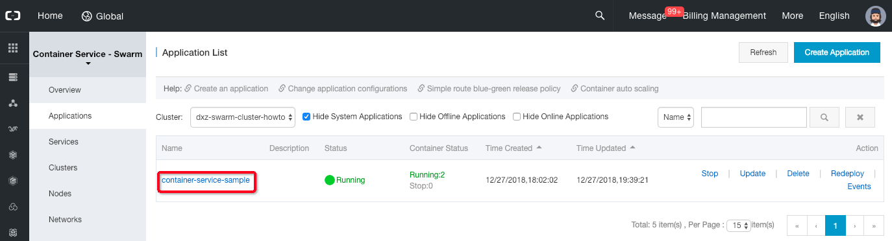

* Click on the "Create Trigger" button, select the "Redeploy" action and check the checkbox between
  "Associated with Image Update" and "container-service-sample". Click on "Confirm" to generate a trigger Link.

   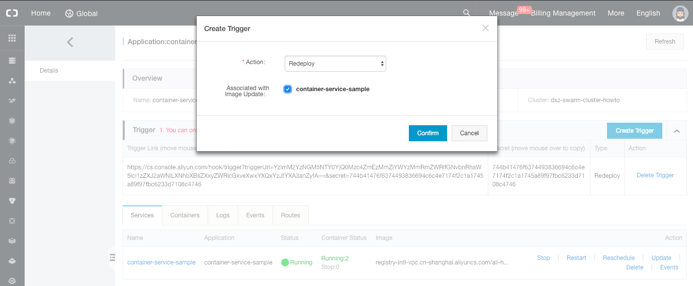

* When the popup closes, a trigger link is displayed. Copy it.

   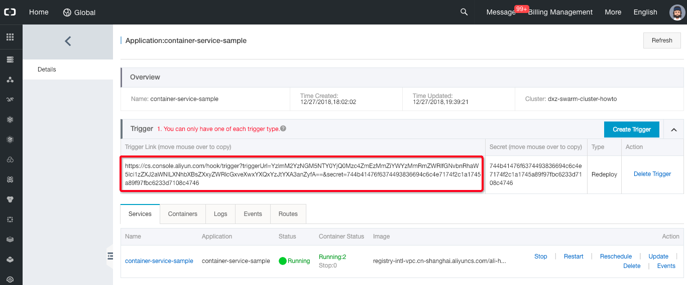

* Go to the [Container Registry console](https://cr.console.aliyun.com/).
* Find the repository "container-service-sample" and click on the "Manage" link on the right side.
* Click on the "Trigger" left menu item.
* Click on the "Create" button. In the new popup set the name "redeploy", paste the trigger URL that you have
  copied earlier, select "Tag triggers", move the "latest" tag to the right panel and click on the "OK" button.

  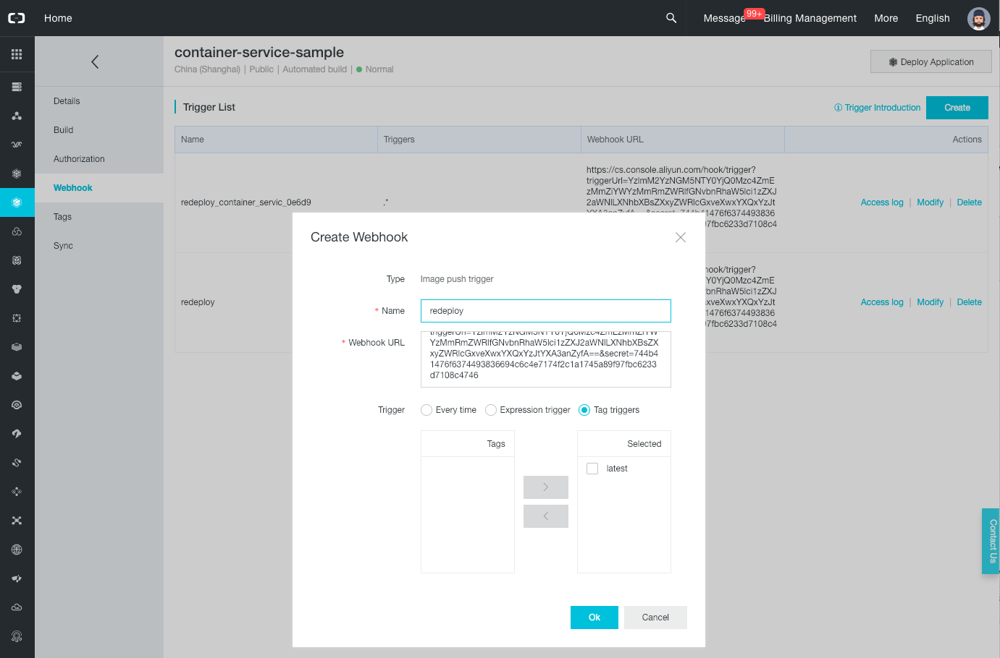

Now that our container repository is linked to our cluster via a trigger, we can test the complete process.

Let's modify our Java class (file `src/main/java/com/alibabacloud/howto/ContainerServiceApplication.java`). Open it in
a text editor and replace its content with the following one:
```java
package com.alibabacloud.howto;

import org.slf4j.Logger;
import org.slf4j.LoggerFactory;
import org.springframework.boot.SpringApplication;
import org.springframework.boot.autoconfigure.SpringBootApplication;
import org.springframework.web.bind.annotation.GetMapping;
import org.springframework.web.bind.annotation.RestController;

import java.net.InetAddress;
import java.net.UnknownHostException;

@RestController
@SpringBootApplication
public class ContainerServiceApplication {

    private static final Logger LOGGER = LoggerFactory.getLogger(ContainerServiceApplication.class);

    @GetMapping("/")
    public String welcome() {
        return getServerIP() + " says: Hello, Container Service!";
    }

    public static void main(String[] args) {
        SpringApplication.run(ContainerServiceApplication.class, args);
    }

    private String getServerIP() {
        InetAddress inetAddress = null;
        try {
            inetAddress = InetAddress.getLocalHost();
        } catch (UnknownHostException e) {
            LOGGER.warn("Unable to obtain the IP address of this server.", e);
        }

        if (inetAddress == null) {
            return "Docker server";
        }

        return inetAddress.getHostAddress();
    }

}
```
> Note: as you can see this modification adds the machine IP address in the message returned when the user
> visits the home page.

Let's commit and push this change to GitHub:
```bash
# Check the changes
git status

# Add the modified file
git add src/main/java/com/alibabacloud/howto/ContainerServiceApplication.java

# Commit and push
git commit -m "Show the IP address in the home message."
git push origin master
```

The commands above should trigger an automatic build:
* Go to the [Container Registry console](https://cr.console.aliyun.com/).
* Find the repository "container-service-sample" and click on the "Manage" link on the right side.
* Click on the "Build" left menu item: you should see a new build log, with the "Building" status at the beginning, and
  then "Successful" after few minutes.

Once the image is built, it only takes few seconds for the application to be deployed again. With your web browser,
navigate to the application URL (e.g. "http://hi-docker.someid.ap-southeast-1.alicontainer.com").

If everything went well, you should be able to see an updated message with the server IP address:

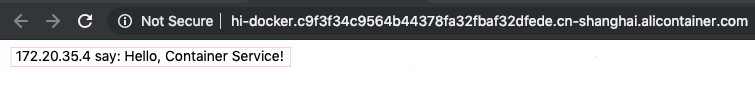

> Note: as you can see the total rebuild process is composed of the following steps:
> GitHub push >> Container Registry re-build >> Container Service re-deploy.

Congratulations, you have completed this tutorial!

## References
* [Spring Boot with Docker](https://spring.io/guides/gs/spring-boot-docker/)
* [Container Registry - Build a repository](https://www.alibabacloud.com/help/doc-detail/60997.htm)
* [Container Registry - Webhook](https://www.alibabacloud.com/help/doc-detail/60949.htm)
* [Container Service - Create a cluster](https://www.alibabacloud.com/help/doc-detail/25995.htm)
* [Container Service - Create an application](https://www.alibabacloud.com/help/doc-detail/26016.htm)
* [Container Service - Triggers](https://www.alibabacloud.com/help/doc-detail/75053.html)

## Support
If you need help, please don't hesitate to <a href="mailto:projectdelivery@alibabacloud.com">contact us</a>.
