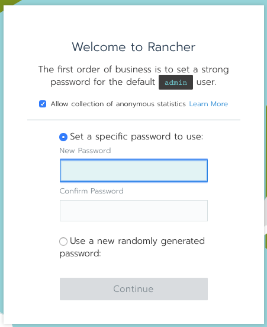
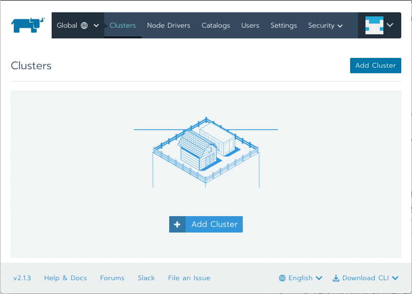

# Getting started with Rancher

## Summary
0. [Introduction](#introduction)
1. [Prerequisite](#prerequisite)
2. [Rancher installation](#rancher-installation)
3. [Kubernetes cluster](#kubernetes-cluster)
    1. [Cluster sizing](#cluster-sizing)
    2. [Cluster creation](#cluster-creation)

## Introduction
[Rancher](https://rancher.com/) is a multi-cluster [Kubernetes](https://kubernetes.io) management platform. The goal
of this tutorial is to explain how to setup Rancher on a
[single node](https://rancher.com/docs/rancher/v2.x/en/installation/) and how to integrate it with
[Alibaba Cloud Container Service](https://www.alibabacloud.com/product/container-service).

## Prerequisite
In order to follow this tutorial, you need to 
[create an Alibaba Cloud account](https://www.alibabacloud.com/help/doc-detail/50482.htm) and
[obtain an access key id and secret](https://www.alibabacloud.com/help/faq-detail/63482.htm).

Cloud resources are created with [Terraform](https://www.terraform.io/) scripts. If you don't know this tool, please
[follow this tutorial](https://www.terraform.io/intro/getting-started/install.html) and familiarize yourself with the
[alicloud provider](https://www.terraform.io/docs/providers/alicloud/index.html).

Please also make sure you are familiarized with Kubernetes. If you need, you can follow
this [tutorial](https://kubernetes.io/docs/tutorials/kubernetes-basics/) to learn the basics. You will also need
to [setup the command line tool 'kubectl'](https://kubernetes.io/docs/tasks/tools/install-kubectl/).

Important: please download the 
[related resources](https://github.com/alibabacloud-howto/devops/tree/master/tutorials/getting_started_with_rancher)
before moving to the next section.

## Rancher installation
There are two ways to [setup](https://rancher.com/docs/rancher/v2.x/en/installation/) Rancher:
* Single-node configuration;
* High-Availability configuration.

We will choose the first way as it makes things simpler.

Open a terminal on your computer and execute the following instructions:
```bash
# Go to the folder where you have downloaded this tutorial
cd path/to/this/tutorial

# Go to the Rancher environment folder
cd environment/rancher

# Download the latest stable version of the Alibaba Cloud provider
terraform init

# Configure the Alibaba Cloud provider
export ALICLOUD_ACCESS_KEY="your-accesskey-id"
export ALICLOUD_SECRET_KEY="your-accesskey-secret"
export ALICLOUD_REGION="your-region-id"

# Configure variables for the Terraform scripts
export TF_VAR_ecs_root_password="your-root-password"

# Create the resources in the cloud
terraform apply
```
The last command should ask you to confirm by entering "yes" and should end with similar logs:
```
Apply complete! Resources: 9 added, 0 changed, 0 destroyed.

Outputs:

rancher_eip_ip_address = 47.74.156.72
```
Open a web browser tab and enter the URL corresponding to https://<rancher_eip_ip_address> 
(e.g. https://47.74.156.72/). Your web browser will complain that the connection is unsecured (which is normal
because we didn't configure any SSL/TLS certificate); just make an exception and continue browsing.

Note: if using an invalid certificate bothers you, please follow
[this documentation](https://rancher.com/docs/rancher/v2.x/en/installation/single-node/#2-choose-an-ssl-option-and-install-rancher)
to setup HTTPS properly.

You should get a page like this:



Set an administrator password and click on the "Continue" button. The next step asks you to configure the server URL,
just keep the default value and click on "Save URL".

You should see the clusters page:



## Kubernetes cluster
Unfortunately the integration with
[Alibaba Cloud Container Service](https://www.alibabacloud.com/product/container-service) is not yet supported by
the current version of Rancher (v2.1.3). However we can create a Kubernetes cluster with Terraform and import it
manually to Rancher.

### Cluster sizing
Before creating our cluster we need to size it correctly. Currently in Alibaba Cloud, a Kubernetes cluster must have
exactly 3 master nodes, but the node instance types (number of CPUs and amount of RAM) and the number of worker nodes
are flexible.

Note: [this document](https://elastisys.com/wp-content/uploads/2018/01/kubernetes-ha-setup.pdf?x83281) is a good
introduction about the master and worker node concepts in Kubernetes.

[This document in Chinese](https://yq.aliyun.com/articles/599169) gives advices about which instance type to choose
for master nodes; it also provides general tips about cluster administration. Concerning our sizing problem,
this article proposes the following configurations:
* 1-5 worker nodes, master specification: 4 vCPUs and 8GB of RAM (2 vCPUs and 4GB of RAM is not recommended)
* 6-20 worker nodes, master specification: 4 vCPUs and 16GB of RAM
* 21-100 worker nodes, master specification: 8 vCPUs and 32GB of RAM
* 100-200 worker nodes, master specification: 16 vCPUs and 64GB of RAM

According to the same article, the disk size for each master node doesn't need to be large, as it mainly contains
the OS (about 3GB), docker images, system and application logs, temporary data, ...etc.

[This second document in Chinese](https://yq.aliyun.com/articles/602932) explains how to choose the number and the type
of workers nodes. It also provides information about network driver, disk size selection and other management tasks.

The first important advice this article provides is to prefer few large workers instead of many small ones:
* A small number of large workers increases the chance of having interdependent containers running on the same
  machine, which greatly reduces network transmission.
* Large resources (such as network bandwidth or physical RAM) concentrated on few nodes allow better resource
  utilization. For example if two applications need 1GB of RAM, it is better to collocate them on one worker with 3GB
  of physical RAM instead of distributing them on two workers with 1.5GB of physical RAM each; in the first case the
  large worker is able to accept a third application that would also need 1GB of RAM, whereas the two small
  workers cannot.
* Pulling Docker images is more efficient on a smaller number of workers, because images are downloaded, stored on
  the local disk, and then re-used between containers.

However a too small number of workers is not a good idea, because a system should continue to function even if a
worker node is down. The exact number of workers depends on the total number of required vCPUs and on the acceptable
fault tolerance.

Let's consider the following example where a system needs a total of 160 vCPUs:
* If the fault tolerance is 10%, we cannot lose more than 16 vCPUs, so a valid configuration is 10 workers
  with 16 vCPUs.
* If the fault tolerance is 20%, we cannot lose more than 32 vCPUs, so a valid configuration is 5 workers
  with 32 vCPUs.

About the amount of RAM for each worker, the document gives the following rule of thumb in case of applications that are
relatively greedy in memory, such as Java applications: a good ratio is 8GB of RAM per vCPU, so if we choose an instance
type with 4 vCPUs, then we need to take about 32GB of RAM.

### Cluster creation
Open a terminal on your computer and execute the following instructions:
```bash
# Go to the folder where you have downloaded this tutorial
cd path/to/this/tutorial

# Go to the Rancher environment folder
cd environment/kubernetes-cluster

# Download the latest stable version of the Alibaba Cloud provider
terraform init

# Configure the Alibaba Cloud provider
export ALICLOUD_ACCESS_KEY="your-accesskey-id"
export ALICLOUD_SECRET_KEY="your-accesskey-secret"
export ALICLOUD_REGION="your-region-id"

# Configure variables for the Terraform scripts
export TF_VAR_ecs_root_password="your-root-password"
export TF_VAR_master_instance_cpu_count=4
export TF_VAR_master_instance_ram_amount=8 # in GB
export TF_VAR_master_instance_disk_size=40 # in GB
export TF_VAR_worker_instance_count=2
export TF_VAR_worker_instance_cpu_count=4
export TF_VAR_worker_instance_ram_amount=32 # in GB
export TF_VAR_worker_instance_disk_size=80 # in GB

# Create the resources in the cloud
terraform apply
```
